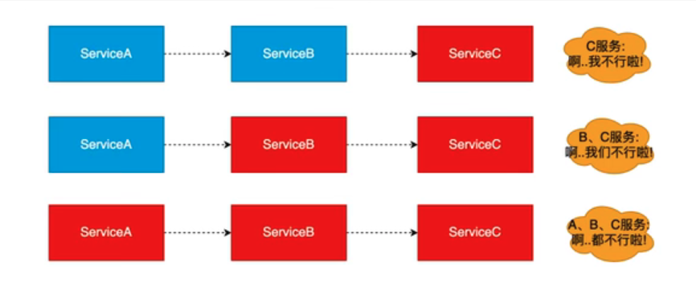
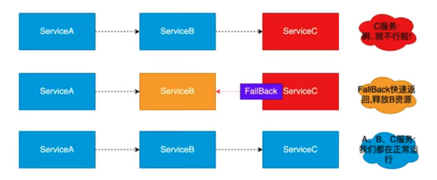
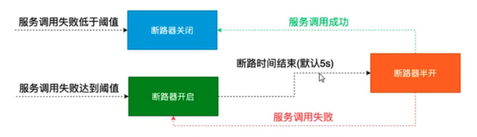
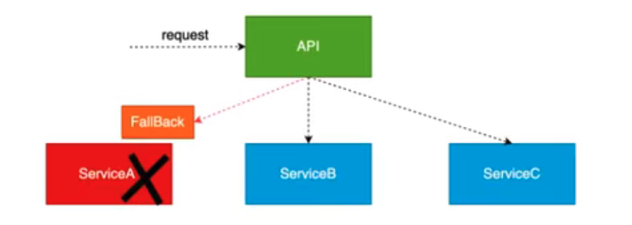

## 1、简介

### 1.1 服务雪崩

在微服务之间进行服务调用时由于某一个服务故障，导致级联服务故障的现象，成为雪崩效应。雪崩效应藐视的数提供方不可用，导致消费方不可用并将不可用逐渐放大的过程。

根本原因：在调用链路中某一个服务执行业务时间过长，或者是大规模出现异常导致自身服务不可用，并把这种不可用放大的情况。



### 1.2 服务熔断

熔断器本身是一种开关装置，当某个服务单元发生故障之后，通过断路器（Hystrix）的故障监控，某个异常条件被触发，直接熔断整个服务，想调用方法返回一个符合预期的可处理的备选响应（FallBack）,而不是长时间的等待或者抛出调用方无法处理的异常，就保证了服务调用方的线程不会长时间被占用，避免故障在分布式系统中蔓延，乃至雪崩。如果目标服务情况出现好转则恢复调用，服务熔断是解决服务雪崩的重要手段。



#### 断路器打开和关闭的条件

```properties
1、当满足一定的阈值的时候（默认10秒内超过20个请求次数）
2、当失败率达到一定的时候（默认10秒内超过50%的请求失败）
3、达到以上阈值，断路器会打开
4、当开启的时候，所有请求都不会进行转发
5、一段时间之后（默认是5s），这个时候断路器是半开状态，会让其中一个请求进行转发，如果成功，断路器会关闭，若失败，继续开启，重复4和5。
```



### 1.3 服务降级

服务压力剧增的时候，根据当前的业务情况及流量对一些服务和页面有策略的降级，以此环节此服务器的压力，以保证核心任务的进行。同时保证部分甚至大部分任务客户能得到正确的响应，也就是当前扥请求处理不了或者处理出错了，给一个默认的返回。

总结一句话：关闭微服务中某些边缘服务，保证系统核心服务正常运行。



### 1.4 服务熔断和降级总结

#### 1.4.1 共同点

+ 目的很一致，都是从可用性可靠性着想，为防止系统的整体缓慢甚至崩溃采取的技术手段
+ 最终表现类似，对于两者来说，最终让用户体验到的是某些功能暂时不可达或者不可用
+ 粒度一般都是服务级别的，当然，业界也有不少更细力度的做法，比如做到数据持久层，只允许查询，不允许增删改
+ 自治性要求很高，熔断模式一般都是服务基于策略的自动触发，降级虽说可人工干预，但在微服务架构下，完全靠人工显然不可能，开关预置，配置中心都是必要手段

#### 1.4.2 不同点

+ 触发原因不太一样，服务熔断一般是某个下游服务的故障引起的，服务降级一般是从整体负荷考虑
+ 管理目标的层次不太一样，熔断其实是一个框架级的处理，每个微服务都需要，而降级一般需要对业务有层级之分。

#### 1.4.3 总结

熔断必会触发降级，所以熔断也是降级的一种，区别在于熔断是对调用链路的保护，而降级是对系统过载的一种保护处理。