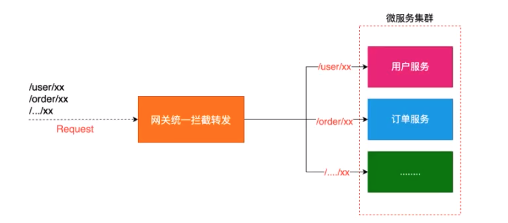

## 1、概述

### 1.1 什么是网关服务

网关统一服务入口，可方便实现对平台众多服务接口进行管控，对访问服务的身份认证，防报文重放与防数据篡改，功能调用的业务鉴权，响应数据的脱敏与并发控制，升值基于API调用的计量或者计费等等。

网关=路由转发+过滤器

+ 路由转发：接受一切外界请求，转发到后盾的微服务上去
+ 过滤器：在服务网关中可以完成一系列的横切功能，例如权限校验，限流以及监控等，这些都可以通过过滤器完成。

### 1.2 为什么需要网关

+ 网关可以实现服务的统一管理
+ 网关可以解决微服务中通用代码的冗余问题，比如权限控制，流量控制，限流等

### 1.3  网关组件在微服务中架构



### 1.4 Gateway

这个项目提供了一个在springmvc之上构建API网关的库，springcloudgateway旨在提供一种简单而有效的方法来路由到api，并为api提供横切关注点，比如安全性，监控/度量和弹性。

#### 特性：

+ 基于springboot2.x和spring webFlux 和 Reactor 构建 响应式异步非阻塞IO模型
+ 动态路由
+ 请求过滤

## 2、使用

构建一个springboot应用，在此基础上引入网关依赖，并配置编写。

### 2.1 引入依赖

```xml
<!--        <dependency> 网关中不能使用springmvc的web模型-->
<!--            <groupId>org.springframework.boot</groupId>-->
<!--            <artifactId>spring-boot-starter-web</artifactId>-->
<!--        </dependency>-->

       
        <dependency>
            <groupId>org.springframework.cloud</groupId>
            <artifactId>spring-cloud-starter-consul-discovery</artifactId>
        </dependency>

        <dependency>
            <groupId>org.springframework.boot</groupId>
            <artifactId>spring-boot-starter-actuator</artifactId>
        </dependency>

        <dependency>
            <groupId>org.springframework.cloud</groupId>
            <artifactId>spring-cloud-starter-gateway</artifactId>
        </dependency>
```

### 2.2 配置

+ 断言：当请求到达网关时，网关前置处理，满足断言请求继续，否则立即返回
+ 过滤：当请求满足断言的所有条件之后，会向后端服务转发，在向后端服务转发之前回经过一些过滤

#### 2.1 配置文件配置路由和过滤器

```yml
server:
  port: 8920 # springmvc端口

spring:
  cloud:
    # 服务注册中心配置
    consul:
      host: localhost
      port: 8500
      discovery:
        hostname: 127.0.0.1
    # 网关配置中心
    gateway:
      # 路由配置
      routes:
        - id: hystrix_user # 路由对象唯一标识
          uri: lb://HYSTRIXCLIENTUSER # 负载均衡写法 //后面是服务id
          predicates: # 断言 用来配置路由规则
            #路径断言
            - Path=/user/**
            #时间之后断言 代表该路由规则必须在指定时间之后才能生效 在之前会报错404
            - After=2021-10-23T17:45:43.143+08:00[Asia/Shanghai]
            #时间之前断言 代表该路由规则必须在指定时间之前才能生效 在之后会报错404
            - Before=2021-10-23T17:45:43.143+08:00[Asia/Shanghai]
            #时间之间断言 代表该路由规则必须在指定时间之间才能生效 在之外会报错404
            - Between=2021-10-23T17:45:43.143+08:00[Asia/Shanghai],2021-10-23T17:48:43.143+08:00[Asia/Shanghai]
            # 携带指定Cookie 需要cookie中包含name=cretin  如果是多个Cookie就多写几组就行 否则404
            - Cookie=name,cretin
            # 携带指定Cookie 需要cookie中包含name=cretin  可以使用正则 否则404
            - Cookie=name,[A-Za-z0-9]+
            # 携带指定请求头 否则404
            - Header=X-Request-Id,\d+
            # 指定请求方式 否则404
            - Method=GET,POST
          filters:
            # 过滤器 添加请求头 用来给路由对象的所有请求加入指定请求头信息
            - AddRequestHeader=User-Name,cretin
            # 过滤器 添加请求参数
            - AddRequestParameter=User-Name,cretin
            # 过滤器 添加响应头 用来给路由对象的所有请求加入指定响应头信息
            - AddResponseHeader=User-Name,cretin
            # 过滤器 添加指定的前缀路径 用来给路由对象的所有请求url加入指定前缀信息
            - PrefixPath=/api # 会将你访问的路径前面加一个api，携带api去访问你的后端服务
            # 过滤器 取来给路由对象的所有转发请求的url去掉指定的几个前缀
            - StripPrefix=n(2) # 去掉2个前缀 比如真实的访问路径为 /api/user/add  ---> /add 实际访问的地址
        - id: hystrix_product  # 路由对象唯一标识
          uri: lb://HYSTRIXCLIENTPRODUCT # 负载均衡写法  不使用负载均衡 ，也可以填写http协议 http://xxxxx
          predicates: # 断言 用来配置路由规则
            - Path=/product/** #一般情况下 会为某个服务专门书写一个最高级别的路径 路径里面也可以写多个，用逗号分割

  application:
    name: GATEWAYCLIENT
   
# 配置暴露的端点
management:
  endpoints:
    web:
      exposure:
        include: "*" #开放所有端点
```

#### 2.2 代码配置路由和过滤器

如果同时使用代码配置和配置文件配置，代码配置的优先级更高~

```java
//路由
@Configuration
public class GatewayConfig {

    @Bean
    public RouteLocator customRouteLocator(RouteLocatorBuilder builder) {
        return builder.routes()
                //配置不同路由
                //配置路由的时候 id需要唯一
                .route("hystrix_user", r -> r.path("/user/**")
                        .uri("lb://HYSTRIXCLIENTUSER"))
                .route("hystrix_product", r -> r.path("/product/**")
                        .uri("lb://HYSTRIXCLIENTPRODUCT"))
                .build();
    }
}

//过滤器
@Component
public class CustomFilter implements GlobalFilter, Ordered {

    @Override
    public Mono<Void> filter(ServerWebExchange exchange, GatewayFilterChain chain) {
        System.out.println("来了一次请求："+exchange.getRequest().getPath());
        ServerHttpRequest request = exchange.getRequest();
        ServerHttpResponse response = exchange.getResponse();
        Mono<Void> filter = chain.filter(exchange);
        //在这里处理一些filter之后的处理
        return filter;
    }

    //用来指定filter的执行顺序 -1 优先级最高
    @Override
    public int getOrder() {
        return 0;
    }
}

```

### 2.3 通过网关提供的web路由查看路由详情规则

访问：http://localhost:8920/actuator/gateway/routes

```xml
如果访问不到，请检查是否开启了端点的暴露
# 配置暴露的端点
management:
  endpoints:
    web:
      exposure:
        include: "*" #开放所有端点
```

```json
[
    {
        "predicate": "(((((((Paths: [/user/**], match trailing slash: true && After: 2021-10-23T17:45:43.143+08:00[Asia/Shanghai]) && Before: 2021-10-23T17:45:43.143+08:00[Asia/Shanghai]) && Between: 2021-10-23T17:45:43.143+08:00[Asia/Shanghai] and 2021-10-23T17:48:43.143+08:00[Asia/Shanghai]) && Cookie: name=name regexp=cretin) && Cookie: name=name regexp=[A-Za-z0-9]+) && Header: X-Request-Id regexp=\\d+) && Methods: [GET, POST])",
        "route_id": "hystrix_user",
        "filters": [
            "[[AddRequestHeader User-Name = 'cretin'], order = 1]",
            "[[AddRequestParameter User-Name = 'cretin'], order = 2]",
            "[[AddResponseHeader User-Name = 'cretin'], order = 3]",
            "[[PrefixPath prefix = '/api'], order = 4]",
            "[[StripPrefix parts = 2], order = 5]"
        ],
        "uri": "lb://HYSTRIXCLIENTUSER",
        "order": 0
    },
    {
        "predicate": "Paths: [/product/**], match trailing slash: true",
        "route_id": "hystrix_product",
        "filters": [],
        "uri": "lb://HYSTRIXCLIENTPRODUCT",
        "order": 0
    }
]
```

