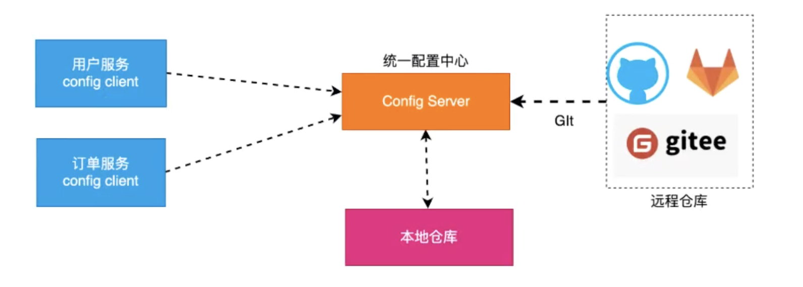
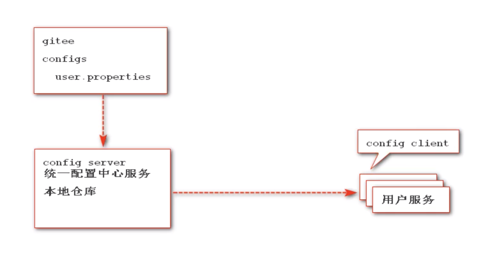

## 1、概述

config又称为统一配置中心，就是将配置统一管理，配置统一管理的好处是在日后大规模集群部署服务应用时相同的服务配置一致，后面再需要修改的时候统一修改全部配置，不需要一个一个服务手动维护。



## 2、使用

### 2.1 server 配置

#### 2.1.1 引入依赖

```xml
<!--        springboot应用-->
        <dependency>
            <groupId>org.springframework.boot</groupId>
            <artifactId>spring-boot-starter-web</artifactId>
        </dependency>

<!--        管理中心-->
        <dependency>
            <groupId>org.springframework.cloud</groupId>
            <artifactId>spring-cloud-starter-consul-discovery</artifactId>
        </dependency>

<!--        健康管理-->
        <dependency>
            <groupId>org.springframework.boot</groupId>
            <artifactId>spring-boot-starter-actuator</artifactId>
        </dependency>

<!--        config配置中心-->
        <dependency>
            <groupId>org.springframework.cloud</groupId>
            <artifactId>spring-cloud-config-server</artifactId>
        </dependency>
```

#### 2.1.2 配置配置文件

```yml
server:
  port: 8848

spring:
  cloud:
    consul:
      host: localhost
      port: 8500
      discovery:
        hostname: 127.0.0.1
    # 配置统一配置中心
    config:
      server:
        git:
          uri: https://gitee.com/mxnzp/springcloud-config.git # 仓库地址
          default-label: master # 默认分支
          username: xxxx # git仓库的账户
          password: xxxx # git仓库的密码

  application:
    name: CONFIGSERVER

```

#### 2.1.3 开启统一配置中心

```java
@SpringBootApplication
@EnableDiscoveryClient
@EnableConfigServer //我是一个统一配置中心
public class ConfigServerApplication {

    public static void main(String[] args) {
        SpringApplication.run(ConfigServerApplication.class,args);
    }
}
```

### 2.2 client 配置



#### 2.2.1 引入依赖

```xml
 <!--        springboot应用-->
        <dependency>
            <groupId>org.springframework.boot</groupId>
            <artifactId>spring-boot-starter-web</artifactId>
        </dependency>

        <!--        管理中心-->
        <dependency>
            <groupId>org.springframework.cloud</groupId>
            <artifactId>spring-cloud-starter-consul-discovery</artifactId>
        </dependency>

        <!--        健康管理-->
        <dependency>
            <groupId>org.springframework.boot</groupId>
            <artifactId>spring-boot-starter-actuator</artifactId>
        </dependency>

<!--        config依赖-->
        <dependency>
            <groupId>org.springframework.cloud</groupId>
            <artifactId>spring-cloud-starter-config</artifactId>
        </dependency>
```

#### 2.2.2 配置配置文件

注意：当你需要将配置文件托管到config服务的时候，当前项目的配置文件需要以 bootstrap.yml 命名，然后删除默认的application.yml文件，否则会无法使用你配置的信息。

bootstrap.yml

```yml
spring:
  cloud:
    consul:
      host: localhost
      port: 8500
      discovery:
        hostname: 127.0.0.1

    config:
      discovery:
        enabled: true # 我是一个config客户端 并且拿服务id去找服务
        service-id: CONFIGSERVER

      label: master # 确定分支
      name: configclient # 确定文件名称
      profile: prod # 确定环境

server:
  port: 8930

# 开启配置文件刷新请求端点暴露
management:
  endpoints:
    web:
      exposure:
        include: "*"
```

gitee项目中有三个文件，分别是 configclient.yml，configclient-dev.yml，configclient-prod.yml

```yml
configclient.yml内容如下：
spring:
  application:
    name: CONFIGCLIENT
  profiles:
    active: dev
    
configclient-dev.yml内容如下：
name: mxn

configclient-prod.yml内容如下：
name: zp
```

#### 2.2.3 添加注解

```java
@SpringBootApplication
@EnableDiscoveryClient
public class ConfigClientApplication {

    public static void main(String[] args) {
        SpringApplication.run(ConfigClientApplication.class,args);
    }
}
```

#### 2.3.4 获取配置信息

```java
@RestController
@RequestMapping("/config")
public class ConfigClientController {

    @Value("${name}")
    private String name;

    @RequestMapping("/demo")
    public String demo() {
        return "demo ok!!! name："+name;
    }
}
```

#### 2.3.5 手动刷新配置

+ 在使用配置的地方加上注解 @RefreshScope

  ```java
  
  @RestController
  @RequestMapping("/config")
  @RefreshScope //用来在不需要重启服务的情况下 将当前scope域中信息刷新为最新配置信息
  public class ConfigClientController {
  
      @Value("${name}")
      private String name;
  
      @RequestMapping("/demo")
      public String demo() {
          return "demo ok!!! name："+name;
      }
  }
  ```

+ 在gitee上修改完配置之后，想每一个微服务发送一个post方式请求。

  比如我在gitee上修改了configclient-prod.yml的内容，然后通过postman向客户端微服务发送post请求：

  http://127.0.0.1:8930/actuator/refresh 

  发送请求之前，访问：http://127.0.0.1:8930/config/demo

  demo ok!!! name：zp

  发送请求之后，访问：http://127.0.0.1:8930/config/demo

  demo ok!!! name：zp1

+ 如果访问时显示404，那么你需要开启actuator/refresh外部访问权限：

  ```yml
  # 开启配置文件刷新请求端点暴露
  management:
    endpoints:
      web:
        exposure:
          include: "*"
  ```

#### 2.3.6 自动刷新配置

由于这种手动刷新的方式依赖人工操作，操作失误的概率会比较大，不推荐使用，于是有自动刷新配置的解决方案。

+ 方案一、使用springcloud bus组件实现
+ 方案二、webhocks实现配置自动刷新

由于自动刷新的逻辑流程比较复杂，在此不做过多介绍，后面会介绍更加友好的方式。