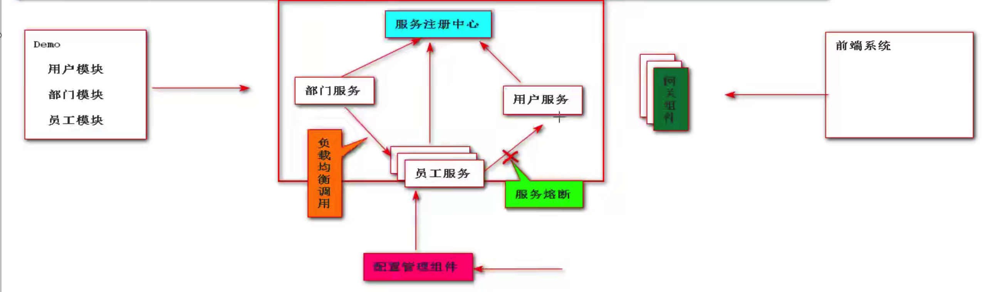
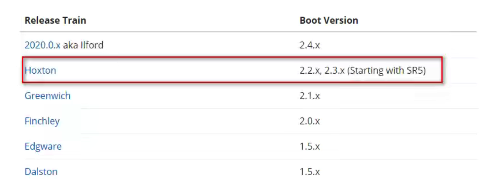

## 1、Spring Cloud 引言

### 1.1 定义

官方定义：springcloud 为开发人员提供了再分布式系统中快速构建一些通用模式的工具

通俗定义：springcloud 含有众多子项目的工具集，tools collection 微服务工具集合

### 1.2 微服务

基于单体基于业务进行拆分，每个服务都是独立应用，独立部署，运行在自己计算机进程，对于这些服务都是分布式管理。

## 2、Spring Cloud 命名和版本选择

### 2.1 命名

定义：springcloud 是一个涵盖众多子项目的工具集，服务发现，服务注册，负载均衡

早期命名：选择伦敦地铁站名称作为发布版本命名 A-Z

Angle、Brixton、Camden、Dalston、Edgware、Finchley、Greenwich、Hoxton、Hoxton.SR6

最新的命名：2020.0.2 数字

### 2.2 springcloud 与 springboot的对应关系

