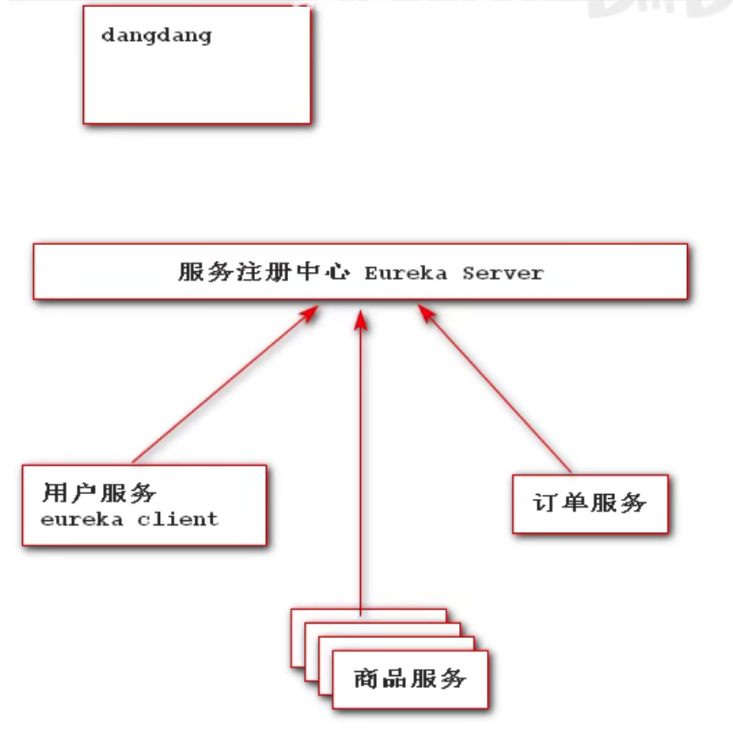
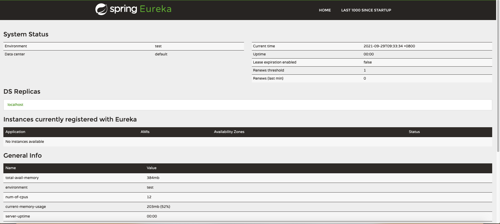
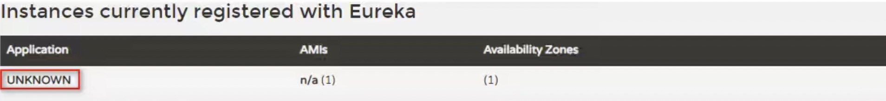
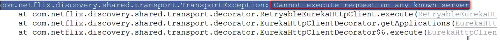

## 1、简述

Eureka 是 Netflix开发的服务发现框架，springcloud-netflix-eureka 服务注册中心

Eureka包含两个组件：Eureka Server 和 Eureka Client

Eureka Server 是一个微服务，只不过这个微服务不提供业务需求，其他真正提供业务服务的微服务都是Eureka Client。



## 2、开发Eureka服务端

### 1、基于之前创建的父项目开发，新建一个module，构建SpringBoot项目。

```xml
<!--引入springboot web 版本号由父项目提供-->
<dependency>
    <groupId>org.springframework.boot</groupId>
    <artifactId>spring-boot-starter-web</artifactId>
</dependency>
```

### 2、引入eureka server 依赖

```xml
<!--引入eureka-->
<dependency>
    <groupId>org.springframework.cloud</groupId>
    <artifactId>spring-cloud-starter-netflix-eureka-server</artifactId>
</dependency>
```

### 3、编写配置 application.yml

```properties
server:
  port: 8761
#  服务名不能出现下划线 推荐服务名大写 有下划线会出现找不到服务的问题
spring:
  application:
    name: EUREKASERVER

#暴露服务地址
eureka:
  client:
    service-url:
      # 单体应用项目
      defaultZone: http://localhost:8761/eureka 
      # defaultZone: http://localhost:8762/eureka,http://localhost:8763/eureka 集群链接其他服务注册中心
    #关闭eureka 立即注册
    fetch-registry: false
    #关闭客户端功能 让当前应用仅仅是服务注册中心
    register-with-eureka: false
```

### 4、在入口类添加注解

```kotlin
@SpringBootApplication
@EnableEurekaServer //当前是一个服务注册中心
public class EurekaServerApplication {
    public static void main(String[] args) {
        SpringApplication.run(EurekaServerApplication.class,args);
    }
}
```

### 5、预览效果



### 6、可能会遇到的问题

+ 6.1 如果你没有配置spring.application.name属性，在eureka的管理界面中会出现一个UNKNOWN的未知应用

  

  注意：在微服务架构中服务名称是一个很重要的服务标识，必须要唯一且容易识别。在配置的过程中，服务名称不能有下划线，否则会出现其他服务找不到当前服务的问题。

+ 6.2 eureka 在启动过程中报错

  

  eureka 含有两个组件 eureka server 和 eureka client 组件，当项目中一引入eureka server 组件时，这个组件同时会将eureka client引入到项目中，因此启动时会将自己作为一个服务中心启动，同时也会将自己作为服务的客户端进行注册，默认启动时要立即注册，注册时服务还没有准备好因此会出现当前错误

  解决办法：关闭自己注册自己的曹邹

  ```properties
  eureka:
      #关闭eureka 立即注册
      fetch-registry: false
      #关闭客户端功能 让当前应用仅仅是服务注册中心
      register-with-eureka: false
  ```

## 3、Eureka 健康管理机制

### 3.1 什么是健康管理机制

默认情况下，如果Eureka Server在一定时间内（默认90秒）没有接收到某个微服务实例的心跳，Eureka Server将会移除该实例。但是当网络分区故障发生时，微服务与Eureka Server之间无法正常通信，而微服务本身是正常运行的，此时不应该移除这个微服务，所以引入了自我保护机制。

### 3.2 它存在的意义

自我保护模式正是一种针对网络异常波动的安全保护措施，使用自我保护模式能使Eureka集群更加的健壮、稳定的运行。

### 3.3 工作机制

自我保护机制的工作机制是如果在15分钟内超过85%的客户端节点都没有正常的心跳，那么Eureka就认为客户端与注册中心出现了网络故障，Eureka Server自动进入自我保护机制，此时会出现以下几种情况：

+ 1、Eureka Server不再从注册列表中移除因为长时间没收到心跳而应该过期的服务。

+ 2、Eureka Server仍然能够接受新服务的注册和查询请求，但是不会被同步到其它节点上，保证当前节点依然可用。

+ 3、当网络稳定时，当前Eureka Server新的注册信息会被同步到其它节点中。

因此Eureka Server可以很好的应对因网络故障导致部分节点失联的情况，而不会像ZK那样如果有一半不可用的情况会导致整个集群不可用而变成瘫痪。

### 3.4 修改默认配置

```properties
# 该配置可以移除这种自我保护机制，防止失效的服务也被一直访问 (Spring Cloud默认该配置是 true)
eureka.server.enable-self-preservation: false

# 该配置可以修改检查失效服务的时间，每隔10s检查失效服务，并移除列表 (Spring Cloud默认该配置是 60s)
eureka.server.eviction-interval-timer-in-ms: 10

```

