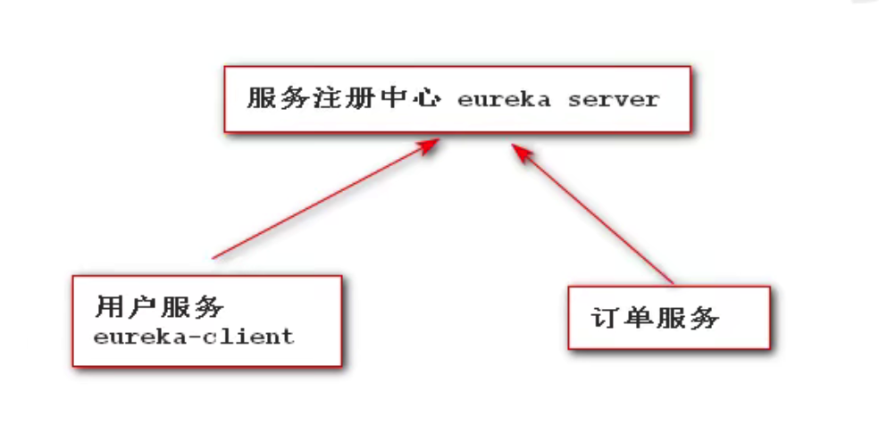
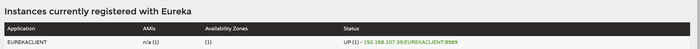

## 1、Eureka Client 概述

所谓的Eureka Client 就是我们日后开发的一个一个的微服务



## 2、开发Eureka Client 

### 2.1 创建一个Springboot 应用并开发出你所谓的功能

```xml
<!--引入springboot web 版本号由父项目提供-->
<dependency>
    <groupId>org.springframework.boot</groupId>
    <artifactId>spring-boot-starter-web</artifactId>
</dependency>
```

### 2.2 引入Eureka Client相关依赖

```xml
<!--引入client依赖-->
<dependency>
    <groupId>org.springframework.cloud</groupId>
    <artifactId>spring-cloud-starter-netflix-eureka-client</artifactId>
</dependency>
```

### 2.3 编写配置 application.yml

```properties
server:
  port: 8989
spring:
  application:
    name: EUREKACLIENT

eureka:
  instance:
    # 每隔10s发送一次心跳
    lease-renewal-interval-in-seconds: 10
    # 告知服务端30秒还未收到心跳的话，就将该服务移除列表
    lease-expiration-duration-in-seconds: 30
  client:
    service-url:
    	defaultZone: http://localhost:8761/eureka #单应用模式
      # defaultZone: http://localhost:8761/eureka,http://localhost:8762/eureka,http://localhost:8763/eureka #注定服务中心地址 集群方式
      
```

### 2.4 在入口类加入注解

```kotlin
@SpringBootApplication
@EnableEurekaClient //让当前微服务作为一个eurekaserver的客户端 进行服务注册
public class EurekaClientApplication {
    public static void main(String[] args) {
        SpringApplication.run(EurekaClientApplication.class,args);
    }
}
```



### 2.5 修改默认健康管理配置

```properties
# 该配置指示eureka客户端需要向eureka服务器发送心跳的频率  (Spring Cloud默认该配置是 30s)
eureka.instance.lease-renewal-interval-in-seconds: 10

# 该配置指示eureka服务器在接收到最后一个心跳之后等待的时间，然后才能从列表中删除此实例 (Spring Cloud默认该配置是 90s)
eureka.instance.lease-expiration-duration-in-seconds: 30
```

