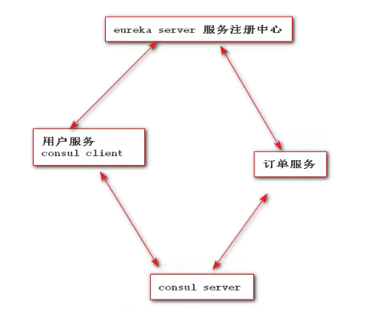
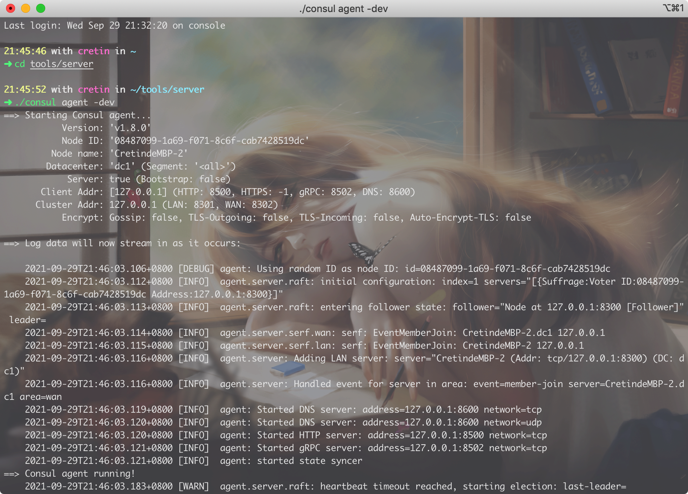
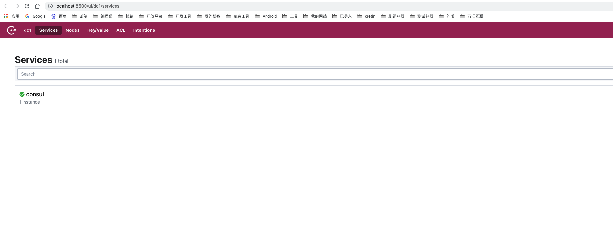

## 1、Consul 简介

Consul是基于go语言进行开发的服务注册中心，轻量级服务注册中心

管理微服务中所有服务注册，发现，管理鼓舞元数据信息存储（服务名，地址列表）心跳健康检查。



## 2、consul服务注册中心安装

### 2.1 下载consul

https://www.consul.io/downloads

### 2.2 在指定目录解压缩

### 2.3 启动服务注册中心

在consul安装目录执行命令

```shell
./consul agent -dev
```



### 2.4 访问consul管理页面

http://localhost:8500



### 2.5 管理页面基本介绍

dc1: 数据中心名称 datacenter  默认为dc1 指定数据中心启动：

```shell
./consul agent -dev -datacenter-aa
```

services：当前consul服务中心注册的服务列表 默认：client server 同事启动自己注册自己，会出现一个consul服务

nodes：用来查看consul的集群节点 