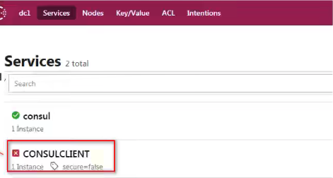

##  1、简述

consul 的客户端就是一个个的微服务项目，只不过他们集成了consul的依赖，成为了consul的客户端，被consul所管理

## 2、搭建consul客户端

### 2.1 创建独立的springboot项目

```xml
<!--springboot-->
<dependency>
    <groupId>org.springframework.boot</groupId>
    <artifactId>spring-boot-starter-web</artifactId>
</dependency>
```

### 2.2 引入consul客户端依赖

```xml
<!--consul-->
<dependency>
    <groupId>org.springframework.boot</groupId>
    <artifactId>spring-boot-starter-actuator</artifactId>
</dependency>
<!--健康管理-->
<dependency>
    <groupId>org.springframework.cloud</groupId>
    <artifactId>spring-cloud-starter-consul-discovery</artifactId>
</dependency>
```

### 2.3 书写配置 application.yml

```properties
server:
  port: 8900

spring:
  application:
    name: CONSULCLIENT
  cloud:
    consul:
      discovery:
        hostname: 127.0.0.1
        register-health-check: true # 健康检查
      host: localhost
      port: 8500
```

### 2.4 在入口类加上注解

```kotlin
@SpringBootApplication
@EnableDiscoveryClient
public class ConsulClientApplication {
    public static void main(String[] args) {
        SpringApplication.run(ConsulClientApplication.class,args);
    }
}
```

### 2.5 一些细节问题

+ 1、如果你直接启动consul client 出现如下问题

  

  原因：consul server检测所有客户端的心跳，但是发送心跳时client必须给予响应该服务才能正常使用，在现有客户端中我们没有引入健康检查依赖，所以导致健康检查始终不通过，导致服务不能正常使用。
