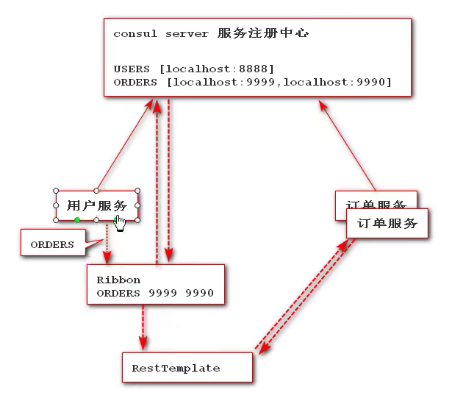

## 1、简介

### 1.1 使用RestTemplate的问题

+ 调用服务的路径主机和服务端口直接写死在url无法实现请求的负载均衡
+ 调用服务的请求路径写死在代码中，后续不方便维护和扩展

### 1.2 如何解决RestTemplate带来的问题

+ 自定义负载均衡解决策略
+ 使用Ribbon组件

### 1.3 Ribbon是什么

官网地址：https://github.com/Netflix/ribbon

Spring Cloud Ribbon是一个基于HTTP和TCP的客户端负载均衡工具，它基于Netflix Ribbon实现，通过Spring Cloud的封装，可以让我们轻松的将面向服务的REST模板请求自动关机转换成客户端负载均衡的负载调用。

作用：负载均衡客户端组件，就是用来实现请求调用时负载均衡

## 2、原理



## 3、使用

### 3.1 引入项目

如果使用了Eureka Client 和 consul client 无需引入依赖，因为在eureka consul 中默认集成了ribbon组件。

```xml
<dependency>
	<groupId>org.springframework.cloud</groupId>
  <artifactId>spring-cloud-starter-netflix-ribbon</artifactId>
</dependency>
```

### 3.2  三种方式

+ DiscoveryClient 服务注册与发现客户端对象

  服务发现客户端对象，根据服务id去服务注册中心获取对应服务列表

  缺点：没有负载均衡，需要自己实现负载均衡

  ```java
  @Autowired
  private DiscoveryClient discoveryClient;
  
  @GetMapping("test")
  public String test(){
    List<ServiceInstance> serviceInstances = discoveryClient.getInstances("ORDERS");
    //通过一定的策略获取列表中的任何一个主机进行请求
    String result = new RestTemplate().getForObject(serviceInstances.get(0).getUri()+"/order",String.class);
  	return result
  }
  ```

+ LoadBalancerClient 负载均衡客户端对象

  负载均衡客户端对象，根据服务id去服务注册中心获取对应服务列表，根据默认负载均衡策略选择列表中一台机器进行返回

  缺点：使用时需要每次先根据服务id获取一个负载均衡机器之后再通过restTemplate调用服务

  ```java
  @Autowired
  private LoadBalanceClient loadBalanceClient;
  
  @GetMapping("test")
  public String test(){
    ServiceInstance serviceInstance = loadBalanceClient.choose("ORDERS");
    //通过一定的策略获取列表中的任何一个主机进行请求
    String result = new RestTemplate().getForObject(serviceInstance.getUri()+"/order",String.class);
  	return result
  }
  ```

+ @LoadBalance

  负载均衡客户端注解

  修饰范围：用在方法上，让当前方法当前对象居右ribbon负载均衡特性		

  ```java
  @Configuretion
  public class BeansConfig{
    	@Bean
    	@LoadBalanced
    	public RestTemplate restTemplate(){
        return new RestTemplate();
      }
  }
  
  
  @Autowired
  private RestTemplate restTemplate;
  
  @GetMapping("test")
  public String test(){
    ServiceInstance serviceInstance = loadBalanceClient.choose("ORDERS");
    //通过一定的策略获取列表中的任何一个主机进行请求
    String result = restTemplate.getForObject("http://ORDERS/order",String.class);
  	return result
  }
  
  ```

  ### 3.3 问题

  还是有路径写死在代码中的问题，不利于后期维护~