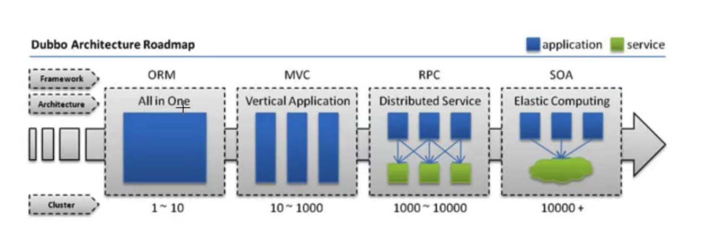

集群：cluster 同一个软件的多个服务节点共同为系统提供服务的过程，称之为该软件服务集群。

分布式：distribute 不同软件集群共同为一个系统提供服务，这个系统称之为分布式系统。

## 1、定义

微服务（microservices）

https://www.martinfowler.com/articles/microservices.html

起源于 25 March(3月) 2014 作者：James Lewis & Martin Fowler

**官方定义**：微服务是一种架构

+ a、基于原来单个应用开发出一系列微笑服务
+ b、每个服务运行在自己计算机进程里面
+ c、每个服务基于项目中业务进行拆分
+ d、拆分出来的每个服务独立部署
+ e、这些服务都是基于分布式管理

**通俗定义**：

​	微服务是一种架构。

​	这种架构是将单个的整体应用程序分割成更小的项目关联的独立的服务。一个服务通常实现一组独立的特定或功能，包含自己的业务逻辑和适配器。各个微服务之间的关联通过暴露api来实现。这些独立的微服务不需要部署在同一个虚拟机，同一个系统和同一个应用服务器中。

## 2、为什么要用微服务

### 2.1 单体应用带来的问题？

+ 1 优点
  + 单一架构模式在项目初期很小的时候开发方便，测试方便，部署方便，运行良好。
+ 2 缺点
  + 应用随着时间的推进，加入的功能越来越多，最终会变得巨大。一个项目中很有可能有数百万行的代码。互相之间繁琐的jar包。久而久之，开发效率低，代码维护困难
  + 如果想整体应用采用新的技术，新的框架或者语言，重构几乎不可能
  + 任意模块的漏洞或者错误都会影响这个应用，降低系统的可靠性

### 2.2 微服务架构

+ 1 优点
  + 将服务拆分成多个单一职责的小的服务，进行单独部署，服务之间通过网络进行通信
  + 每个服务应用有自己单独的管理团队，高度自治
  + 服务各自有自己单独的职责，服务之间松耦合，避免因一个模块的问题导致服务崩溃
+ 2 缺点
  + 开发人员要处理分布式系统的复杂性
  + 多服务运维难度，随着服务的增加，运维的压力也在增大
  + 服务治理和服务监控变得很重要

## 3、架构的演变过程

### 3.1 单一架构 All In One

所有代码都写在一起，ORM 是关键，如何解决对象关系映射，衍生出来的框架：Hibernate JPA MyBatis

### 3.2 垂直架构

MVC架构，控制器是关键，衍生出来的框架：struts，struts2，SpringMVC，springboot

### 3.3 分布式服务架构

tomcat 集群

mysql集群

redis集群

RPC衍生出来了，远程过程调用，作用：服务间通信的一种手段

### 3.4 SOA 面相服务体系架构， 微服务

服务治理，服务监控很关键

**好的架构不是设计出来的，是历史演变出来的**

## 4、微服务的解决方案

### 4.1 国内阿里系

springboot + dubbo（spring springboot(兼容)）+ zookeeper 最早期

### 4.2 spring cloud 技术栈

+ 最早期：spring cloud netflix 16年到17年
+ spring cloud spring 自己封装微服务解决方案
+ spring cloud alibaba 阿里巴巴解决方案