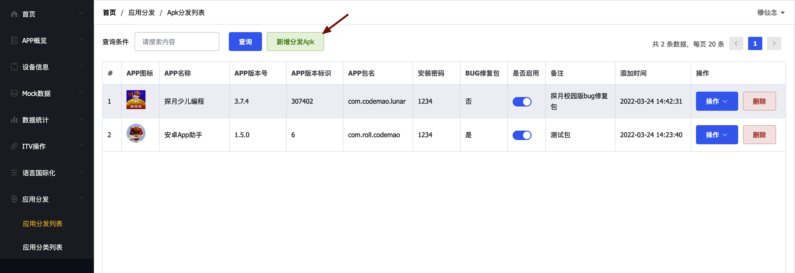
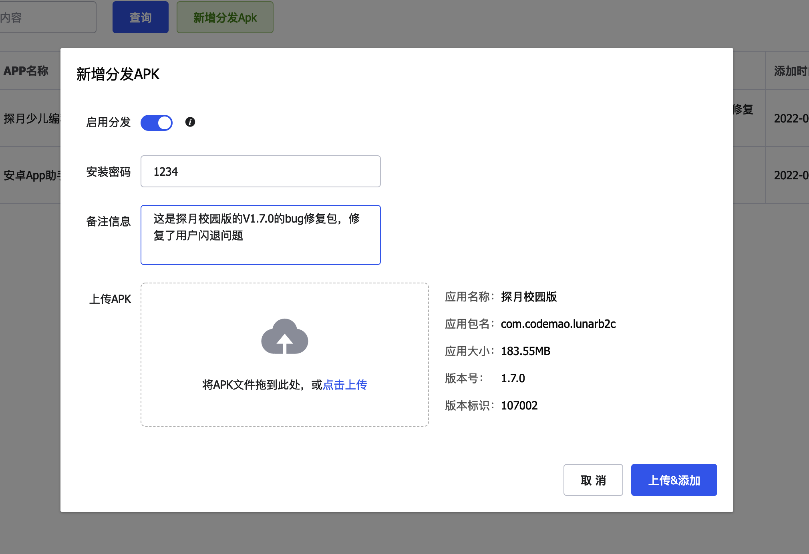
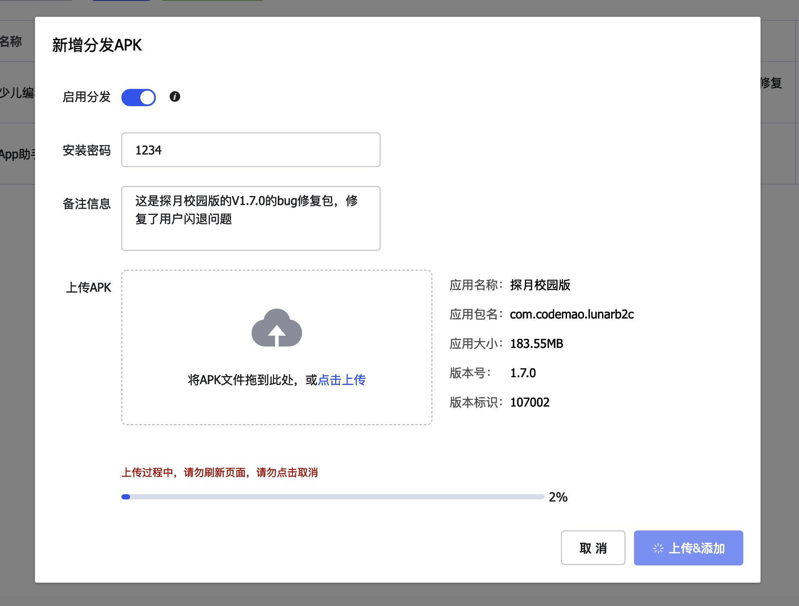
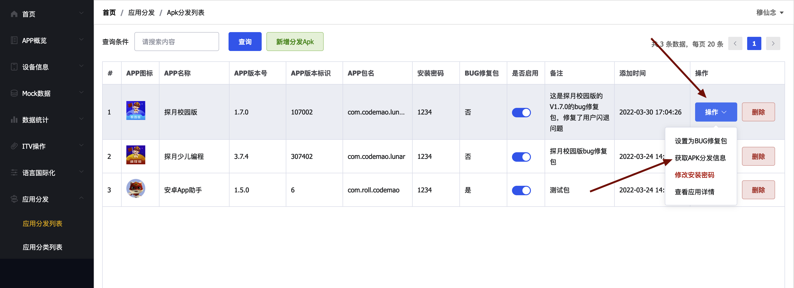
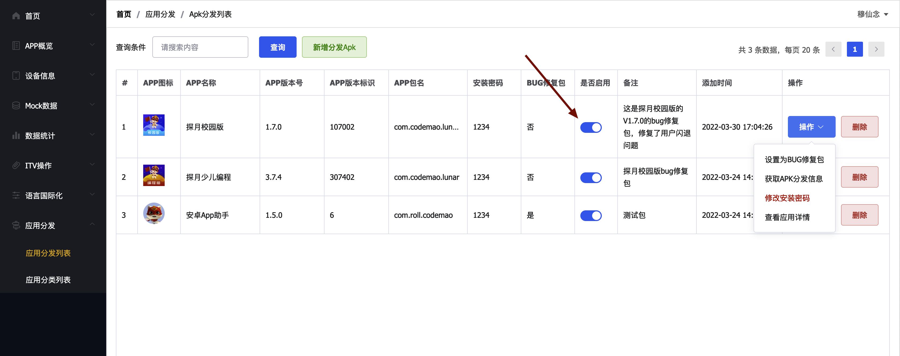
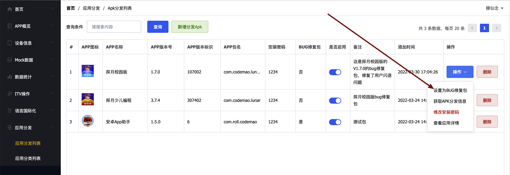

## 1、前言

某些场景下需要给特定用户发送bug修复包，目前使用的是蒲公英，但是蒲公英会展示所有历史Android包，会给用户造成困扰，针对这种情况，我们开发了自己的渠道包分发平台。另外此平台也可以支持容灾降级SDK进行修复包的分发。

## 2、使用文档

### 2.1 进入后台

点击链接进入管理后台：http://log.mxnzp.com/pro_admin_codemao/#/apk/list

使用账号登录，账号可以找 @穆仙念 获取。

### 2.2 上传新的bug修复包

#### 2.2.1 点击新增分发APK

#### 2.2.2 输入信息并拖入APK

右边会显示当前你将要上传的apk的相关信息，请确认无误。

#### 2.2.3 上传

点击上传按钮进行上传，上传过程中不得刷新页面，否则将上传失败。

#### 2.2.4 获取对外分发信息

选择你需要分发的APP，点击操作按钮，获取分发二维码和分发链接。

如果二维码无法正常显示，可以点击强刷二维码重新生成二维码图片，点击保存图片可以将二维码保存到本地。

#### 2.2.5  停用或启用分发

需要注意的是，如果你停用了当前apk，那么用户访问此版本的时候将会无法正常访问。

#### 2.2.6 设置为BUG修复包

这个功能需要配合AndroidCrashHelper SDK一起使用，选择你需要操作的APP，点击操作按钮，点击设置为BUG修复包，此时，SDK会获取到此版本的信息，然后下发到SDK进行应用升级操作。

