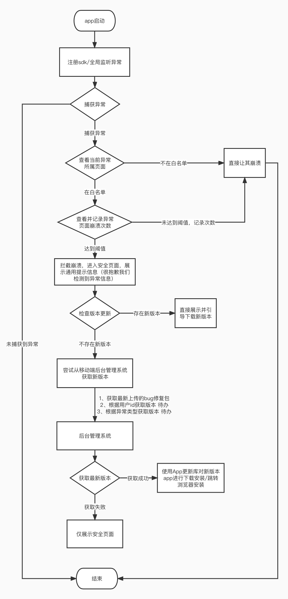

## 一、背景

可能由于某些种种特殊的原因，我们在某一个版本发布后出现了App刚上线就全线崩溃的问题，由于是一启动就崩溃，连强制更新都没有办法正常使用，只能让用户卸载重装，这无疑是一个重大失误。所以我们需要一个针对崩溃能友好提示并引导用户升级的方案，尤其是进主页就崩溃的这种情况。

## 二、实现思路

### 2.1 捕获异常

因为只要应用抛出的异常我们没有正常捕获和处理，就会导致应用崩溃，所以我们需要对应用未捕获的异常进行二次捕获，主要原理就是使用 Thread.setDefaultUncaughtExceptionHandler 来进行捕获。但是这个方法只能捕获异常，不能拦截异常，所以还需要一些骚操作，感兴趣的可以看下这里的讲解：https://github.com/android-notes/Cockroach/blob/master/%E5%8E%9F%E7%90%86%E5%88%86%E6%9E%90.md ，最终实现捕获并拦截异常信息。

### 2.2 拦截和放行

当我们捕获到异常之后，需要看下当前的环境，如果用户处于比较敏感的页面，比如首页，欢迎页面等等就崩溃了，我们就不让app闪退，而是进入一个说明页面，告知用户应用出现了异常，于此同时提示用户有新版本更新。

### 2.3 引导更新

在说明页面中，引导用户去下载新版本。

## 三、流程图

## 四、开发形式

开发独立的sdk，方便其他app进行集成。

## 五、实现说明

### 4.1 配置白名单

提供配置页面与最大崩溃次数映射关系的入口，指定特殊Activity和Fragment的最大崩溃次数，当连续崩溃次数达到阈值并且时间也在规定范围内，引导用户下载更新

### 4.2 远程配置白名单

使用友盟在线自定义参数或者日志接口远程配置白名单内容。

### 4.3 引导更新降级处理

针对线上某些用户的崩溃个例问题，我们可能会发bug修复包，但是不会将bug修复包全量发布，所以当特定用户遇到这些问题的时候，我们可以引导用户下载bug修复包，但是这个配置将在，移动端管理后台去配置，即使移动端管理后台出现了问题，也不会影响现阶段功能。

于此同时，将来还希望能加上针对用户ID和针对特定异常类型进行特定修复包分发的功能。

### 4.4 说明页面定制

说明页面可能会因为app的不同长的样子也不一样，所以将提供两种方式给调用方定制这个页面，一个是调用方直接提供跳转的Activity，所有的逻辑由自己控制；另外一种方案是仅提供页面UI的定制权，Activity由SDK提供。

另外，在此页面，我们会自动上报收集到的异常信息，并做分析之后上传到管理后台或者阿里云日志系统并按照一定规则通知到钉钉。

### 4.5 移动端后台管理页面定制

移动端后台管理页面新增上传bug修复包功能和bug修复包的分发功能，取代使用蒲公英给用户更新app的方式。

