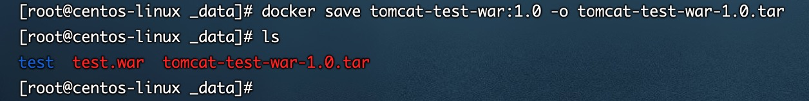

### 一、运行容器

加载本地镜像：docker load -i tomcat-8.0-jre8.tar

docker run 镜像名:tag 镜像id

a、以tomcat为例，运行tomcat容器

docker run tomcat:8-jdk8-corretto

b、映射宿主机端口 与 容器中端口 -p 可以有多个

docker run -p 8080（宿主机端口）:8080（容器端口） tomcat:8-jdk 8-corretto 

c、启动容器 映射外部端口 后台启动 -d

docker run -p 8080（宿主机端口）:8080（容器端口）-d（后台运行）  tomcat:8-jdk8-corretto 

d、启动容器 指定名称（--name） 后台运行 端口映射

docker run -p 8080（宿主机端口）:8080（容器端口）-d（后台运行）--name tomcat8  tomcat:8-jdk8-corretto 

### 二、查看运行中的容器

docker ps

| CONTAINER ID | IMAGE                  | COMMAND           | CREATED            | STATUS            | PORTS              | NAMES            |
| ------------ | ---------------------- | ----------------- | ------------------ | ----------------- | ------------------ | ---------------- |
| 6ede051ddd1e | tomcat:8-jdk8-corretto | "catalina.sh run" | About a minute ago | Up About a minute | 8080/tcp           | quizzical_keller |
| 容器id       | 镜像                   | 容器内执行的命令  | 创建时间           | 当前状态          | 容器服务监听的端口 | 容器名称         |

docker ps -q 正在运行的容器id

docker ps -a 查看所有容器（运行 & 非运行）

docker ps -aq 返回所有容器的id

### 三、停止 关闭 重启命令

docker start 容器名字|容器id 启动容器

docker restart 容器名字|容器id 重新启动容器

docker stop 容器名字|容器id 正常停止容器运行

docker kill 容器名字|容器id 立即停止容器运行

### 四、删除容器

docker rm 容器名称|容器id 	删除停止的容器

docker rm -f 容器名称|容器id 	删除正在运行的容器

docker rm -f $(docker ps -aq)    删除所有容器

### 五、查看容器中的服务运行日志

docker logs 容器id | 容器名称      查看当时的日志，不能实时刷新

docker logs -t 容器id | 容器名称 加入时间戳

docker logs -f 容器id | 容器名称 跟随最新的日志打印

docker logs --tail 容器id | 容器名称 数字 显示最后多少条

### 六、查看容器内进程

docker top 容器id或者容器名  -- 查看容器内的进程

### 七、与容器内部进程交互

docker exec -it 容器id或者容器名 bash

退出容器 exit

### 八、操作系统与容器的传输文件

从容器复制文件到操作系统： docker cp 容器唯一标识(id,name):容器内资源路径 操作系统文件路径 

从操作系统复制文件到容器：docker cp 文件:目录名 容器唯一标识(id,name):容器内资源路径

### 九、查看容器内部细节

docker inspect 容器id|容器名称

### 十、数据卷 Volume

作用：实现宿主机系统与容器之前的文件共享

数据卷使用：

a、docker run -d -p 8080：8080 --name tomcat01 -v 宿主机目录(必须是绝对路径) 容器内目录 tomcat:8-jdk8-corretto 

1、自定义数据卷目录

docker run -d -p 8081:8080 --name tomcat02 -v /root/apps/:/usr/local/tomcat/webapps tomcat:8-jdk8-corretto 

2、自动数据卷目录

docker run -d -p 8081:8080 --name tomcat03 v aa:/usr/local/tomcat/webapps tomcat:8-jdk8-corretto 

注意：

1、aa代表一个数据卷的名字，名称可以随便写，docker在不存在时渣滓洞创建这个数据卷同时自动映射宿主机中某个目录

2、同时在启动容器时会将aa对应容器目录中全部内容复制到aa映射目录中

### 十一、将容器打包成一个新的镜像

docker commit -m "描述信息" -a ”作者信息“ (容器id或者名称) 打包的镜像名称:标签

### 十二、将镜像备份出来

docker save 镜像名称:tag -o 文件名

有了镜像备份，可以使用load的方式加载本地镜像，加载本地镜像：docker load -i tomcat-8.0-jre8.tar