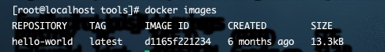
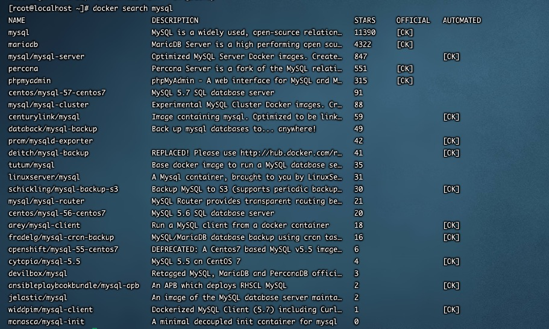
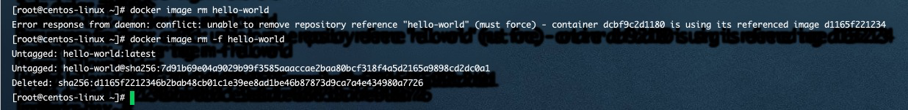

### 一、查看镜像

docker images

docker image mysql //查看指定名字的容器

docker image -q //仅显示id

### 二、下载镜像

先到 https://hub.docker.com/ 上搜索相关镜像，获取到镜像名称和版本号

1、docker pull 镜像名称:版本号 （推荐使用）

docker pull mysql:5.7

2、根据摘要下载

docker pull 镜像名:@摘要 DIGEST

### 三、命令行搜索

docker search 镜像名

### 四、删除镜像

1、docker image rm 镜像名:tag | 镜像id

2、docker image rm -f 镜像名:tag | 镜像id  //强制删除

3、docker rmi 镜像名:tag | 镜像id

4、删除所有镜像

docker image rm -f $(docker image -q) //慎用

