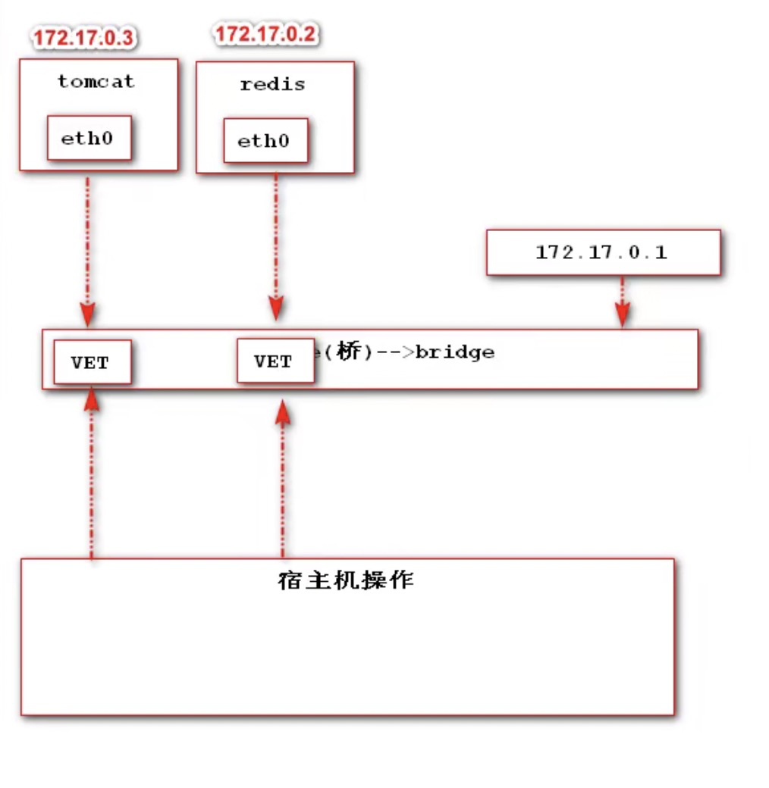

### 一、为什么提供网络功能

Docker 允许通过外部访问容器或者容器互联的方式来提供网络服务。

### 二、docker容器与操作系统通信机制

### 三、网络使用

一般在使用docker网桥（bridge）实现容器与容器通信时，都是站在一个应用角度进行容器通信

a、查看docker网桥配置

docker network ls

b、创建自定义网桥

docker create ems(网桥名称) ====》 docker create  bridge ems(网桥)

docker run -d -p 8082:8080 --network ems --name mytomcat01 tomcat:8.0-jre8 

docker run -d -p 8083:8080 --network ems --name mytomcat02 tomcat:8.0-jre8 

一旦在启动容器时指定了网桥之后，日后可以在任何这个网桥关联的容器中使用容器名字进行与其他容器通信。

注意：在使用docker run --network 网桥时网桥必须存在才行。

### 四、删除网桥

docker network rm 网桥名称

### 五、查看网桥详情

docker inspect ems

