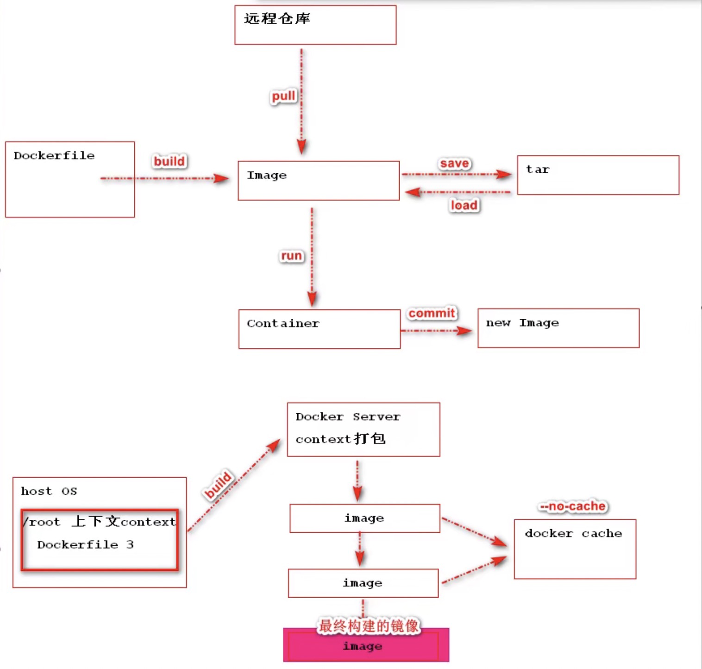

## 一、什么是Dockerfile

用来帮助我们自己构建一个自定义镜像，Dockerfile成为镜像构建文件，描述文件

## 二、为什么要存在Dockerfile

在dockerhub中官方提供了很多镜像已经能满足我们的所有服务了，为什么还需要自定义镜像，原因：日后用户可以将自己的应用打包成镜像，这样就可以让我们的应用进行容器运行。

## 三、Dockerfile构建镜像原理



## 四、Dockerfile的保留命令

| 保留字     | 作用                                                         |
| ---------- | ------------------------------------------------------------ |
| FROM       | 当前镜像时基于哪个镜像                                       |
| RUN        | 构建镜像时需要运行的命令                                     |
| EXPOSE     | 当前容器对外暴露出的端口号                                   |
| WORKDIR    | 指定在创建容器后，终端默认登录进来的工作目录，一个落脚点     |
| ENV        | 用来在构建镜像过程中设置环境变量                             |
| ADD        | 将宿主机目录下的文件拷贝进镜像且ADD命令会自动处理URL和解压tar包 |
| COPY       | 类似于ADD，拷贝文件和目录到镜像中<br>将从构建上下文目录中<原路径>的文件/目录复制到新的一层的镜像内的<目标路径>位置 |
| VOLUME     | 容器数据卷，用于数据保存和持久化工作                         |
| CMD        | 指定一个容器启动时要运行的命令<br>Dockerfile中可以有多个CMD命令，但只有最后一个生效，CMD会被docker run之后的参数替换 |
| ENTRYPOINT | 指定一个容器启动时要运行的命令<br>ENTRYPOINT的目的和CMD一样，都是在指定容器启动程序及其参数 |

## 五、命令详解

构建命令：

```shell
docker build -t mycentos7:01 .
.代表当前目录~
```

### 5.1 FROM命令

基于哪个镜像进行构建新的镜像，在构建时会自动从docker hub拉取base镜像 必须作为Dockerfile的第一个指令出现

语法：

```dockerfile
FROM	<image>
FROM	<image>[:<tag>] 使用版本不写未latest
FROM	<image>[@<digest>] 使用摘要
```

例如：

```dockerfile
FROM	centos:7
```

docker run -it centos:7 //运行的时候直接进入bash

### 5.2 RUN命令

RUN指定将在当前镜像之上的新层中执行任何命令并提交结果，生成的提交镜像将用于Dockerfile中的下一步

语法：

```dockerfile
RUN <command> (shell form, the command is run in a shell,which by default is /bin/sh -c on Linux or cmd /S /C on Windows)
RUN echo hello

# json数据格式
RUN ["executable","param1","param2"] (exec form)
RUN ["/bin/bash","-c","echo hello"]
```

例如：

```dockerfile
FROM centos:7
#RUN yum install -y vim
RUN ["yum","install","-y","vim"] #json数据格式 功能是一样
```

### 5.3 EXPOSE命令

用来指定在构建的镜像在运行为容器时对外暴露的端口。

语法：

```dockerfile
EXPOST 80/tcp 如果没有显示指定协议类型默认暴露都是tcp
EXPOST 80/udp
```

例如：

```dockerfile
FROM centos:7
#RUN yum install -y vim
RUN ["yum","install","-y","vim"] #json数据格式 功能是一样
EXPOST 8080 # 暴露端口，只有暴露了才能在容器外映射
EXPOST 8081 # 可以暴露多个端口
```

### 5.4 WORKDIR

用来为Dockerfile中的任何RUN、CMD、ENTRYPOINT、COPY和ADD指令设置工作目录。如果WORKDIR不存在，即使它没有在任何后续Dockerfile指令中使用，它也将被创建。

语法：

```dockerfile
WORKDIR /path/to/workdir

WORKDIR /a
WORKDIR a
WORKDIR c
注意：WORKDIR指定可以在Dockerfile中多次使用，如果提供了相对路径，则该路径将与先前WORKDIR指令的路径相对
```

例如：

```dockerfile
FROM centos:7
#RUN yum install -y vim
RUN ["yum","install","-y","vim"] #json数据格式 功能是一样
EXPOST 8080 # 暴露端口，只有暴露了才能在容器外映射
EXPOST 8081 # 可以暴露多个端口
WORKDIR /data
WORKDIR aa # 现在进入之后就会直接进入/data/aa
```

### 5.5 COPY

用来将context目录中指定文件复制到镜像的指定目录中

语法：

```dockerfile
COPY src dest
COPY ["<src>",..."<dest>"]
```

例如：

```dockerfile
FROM centos:7
#RUN yum install -y vim
RUN ["yum","install","-y","vim"] #json数据格式 功能是一样
EXPOST 8080 # 暴露端口，只有暴露了才能在容器外映射
EXPOST 8081 # 可以暴露多个端口
WORKDIR /data
WORKDIR aa # 现在进入之后就会直接进入/data/aa
COPY aa.txt /data/aa # 将aa.txt 拷贝到/data/aa
```

### 5.6 ADD

用来从context上下文复制新文件、目录或远程文件url，并将它们添加到位于指定路径镜像文件系统中

语法：

```dockerfile
ADD home* /mydir/ 通配符添加多个文件
ADD hom?.txt /mydir/ 通配符添加
ADD test.txt relativeDir/ 可以指定相对路径
ADD test.txt /absoluteDir/ 也可以指定绝对路径
```

例如：

```dockerfile
FROM centos:7
#RUN yum install -y vim
RUN ["yum","install","-y","vim"] #json数据格式 功能是一样
EXPOST 8080 # 暴露端口，只有暴露了才能在容器外映射
EXPOST 8081 # 可以暴露多个端口
WORKDIR /data
WORKDIR aa # 现在进入之后就会直接进入/data/aa
COPY aa.txt /data/aa # 将aa.txt 拷贝到/data/aa
ADD bb.txt /data/aa # 将bb.txt 拷贝到/data/aa
ADD https://mirrors.bfsu.edu.cn/apache/tomcat/tomcat-8/v8.5.61/bin/apache-tomcat-8.5.61.tar.gz /data/bb # 可以直接添加远程文件到/data/bb 构建镜像的时候会自动去下载
ADD apache-tomcat-8.5.61.tar.gz /data/bb #如果添加本地tar文件到镜像目录，系统会自动解压该tar文件
RUN mv apache-tomcat-8.5.61 tomcat #重命名当前文件夹为tomcat
WORKDIR tomcat #直接进入tomcat命令
```

### 5.7 VOLUME命令

用来定义容器运行时可以挂载到宿主机的目录

语法：

```dockerfile
VOLUME ["/data"]
```


