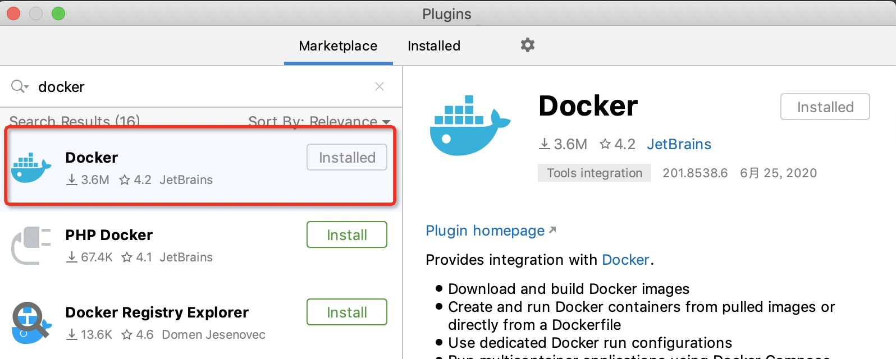
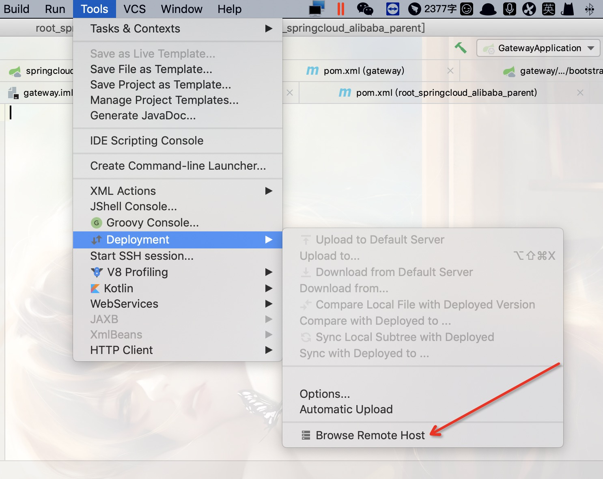
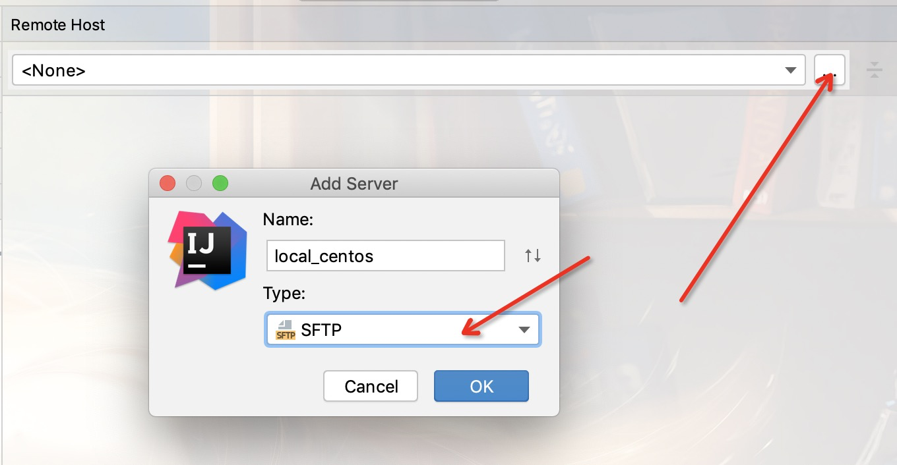
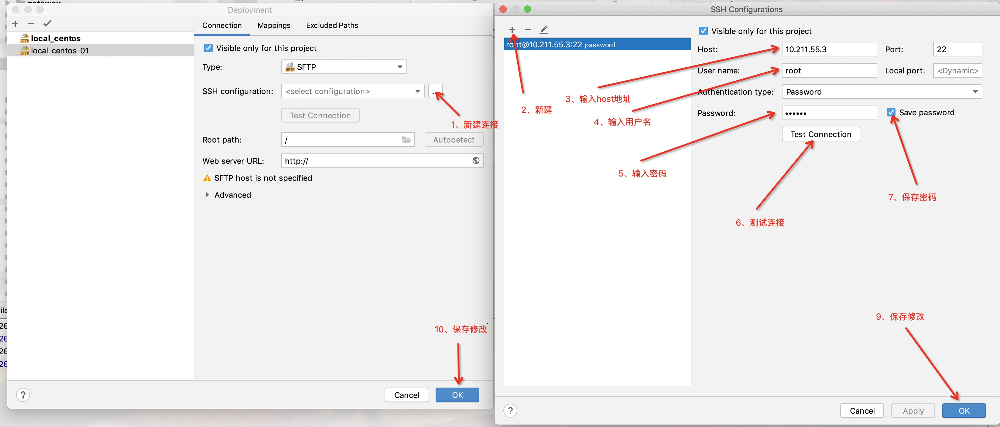
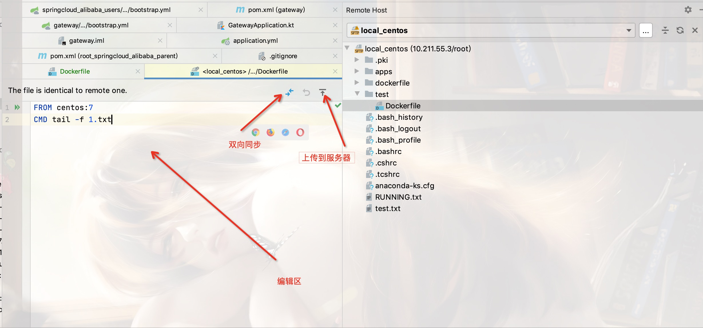

## 一、安装Docker插件

在插件仓库搜索Docker插件并安装

## 二、创建Dockerfile

可以实现Dockerfile语法高亮

## 三、使用idea的远程服务工具

### Tools->Deployment->Browse Remote Host

### 新建一个远程连接

### 后面可以点击Dockerfile之后直接编辑，点击右上角上传即可。  

