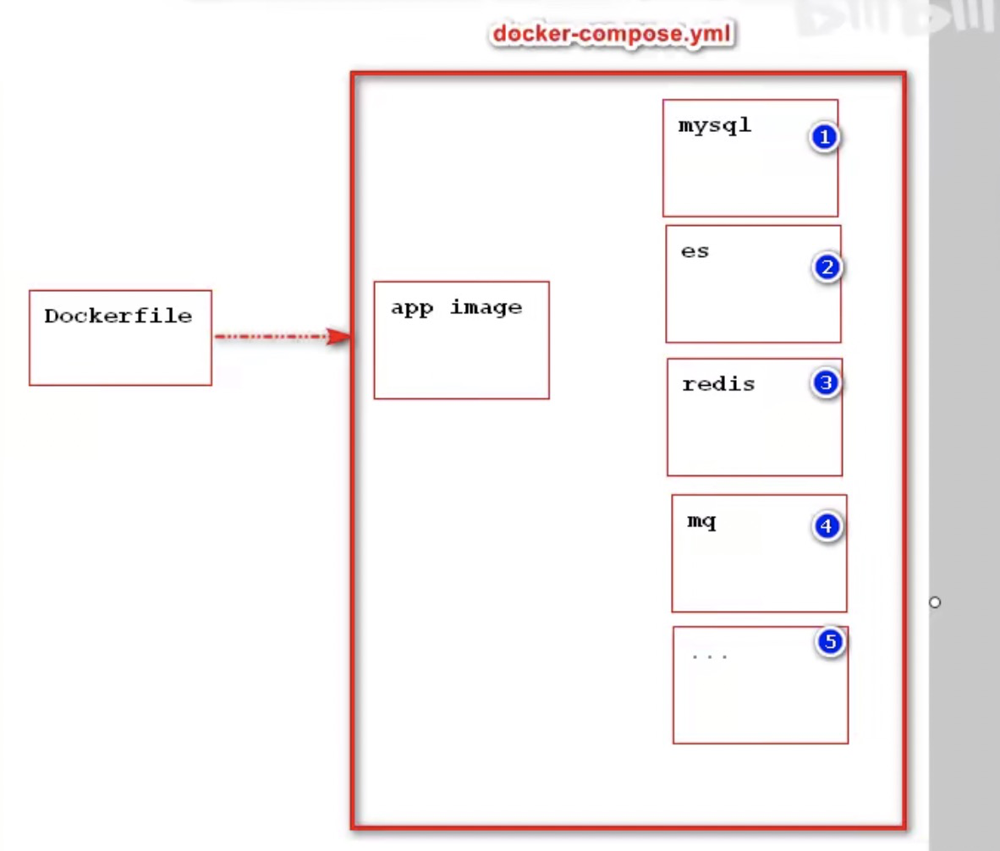
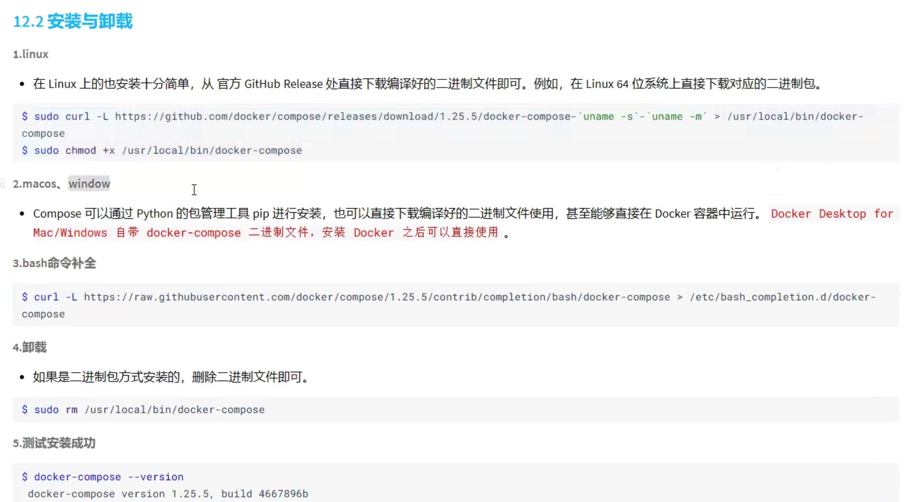
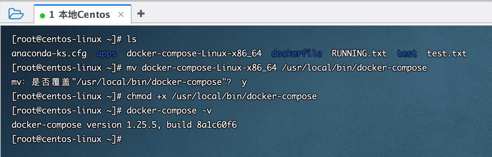

### 一、简介

Docker Compose是Docker官方的开源项目，负责实现对Docker容器集群的快速编排。

它的定位是【定义和运行多个Docker容器的应用】，其前身是开源项目Fig. 同时可以对多个容器进行编排。

 

### 二、核心概念

服务：一个应用的容器，服务可以存在多个

项目：由一组关联的应用容器组成的一个完整业务单元，在 docker-compose.yml 文件中定义。

### 三、Compose 使用

a、下载docker-compost

curl -L https://github.com/docker/compose/releases/download/1.25.5/docker-compose-`uname -s`-`uname -m` > /usr/local/bin/docker-compose

sudo chmod +x /usr/local/bin/docker-compose



下载可能很慢，可以直接去github下载，https://github.com/docker/compose/releases/download/1.25.5/docker-compose-Linux-x86_64，

将下载的docker-compose放入/usr/local/bin/docker-compose

添加权限：sudo chmod +x /usr/local/bin/docker-compose

查看版本 docker-compose -v



### 四、模板命令总结

```doc
services:
	服务id：
		build: #启动服务时先将build命令中指定Dockerfile打包成镜像，再运行该镜像
      context: demo # 指定上下文目录dockerfile所在目录
      dockerfile: Dockerfile
		image: # 使用镜像是谁， image:tag image image:@digest
		container_name: # 服务启动之后容器名称 相当于docker run 之后的 --name
		ports: # 用来指定容器与宿主机端口映射 相当于docker run之后的 -p
			- "808:8080"
		volumes: # 用来指定容器中目录与宿主机目录进行数据卷映射 docker run 之后的 -v
			- /root/apps:容器内路径
			- aa（自动）:容器内路径 注意：一旦使用卷名自动，必须通过volumes进行声明
		networks: # 用来指定容器使用的是哪个网桥 docker run --networks
			- ems （网桥名称自动创建）注意：一旦指定网桥，必须通过network进行声明
		environment: # 用来给容器中某些环境进行赋值操作
			- MYSQL_ROOT_PASSWORD=root
		env_file:# 用来给容器中某些环境进行赋值操作，将环境变量赋值转移到配置文件中
			- mysql_env 文件中内容必须是MYSQL_ROOT_PASSWORD=root
		command: redis-server /usr/redis/conf/redis.conf # 用来覆盖容易自动默认指令
		depends_on: #用来指定当前服务启动依赖哪些服务，依赖的服务会在当前服务之前优先启动
			- mysql
			- redis
		healthcheck: #心跳机制
			healthcheck: #心跳检查
      test: ["CMD","curl","-f","http://localhost"]
      interval: 1m30s
      timeout: 10s
      retries: 3
    sysctls: #用来修改容器中系统内部参数，并不是必须，有些服务启动受容器内操作系统参数限制可能会无法启动必须通过修改容器中参数才能启动
      - net.corn.somaxconn=1024
      - net-ipv4.tcp_syncookies=0
    ulimits: # 用来修改容器中系统内部进程数限制 日后使用时可根据当前容器运行服务要求进行修改
      nproc: 65535
      nofile:
        soft: 20000
        hard: 40000
    
volumes:
	aa: 
networks:
	ems:
```


### 五、Hello world 程序

docker-compose.yml

```dockerfile
version: "3.8" # 官方网址：https://docs.docker.com/engine/reference/builder  支持3.8
services: # 用来书写当前项目中哪些容器 服务
  demo:
    build: #启动服务时先将build命令中指定Dockerfile打包成镜像，再运行该镜像
      context: demo # 指定上下文目录dockerfile所在目录
      dockerfile: Dockerfile
    container_name: demo # 指定构建成功之后的镜像后面的运行名称
    ports:
      - "8082:8080"
    network_mode:
      -  hello
    depends_on:
      - tomcat01

  tomcat01: # 服务名称
    image: tomcat:8.0-jre8 # 指定使用镜像  iamge:tag
    container_name: tomcat01 # 指定启动时容器名称 --name
    ports: # 指定容器端口与宿主机端口映射 -p
      - "8080:8080"
    volumes: # 指定容器中哪个路径与宿主机中路径进行数据卷映射
#      - /root/apps:/usr/local/tomcat/webapps
      - tomcatwebapps01:/usr/local/tomcat/webapps
    networks: # 指定容器启动之后使用哪个网桥 --network
      - hello
    depends_on: # 代表这个容器必须依赖哪些容器启动之后can呢个启动
      - tomcat02 # 书写的是服务名
      - redis
      - mysql
    healthcheck: #心跳检查
      test: ["CMD","curl","-f","http://localhost"]
      interval: 1m30s
      timeout: 10s
      retries: 3
    sysctls: #用来修改容器中系统内部参数，并不是必须，有些服务启动受容器内操作系统参数限制可能会无法启动必须通过修改容器中参数才能启动
      - net.corn.somaxconn=1024
      - net-ipv4.tcp_syncookies=0
    ulimits: # 用来修改容器中系统内部进程数限制 日后使用时可根据当前容器运行服务要求进行修改
      nproc: 65535
      nofile:
        soft: 20000
        hard: 40000

  tomcat02: # 服务名称
    image: tomcat:8.0-jre8 # 指定使用镜像  iamge:tag
    container_name: tomcat02 # 指定启动时容器名称 --name
    ports: # 指定容器端口与宿主机端口映射 -p
      - "8081:8080"
    volumes: # 指定容器中哪个路径与宿主机中路径进行数据卷映射
#      - /root/apps:/usr/local/tomcat/webapps
      - tomcatwebapps02:/usr/local/tomcat/webapps
    networks: # 指定容器启动之后使用哪个网桥 --network
      - hello
    healthcheck: #心跳检查
      test: ["CMD","curl","-f","http://localhost"]
      interval: 1m30s
      timeout: 10s
      retries: 3

  mysql: #服务名称
    image: mysql:5.7.32
    container_name: mysql
    ports:
      - "3307:3306"
    volumes:
      - mysqldata:/var/lib/mysql
      - mysqlconf:/etc/mysql
    #environment:
    #  - MYSQL_ROOT_PASSWORD=root
    env_file: #用来将environment环境中配置放入指定文件中 mysql.env 的内容 请查看下文
      - mysql.env
    networks:
      - hello
    healthcheck: #心跳检查
      test: ["CMD","curl","-f","http://localhost"]
      interval: 1m30s
      timeout: 10s
      retries: 3

  redis: #服务名称
    image: redis:5.0.10
    container_name: redis
    ports:
      - "6380:6379"
    volumes:
      - redisdata:/data
    networks:
      - hello
    command: "redis-server --appendonly yes" # run 镜像之后用来覆盖容器内容默认命令
    healthcheck: #心跳检查
      test: ["CMD","curl","-f","http://localhost"]
      interval: 1m30s
      timeout: 10s
      retries: 3

volumes: #定义服务所使用到的卷名
  tomcatwebapps01: # 服务中使用到的volume变量需要在这里定义 compose自动创建该卷名但是会在之前加上项目名
    external: # 使用自定义卷名
      false  # true确定使用指定卷名，注意：一旦使用外部自定义卷名启动服务之前必须手动创建
  tomcatwebapps02:
  mysqldata:
  mysqlconf:
  redisdata:

networks: #定义服务用到的网桥
  hello: # 服务中使用到的网桥变量需要在这里定义
    external:
      false  # true确定使用指定卷名，注意：一旦使用外部自定义卷名启动服务之前必须手动创建


```

mysql.env：

```
MYSQL_ROOT_PASSWORD=root
```

### 六、docker-compose 指令

#### 1、模板指令和指令

模板指令：用来书写在docker-compose.yml文件中指令称之为模板指令，用来为服务进行服务的

指令：用来对整个docker-compose.yml对应的这个项目操作，书写docker-compose命令之后的命令

​			docker-compose up(指令)

#### 2、常用指令

+ up 指令

  作用：用来启动所有docker-compose 服务

  选项：-d 后台启动所有服务

+ down 指令

  作用：用来关闭所有docker-compose服务，并移除自动创建的网桥

+ exec 指令

  作用：进入容器

  docker-compose exec 服务id(redis) bash

+ ps 指令

  作用：用来展示当前docker-compose运行的所有容器

  ​	docker-compse ps

+ restart 指令

  作用： 用来重启项目中某个服务如果不写服务id ，默认重启所有服务

  ​	docker-compose restart [服务id]

+ rm 指令

  作用：用来删除项目服务

  ​	docker-compose rm -fv 注意：谨慎操作，-v会删除服务的数据卷

+ start / stop 指令

  作用：启动和停止服务

  ​	docker-compose start 服务id

  ​	docker-compose stop 服务id，不会移除网桥

+ top 指令

  作用：用来查看compose容器中的进程

  ​	docker-compose top 【服务id】

+ pause / unpause 指令

  作用：暂停和恢复服务

  ​	docker-compose pause 【服务id】

  ​	docker-compose unpause 【服务id】

+ logs 指令

  作用：查看日志信息

  ​	docker-compose logs【服务id】

### 七、docker可视化工具 portainer

#### 1、下载可视化

​	docker pull portainer/portainer

#### 2、启动portainer

```shell
docker run -d 
					 -p 8000:8000
					 -p 9000:9000
					 --name=portanier
					 --restart=always # 停止就重启
					 -v /var/run/docker.sock:/var/run/docker.sock
					 -v portainer_data:/data
					 portainer/portainer

# 执行如下命令
docker run -d -p 8000:8000 -p 9000:9000 --name=portanier --restart=always -v /var/run/docker.sock:/var/run/docker.sock -v portainer_data:/data portainer/portainer
```

#### 3、查看后台管理

http://10.211.55.3:9000/#/containers

