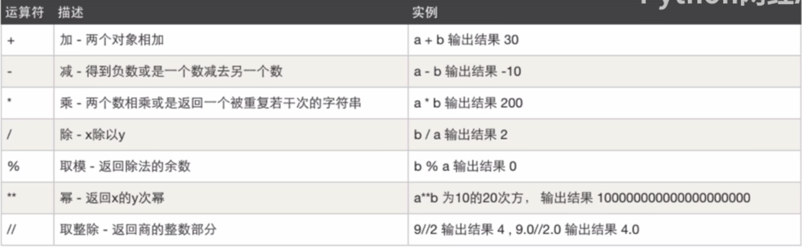
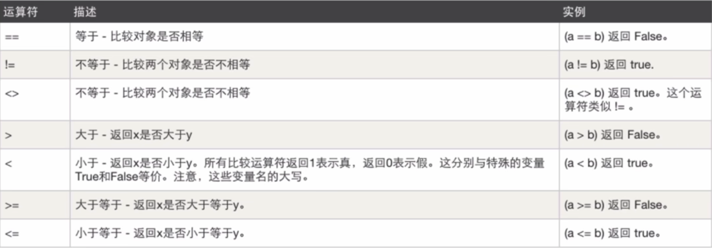
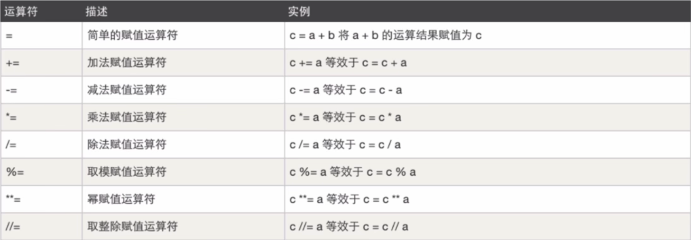
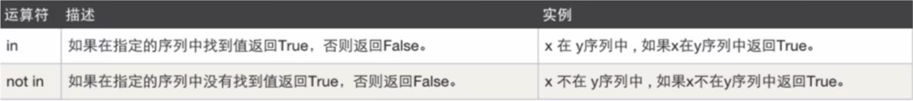
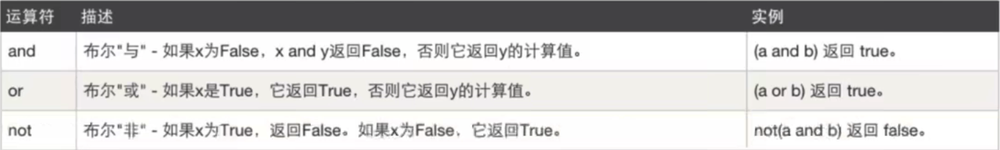

## 1、变量

变量就是一别名。格式为【变量名 = 值】

```python
name = "mxn"
age = 10
merry = True

print(name)
print(age)
print(merry)
```

说明：

+ 给变量赋值 `age = 18`
+ 让age代指值 `age=18`

### 1.1 变量规范

三个规范：

+ 变量名只能有字母，数字，下划线组成
+ 不能以数字开头
+ 不能用python内置的关键字作为变量（python编辑器会提示，如果你是用来内置的关键字）

两个建议：

+ 下划线连接命名方式（小写）

  ```python
  father_name = "mxn"
  brother_name = "pad"
  ```

+ 见名知意

 ### 1.2 变量内存指向关系

+ 第一种情况

  ```python
  name = "wupeiqi"
  ```

  在计算机的内存中创建一块区域保存字符串“wupeiqi”，name变量名则指向这块区域

  

+ 第二种情况

  ```python
  name = "wuupeiqi"
  name = "alex"
  ```

  在计算机的内存中创建一块区域保存字符串“wupeiqi"，name变量名则指向这块区域，然后又再内存中创建了一块区域保存字符串”alex“，name变量名则指向”alex“所在的区域，不再指向”wupeiqi“所在区域（无人指向的数据会被标记为垃圾，由解释器自动化回收）

  

+ 第三种情况

  ```python
  name = "wupeiqi"
  new_name = name
  ```

  在计算机的内存中创建一块区域保存字符串”wupeiqi"，name变量名则指向这块区域，new_name变量名指向name变量，因为被指向的是变量名，所以自动会转指向到name变量代表的内存区域。

  

+ 第四种情况

  ```python
  name = "wupeiqi"
  new_name = name
  name = "alex"
  ```

  在计算机的内存中创建一块区域保存字符串“wupeiqi”，name变量名则指向这块区域，然后new_name指向name所指向的内存区域，最后又创建了一块区域存放“alex”，让name变量指向”alex“所在区域。

  

+ 第五种情况

  ```python
  name = 18
  age = str(name)
  ```

  在计算机的内存中创建一块区域保存整型18，name变量名则指向这块区域，通过类型转换依据整型18再在内存中创建一个字符串”18“，age变量指向保存这个字符串的内存区域。

  

## 2、注释

写代码的时候，对代码的解释说明。

+ 单行注释

  ````python
  # 声明一个变量
  name = "mxn"
  
  #name = "zp"
  
  age = 19 #他的年龄是19
  ````

+ 多行注释

  ```python
  """
  多行注释内容
  """
  
  """
  多行注释
  name = "mxn"
  age = 19
  """
  ```

  

## 3、输入

输入，可以实现程序和用户之间的交互。

```python
name = input("请输入用户名：")
print(name)
```

**注意**：用户输入的内容都是字符串

## 4、条件语句

### 4.1 基本条件判断

语法：

```python
if 条件:
    条件成立的代码
    条件成立的代码1
    条件成立的代码2
else:
  	条件不成立的代码
    条件不成立的代码1
    条件不成立的代码2
```

例如：

```python
name = input("请输入内容：")
if name == "mxn":
    print("爸爸你好")
else:
    print("输入错误")
    
if 1==1:
  	print("1确实等于1")
else:
  	print("你有点憨")
输出：
1确实等于1

name = 10
if name > 0
	print("是的")
else
	print("错的")
输出：
是的

username = "mxn"
password = "666"
if username == "mxn" and password = "666":
		print("登录成功")
else:
  	print("登录失败")
输出：
登录成功

username = "mxn"
if username == "mxn" or username == "zp":
  	print("自己人")
else:
  	print("no")
输出：
自己人

num = 10
if num % 2 == 1:
  	print("是奇数")
else:
  	print("是偶数")
输出：
是偶数


```

提醒：建议缩进4个空格，当然两个也可以。条件成立或者不成立下的代码缩进一定要一致。

### 4.2 多条件判断

语法：

```python
if 条件A:
  	A成立代码
    A成立代码2
elif 条件B:
  	B成立代码
    B成立代2
elif 条件C:
  	C成立代码
    C成立代码2
else:
  	都不成立代码
  	都不成立代码2
```

示例：

```python
score = input("请输入分数：")
realScore = int(score)

if realScore > 90:
    print("优秀")
elif realScore > 80:
    print("良好")
elif realScore > 60:
    print("及格")
else:
    print("不及格")
```

### 4.3 条件嵌套

语法：

```python
if 条件A:
		if 条件A1:
      	条件A1满足
    else:
      	条件A1不满足
else:
  	条件A不成立
```

实例：

```python
print("欢迎致电10086，我们提供如下服务：1.话费相关；2.业务办理")

choice = input("请选择服务序号：")

if choice == "1":
    print("你选择了话费服务")
    cost = input("查询话费请按1，查询流量请按2")
    if cost == "1":
        print("话费余额不足10元")
    else:
        print("流量还有100M")
elif choice == "2":
    print("暂不提供服务")
else:
    print("代号输入有误")
```

## 5、循环语句

### 5.1 while循环

语法：

```python
while 条件:
  	条件成立之后代码
  	条件成立之后代码1
  	条件成立之后代码2
```

示例：

```python
# 示例1
while True:
  	print("祝你开心一整天")
    
输出：
一直输出  祝你开心一整天  造成死循环

# 示例2
while 1 < 2:
  	print("祝你开心一整天")
    
输出：
一直输出  祝你开心一整天  造成死循环

# 示例3
flag = True
while flag:
  	print("祝你开心一整天")
    flag = false
    
输出：
输出一个 祝你开心一整天 循环结束

# 示例4
num = 1
while num > 0:
  	print("祝你开心一整天")
    num = 0
    
输出：
输出一个 祝你开心一整天 循环结束

# 示例5
num = 1
while num < 5:
  	print("祝你开心一整天")
    num = num + 1

输出：
输出4个 祝你开心一整天 循环结束

```

+ **循环终止 break**

  break 用于在while循环中帮你终止循环

  ```python
  num = 1
  while True:
    	print(num)
  		if num > 4:
      		break  
      num = num + 1
  
  输出:
  1
  2
  3
  4
  5
  ```

+ **continue**

  在循环中结束本次循环，直接进入下一次循环、

  ```python
  num = 0
  while num < 11:
      num = num + 1
      if num % 2 == 1:
          continue
      print("遇到了一个偶数 "+str(num))
  输出：
  遇到了一个偶数 2
  遇到了一个偶数 4
  遇到了一个偶数 6
  遇到了一个偶数 8
  遇到了一个偶数 10
  ```

+ **while else**

  ```python
  while 条件:
    	代码
  else:
    	代码
  
  num = 1
  while num < 5:
    	print(num)
      num = num + 1
  else:
    	print("数字大于等于5了")
  输出：
  1
  2
  3
  4
  数字大于等于5了
  
  while True:
    	print("我就输出一次")
      break
  else:
    	print("被break掉之后我不会被执行")
  输出：
  我就输出一次
  ```

  注意：如果循环是被break掉的，那个while后面的else也是不会被执行的。

### 5.2 for 循环

语法：

```python
for 变量名 in 目标数据:
		代码
```

示例：

```python
message = "mxn是好人"
for item in message:
  	print(item)
输出：
m
x
n
是
好
人 
```


## 6、字符串格式化

字符串格式化，使用更加便捷的形式实现字符串的拼接。

### 6.1 %

+ 基本格式化操作

  ```python
  # 示例1
  name = "mxn"
  # 占位符
  text = "我叫%s,大家好" % name
  print(text)
  输出：
  我就叫mxn,大家好
  
  # 示例2
  name = "mxn"
  age = 19
  # 占位符
  text = "我叫%s,大家好,今年%d岁" %(name,age)
  print(text)
  输出：
  我叫mxn,大家好,今年19岁
  
  # 示例3
  message = "%(name)s我想你了，你来玩%(day)s天好吗" % {"name": "mxn","day":3}
  print(message)
  输出：
  mxn我想你了，你来玩3天好吗
  ```

+ %转译

  ```python
  # 示例1 如果文本中出现%并且需要原样输出，需要书写两个%%，相当于转译
  text = "%s，我作业已经做了90%%了，你怎么样了"%"mxn"
  print(text)
  输出：
  mxn，我作业已经做了90%了，你怎么样了
  ```

### 6.2 format（推荐）

```python
# 示例1
newText = "我叫{0}，今年{1}岁，身高{2}cm".format("mxn",18,187)
print(newText)
输出：
我叫mxn，今年18岁，身高187cm

# 示例2 参数复用
newText = "我叫{0}，今年{1}岁，我真的叫{0}".format("mxn",18)
print(newText)
输出：
我叫mxn，今年18岁，我真的叫mxn

# 示例3 使用别名
text = "我叫{name}".format(name="mxn")
print(text)
输出：
我叫mxn
```

### 6.3 f

python3.6之后才支持，更加便捷。

```python
# 示例1
action = "跑步"
text = f"嫂子喜欢{action}，跑完之后满身大汗~"
print(text)
输出：
嫂子喜欢跑步，跑完之后满身大汗~

# 示例2
name = "mxn"
age = 19
text = f"嫂子的名字叫{name}，今年{age}岁"
print(text)
输出：
嫂子的名字叫mxn，今年19岁

# 示例3 可以进行计算
text = f"我的年龄是{1+2}岁"
print(text)
输出：
我的年龄是3岁

# 示例3 可以进行计算
text = f"我的年龄是{1+2=}岁"
print(text)
输出：
我的年龄是1+2=3岁

# 示例4 进制之前的转换
v1 = f"嫂子今年{22}岁"
print(v1)
v2 = f"嫂子今年{22:#b}岁"
print(v2)
v3 = f"嫂子今年{22:#o}岁"
print(v3)
v4 = f"嫂子今年{22:#x}岁"
print(v4)
输出：
嫂子今年22岁
嫂子今年0b10110岁
嫂子今年0o26岁
嫂子今年0x16岁

# 示例五 表达式运算
name = "mxn"
text = f"我是{name.upper()}"
print(text)
输出：
我是MXN
```

## 7、运算符

### 7.1 算术运算符

加减乘除



### 7.2 比较运算符

大于，小于



注意：python3 中不支持 <>

### 7.3 赋值运算符

变量赋值



### 7.4 成员运算 

是否包含



### 7.5 逻辑运算

且或非



### 7.6 运算符优先级

元素安抚的优先级有很多，常见的没几个，推荐你记住三个：

+ 算数运算符优先级 大于 比较运算符
+ 比较运算符优先级  大于 逻辑运算符
+ 逻辑运算符内部三个优先级  not > and > or

上述三个优先级从高到底总结：`加减乘除>比较>not and or`