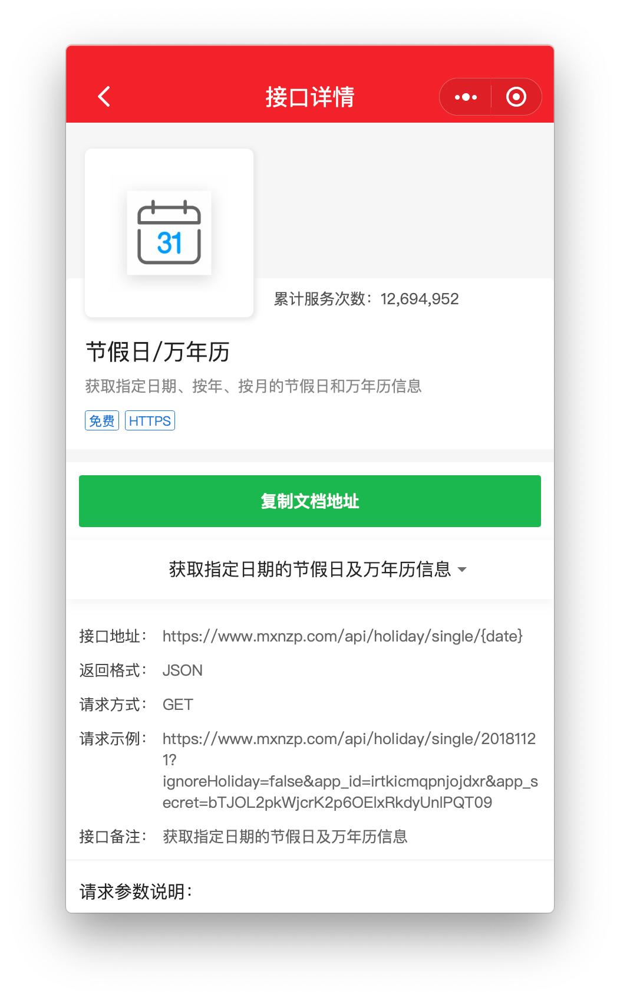

## 前言

Roll地盘是用来申请RollApi免费通用接口调用凭证的工具小程序，V1版本已经上线了一年多了，虽然有着一些bug，虽然页面内容比较单一，但也还是跌跌撞撞的陪伴了大家伙这么长时间，也顺利的完成了它的使命。

现如今，它的升级版本来了，换了全新的ui页面，也换了一份新的心情。

## 功能

除了保留最主要的申请接口凭证功能之外，将RollApi免费通用API的部分接口进行了功能化，开发了一些使用工具页面，比如【哔哩哔哩视频解析】，【抖音去水印】，【查询条码信息】，【生成二维码】等等，后续也会持续新增一些功能，也将公众号中的文章搬到了小程序，方便大家浏览与交流。另外也新增了积分模块，每日登录可以获取积分，每日签到也可以获取积分。

具体功能点：

### 功能1、优化获取app_id流程

之前获取app_id的时候，很容易出现明明申请了app_id，但是查看app_id的时候显示为空，这个也是在之前的版本中用户反馈最多的问题，现在已经修复了。

### 功能2、新增了一些在线工具

+ **条码查询商品信息**

  

+ **哔哩哔哩视频解析**

  

+ **生成二维码**

  

+ **今日老黄历**

  

+ **生成短链**

  

+ **抖音视频去水印**

  

### 功能3、新增积分模块

为什么就会有积分模块呢？是因为目前所有的接口都是免费的，所以我会使用最少的成本去开发接口，像音视频相关的接口都不会开放，走的都是oss，走的都是钱，那么有积分之后，后续将会推出积分兑换请求次数调用特殊接口的功能，比如调用段子乐的图片和视频接口等等。

不过不用担心的是，目前所有存在的接口都不会有所变动，你可以继续正常使用，积分兑换请求次数的接口会在后续开发中陆续推出。

### 功能4、首页新增了文章模块

首页新增了文章的模块，文章的来源是《Cretin的开发之路》和《爆笑段子乐》两个公众号的文章，希望这些文章既能给你带来快乐，也可以给你带来一些技术上的思考。还希望你能多多点赞哈~

### 功能5、API接口文档

当前小程序的版本提供了API接口文档查看的功能，可以查看到接口的详情信息。

## 最后

如果你在使用过程中有什么问题，请通过小程序的客服功能联系我，我希望它能越来越好。
