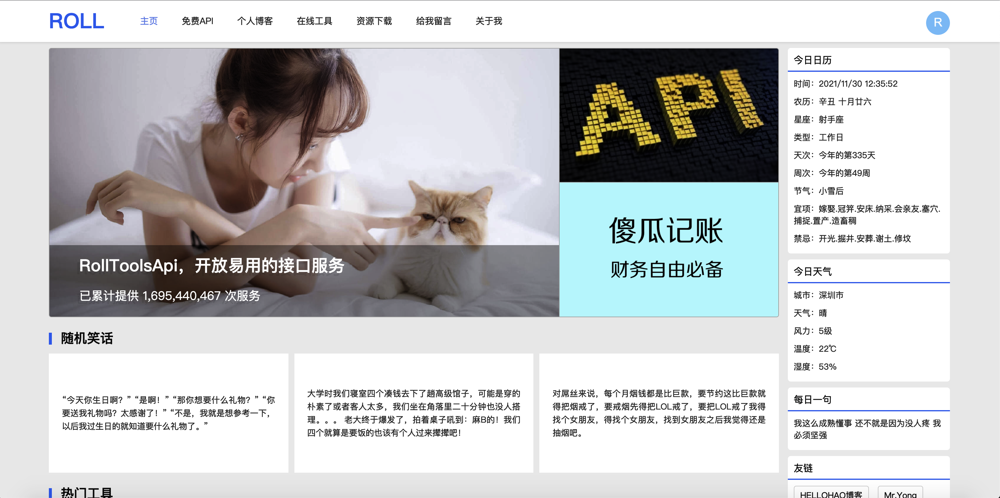
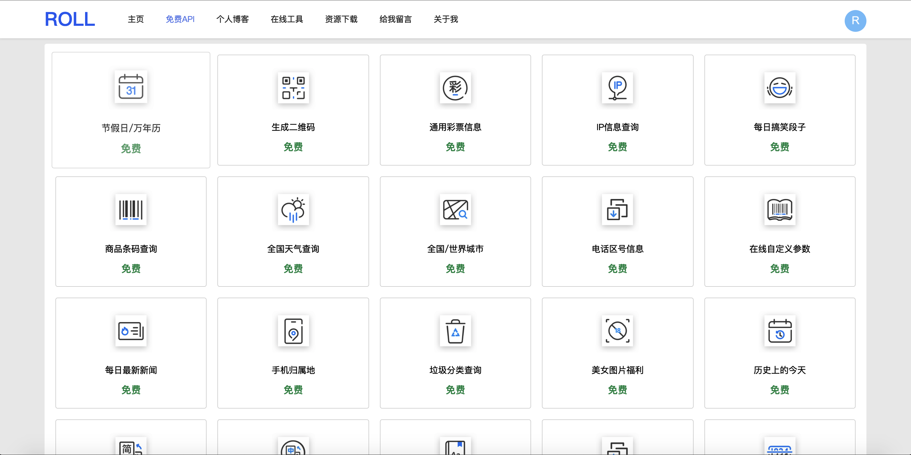
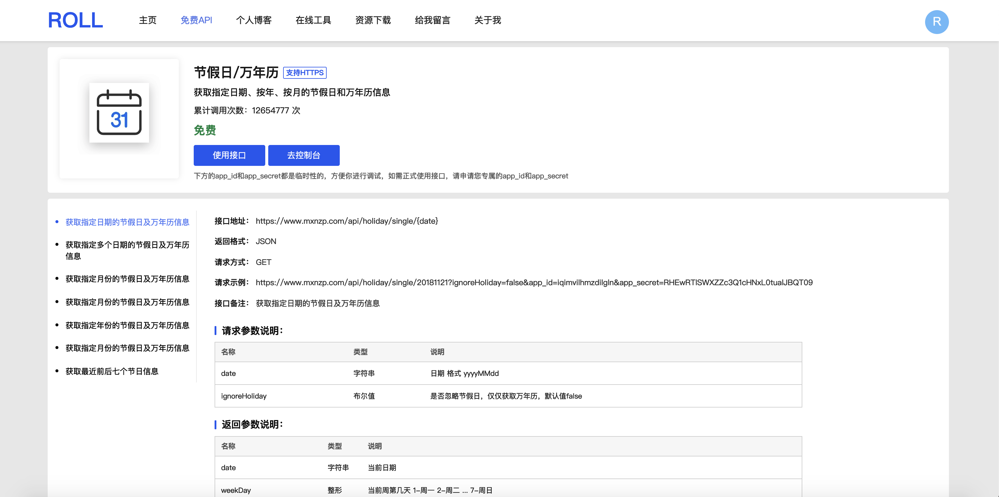
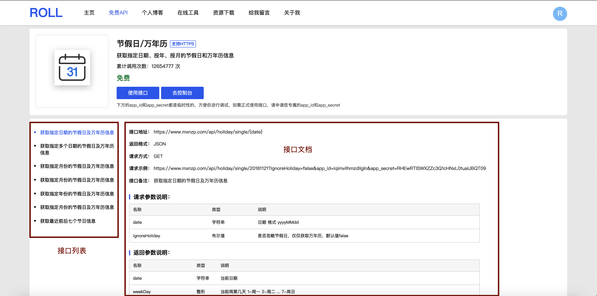
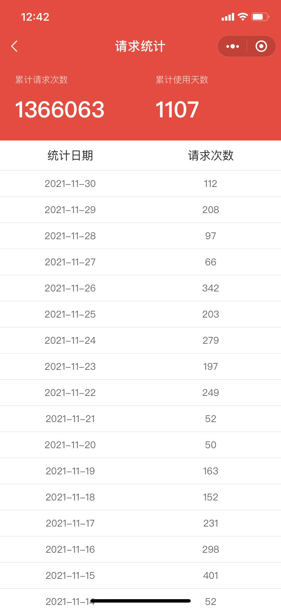
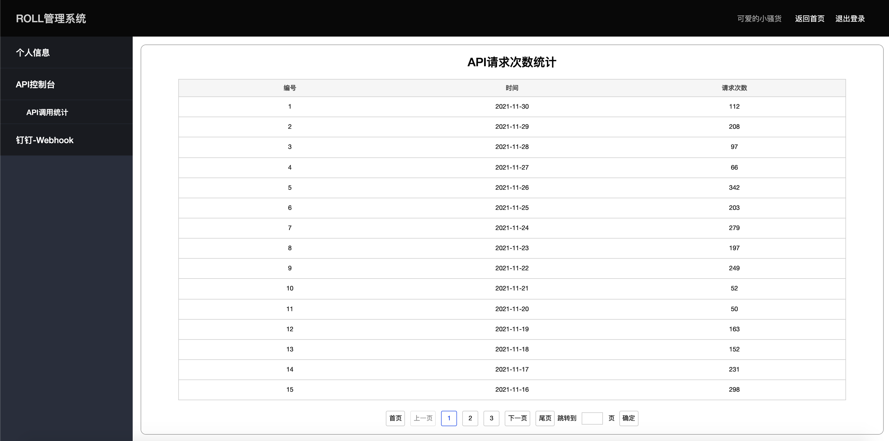
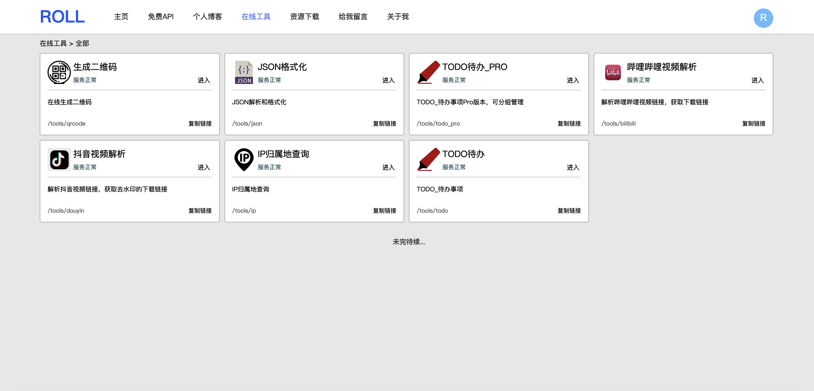

## 前言

由于某些机缘巧合，几年前启动了通用免费API【RollApi】的项目，旨在提供一些通用接口给新入行，或者学习新技术的伙伴调用，实现一些功能，随着时间的迁移，接口的数量也从几个变成十几个再到现在的几十个，服务器的配置也从入门版到现在的通用版。

最开始的接口文档是在github上更新的，但是由于很多小伙伴很难打开github，或者说访问github很不流畅，所以有了这个个人主页，主要用来提供api接口的接入文档。这个主页的技术实现是 node.js +  art-template 做的服务端渲染，这是当初在学习nodejs的时候留下来的作品，虽然后面学习了vue之后觉得这个个人主页做的很low，但毕竟是个技术的产物，就没有替换，继续在使用nodejs+art在维护。

## 使用

> 注意：个人主页没有做手机端适配，访问请使用pc浏览器

### 1、请访问：[https://www.mxnzp.com](https://www.mxnzp.com/)

### 2、点击顶部【免费API】即可访问所有接口的列表，[https://www.mxnzp.com/doc/list](https://www.mxnzp.com/doc/list)

### 3、点击其中一个查看详情，例如查看第一个：[https://www.mxnzp.com/doc/detail?id=1](https://www.mxnzp.com/doc/detail?id=1)

### 4、页面左边是接口的子接口列表，右边是子接口的说明文档

### 5、接口需要申请APP_ID和APP_SECRET，点击查看如何申请。[http://blog.mxnzp.com/?p=59](http://blog.mxnzp.com/?p=59)

### 6、查看请求详情，第一种方式，搜索小程序【Roll地盘】，我的页面点击顶部今日请求或者累计请求次数可进入请求统计页面查看，第二种方式，打开 https://www.mxnzp.com ，登录之后绑定APP_ID和APP_SECRET后在控制台可查看。

## 其他

当前站点也提供了一些在线工具。请访问：[https://www.mxnzp.com/tools/home](https://www.mxnzp.com/tools/home)

