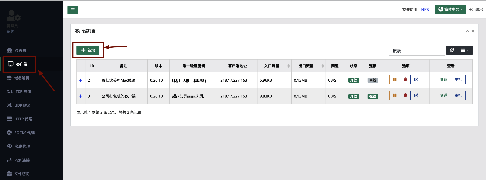
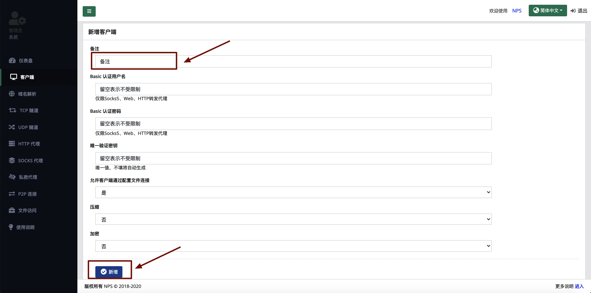
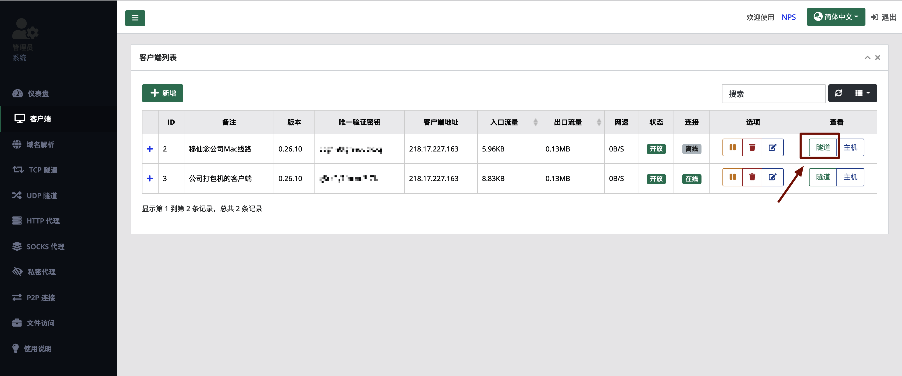
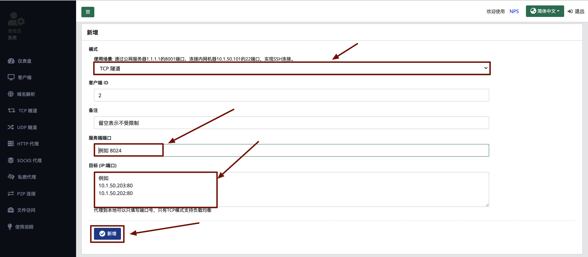
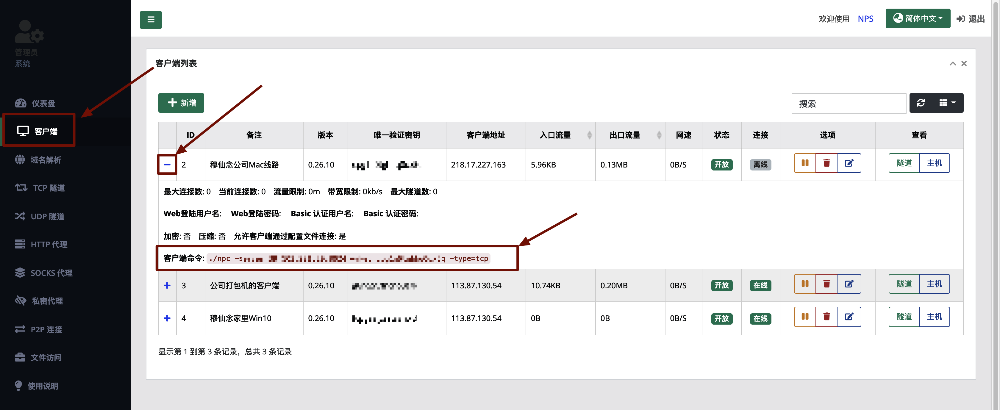
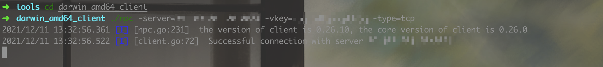
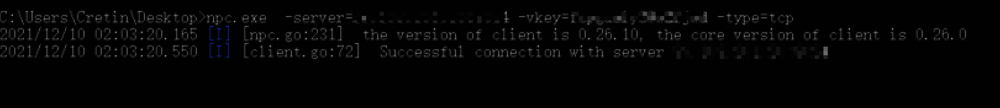
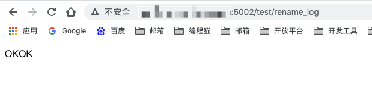

## 前言

先说下背景，大家通常使用内网穿透，一般都是用在那种开发公众号的时候，联调的时候需要在公众号配置公网可以访问的请求地址，所以需要内网穿透到本机的某个端口，方便联调。但是我这次使用内网穿透，是为了做一个骚操作。

我们呢每天完成开发任务之后，提交代码是需要提Merge Request的，但是使用GItlab的同学都知道，Gitlab上要发起一个Merge Request是很麻烦的一件事情，起码要点击5次跳转三个页面才能完成，像我这么懒的人，怎么会允许这种行为呢？于是开发了一个push自动发起Merge Request的东西。

核心原理就是在你commit的时候，在message里面写入一段指令，例如：修复了xxxbug，[[mq -u mxn -b xxx]]，两个中括号内的内容就是指令，mq是指令名称，意在发起merge request，-u指的是你发起mq的成员对象，-b值得是你当前分支的代码将要mq到哪个分支。一旦commit之后再push代码，就会执行指令，自动发起mq...  

其中的一些实现逻辑就不讲了，先说说遇到的问题。要知道，Gitlab是搭建在公司内网中的，所以云服务器上是不能直接访问Gitlab自带的api的，所以我需要一条桥梁，就是阿里云服务器到公司内网的桥梁，正好我们公司有一台打包机，是7*24小时待机的，所以我打算在云服务器上搭建内网穿透服务，然后穿透到公司内网上的打包机上，在打包机上启动一个转发请求的springboot服务，这个服务的作用就是请求指定的url，然后将url请求到的数据原封不动的返回给调用方，这样通过内网穿透，就能实现在云服务器上访问公司内网的资源了。

看起来好像挺绕的~~

## 如何搭建

其实，可以选择的内网穿透的工具挺多的，比如Frp，Ngrok，Nps等等，我是怎么选的呢，我是看后台管理系统哪个好看就用哪个，所以我选了Nps。

首先，贴出Nps Github地址：https://github.com/ehang-io/nps

> 如果你只是想免费用一下内网穿透，你可以直接跳到第3步。

**什么是Nps？**

> NPS 是一款轻量级、功能强大的内网穿透代理服务器。支持 tcp、udp 流量转发，支持内网 http 代理、内网 socks5 代理，同时支持 snappy 压缩、站点保护、加密传输、多路复用、header 修改等。支持 web 图形化管理，集成多用户模式。管理系统比 FRP 方便很多，更容易上手。

### 1、搭建服务端工具

> 配置要求：
>
> 1、需要一台有公网ip的服务器
>
> 2、开放端口，比如我这里的7500，8024，5000~5099（用来给朋友开放入口）

服务端是Centos的系统，选择下载：[linux_amd64_server.tar.gz](https://github.com/ehang-io/nps/releases/download/v0.26.10/linux_amd64_server.tar.gz)，下载地址是：https://github.com/ehang-io/nps/releases/download/v0.26.10/linux_amd64_server.tar.gz，我盲猜有很多人下载不下来，所以我放到我自己的文件服务器了：http://www.cretinzp.com:8029/file/2021/12/10/linux_amd64_server.tar.gz。

+ 下载完成之后，解压，进入文件夹，执行安装命令：

```shell
sudo ./nps install
```

+ 启动nps服务

```shell
sudo nps start
```

+ 停止和重启

```shell
sudo nps stop
sudo nps restart
```

+ 查看启动日志

一般来讲，第一次启动都会报错，我盲猜你的服务器应该使用了nginx，所以80端口被占用，正好nps也要使用80端口，所以就会失败，正好用下面的命令查看错误日志。

```shell
vi /var/log/nps.log
```

至此，服务端就安装完了，贼快是吧，然后可以去看下管理后台长啥样。

- 访问服务端ip:web服务端口（默认为8080）
- 使用用户名和密码登陆进入管理后台（默认admin/123，正式使用一定要更改）

### 2、在管理端创建客户端

+ 进入管理后台之后，选择左边客户端，点击右边新增按钮



+ 填写客户端备注，点击新增



+ 回到客户端列表，选择一台客户端，添加隧道，然后点击新增隧道按钮



+ 选择tcp隧道，服务端端口随便填写一个不冲突的端口数字，目标地址填写你需要映射到的内网ip+端口，后续将会访问服务端的这个端口号映射到你的内网目标地址。最后点击新增。比如这里我定义服务端端口为5002，目标ip为：127.0.0.1:8011



这样，一个客户端就算创建完成了。

### 3、搭建客户端工具

+ **3.1 下载客户端工具**
+ 3.1.1 如果你是Mac系统

  请下载nps客户端程序，选择[darwin_amd64_client.tar.gz](https://github.com/ehang-io/nps/releases/download/v0.26.10/darwin_amd64_client.tar.gz)，下载地址为https://github.com/ehang-io/nps/releases/download/v0.26.10/darwin_amd64_client.tar.gz，我盲猜有很多人下载不下来，所以我放到我自己的文件服务器了：http://www.cretinzp.com:8029/file/2021/12/11/darwin_amd64_client.tar.gz

  下载后解压，可以获得 nps的运行程序。

+ 3.1.2 如果你是Windows系统

  请下载nps客户端程序，选择[windows_amd64_client.tar.gz](https://github.com/ehang-io/nps/releases/download/v0.26.10/windows_amd64_client.tar.gz)，下载地址为https://github.com/ehang-io/nps/releases/download/v0.26.10/windows_amd64_client.tar.gz，我盲猜有很多人下载不下来，所以我放到我自己的文件服务器了：http://www.cretinzp.com:8029/file/2021/12/11/windows_amd64_client.tar.gz

  下载后解压，可以获得 nps的运行程序。

+ **3.2 复制运行指令**

进入客户端列表，点击你需要使用的客户端左边的+号，在展开的信息中复制客户端命令



+ **3.3 运行客户端**

+ 3.3.1 如果你是Mac系统

  进入到npc所在目录，执行 ./npc -server=xxx:xxx -vkey=xxx -type=tcp， ./npc后面的命令都是从上一步骤中复制过来的。

  

+ 3.3.2 如果你是Windows系统

  打开cmd，进入到npc所在目录，执行 npc.exe -server=xxx:xxx -vkey=xxx -type=tcp， ./npc后面的命令都是从上一步骤中复制过来的。

  > 如果使用`powershell`运行，**请将ip括起来！**

  

+ **3.4 验证效果**

我本地有个8011的端口正在提供服务，并且提供了一个test接口，接口地址为 /test/rename_log，于是我请求 serveradd:5002/test/rename_log 进行验证。如果你发现没有反应，有可能是服务器端口未被开放，比如我这里的5002端口需要被开放才可以访问到。具体请搜索




## 如何申请免费隧道？

前段时间双十一，购买了一台3年10M的服务器，于是在上面搭建了nps，现在我自己也在用，所以也开放给关注我的朋友们使用，如果你正好需要一个内网穿透的服务，但是你没有服务器资源可以拿来做这个，那么你可以在我这里申请一条免费的线路，以解燃眉之急。

关注《Cretin的开发之路》，回复#12，即可申请免费线路。


## 关于我

> 如果你觉得我搞的一些小东西还挺好玩的，别忘了动动你的小手帮我分享一下，在此谢谢你了

如果你也喜欢折腾一些东西，你可以通过留言，客服找到我，正好，我也喜欢折腾一些东西，我们可以做朋友。

欢迎访问我的个人主页：[https://www.mxnzp.com](https://www.mxnzp.com)
新搭建的博客主站：[http://blog.mxnzp.com](http://blog.mxnzp.com/)
Github地址：https://github.com/MZCretin