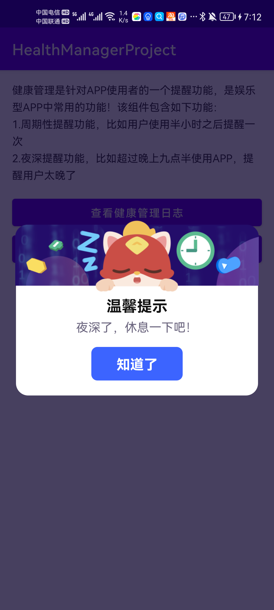

## 1、背景

细心的同学发现了没有，抖音早就加上了时间管理的功能，旨在让你刷抖音刷时间长了给你一个提示，正好我们最近也开发了这样的需求，索性抽取出来，做成了SDK，让你用少量的配置就可以实现这个功能，基本没有什么侵入。

## 2、功能

该组件包含如下功能：

+ 1.周期性提醒功能，比如用户使用半小时之后提醒一次
+ 2.夜深提醒功能，比如超过晚上九点半使用APP，提醒用户太晚了
+ 3.SDK提供日志页面和参数配置页面，方便测试进行验证
+ 4.支持ui自定义
+ 5.代码完全无侵入，集成超级简单
+ ...没了

## 3、实现原理

实现方式就是利用handler的sendEmptyMessageDelayed去执行延时任务，另外监听了应用生命周期的变化，及时的去取消延迟任务以及记录任务剩下的时间，真的没别的了。

## 4、集成方式

+ Step 1 Add it in your root build.gradle at the end of repositories:

  ```
  allprojects {
        repositories {
           ...
           maven { url 'https://jitpack.io' }
        }
     }
  ```

+ Step 2 Add the dependency

```
dependencies {
     implementation 'com.github.MZCretin:HealthManager:TAG'
}
```

+ Step 3 Init SDK and enjoy it.

  ```kotlin
          var startHour = 21
          var startMinute = 0
          var startSecond = 0
          var endHour = 6
          var endMinute = 0
          var endSecond = 0
          var overDay = 1
          var appUseLimit = 1800
          var backgroundTime = 300
  
          //健康管理
          val config = HMConfig
              //创建配置
              .createConfig()
              //设置环境 debug环境有日志输出 TAG为HealthManagerSDK
              .isDebug(BuildConfig.DEBUG)
              //设置允许APP在后台被计时的最长时间，比如设置5分钟，那么应用处于后台超过5分钟，就清空之前的计时，下次进入app就从头开始计时，否则就继续计时
              .setMaxInBackgroundTime(backgroundTime)
              //设置单次可使用的最长时间，当超过这个时间就会弹窗提醒
              .setStudyTimeLimit(appUseLimit)
              //设置欢迎页面，因为在这个页面不能显示健康管理弹窗 没有欢迎页面就不设置
              .setAppSplashActivity(SplashActivity::class.java)
              //设置周期性弹窗的ui 有一点需要注意，在你自定义的布局文件中，点击关闭的页面或者按钮的id需要是 id_health_ok，id_health_ok_v2, id_health_ok_v3, id_health_ok_4中的一个或几个
              .setLayoutCover(R.layout.activity_health_manager_cover)
              //设置夜深了弹簧ui  有一点需要注意，在你自定义的布局文件中，点击关闭的页面或者按钮的id需要是 id_health_ok，id_health_ok_v2, id_health_ok_v3, id_health_ok_4中的一个或几个
              .setLayoutDialog(R.layout.activity_health_manager_dialog)
              //设置夜深模式信息 即设置夜深模式开始的时间和结束时间 dailyNightModeOverDay指的是你设置的时间是否是跨越当日的
              //比如你设置深夜时间指的是当天晚上21：00到次日06：00 那就是 startHour = 21 startMinute = 0 startSecond = 0 endHour = 6  endMinute = 0 endSecond = 0 dailyNightModeOverDay = true
              //比如你设置深夜时间指的是当天晚上21：00到次日当天晚上23：00 那就是 startHour = 21 startMinute = 0 startSecond = 0 endHour = 23  endMinute = 0 endSecond = 0 dailyNightModeOverDay = false
              .setNightModeInfo(
                  startHour,
                  startMinute,
                  startSecond,
                  endHour,
                  endMinute,
                  endSecond,
                  overDay == 1
              )
          //初始化
          HealthManager.init(this, config)
  ```

  

## 5、效果图




## 6、源码

如果你还不能翻墙，那我也救不了你了~

https://github.com/MZCretin/HealthManager