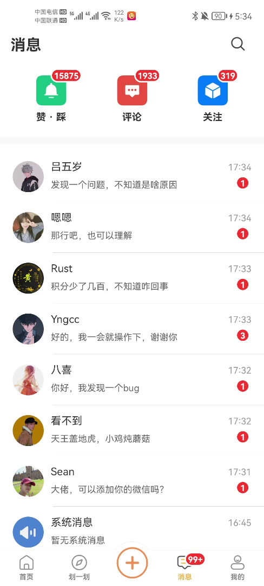
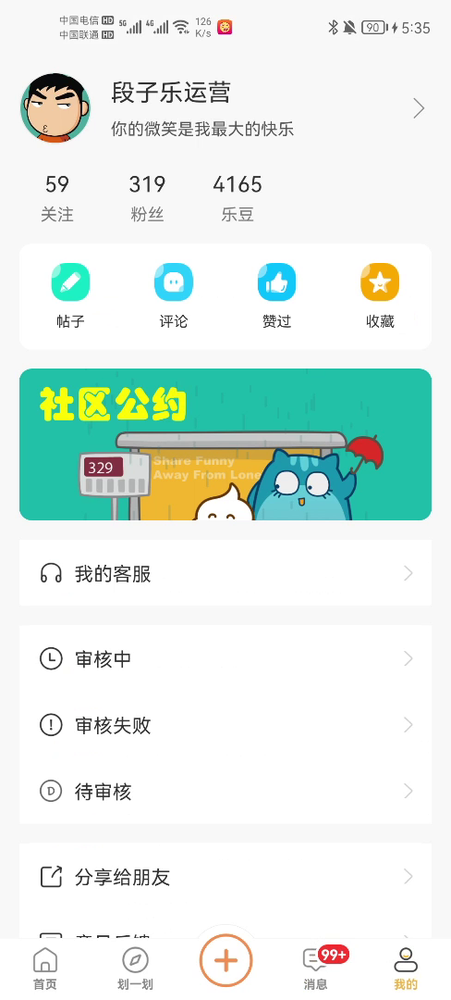
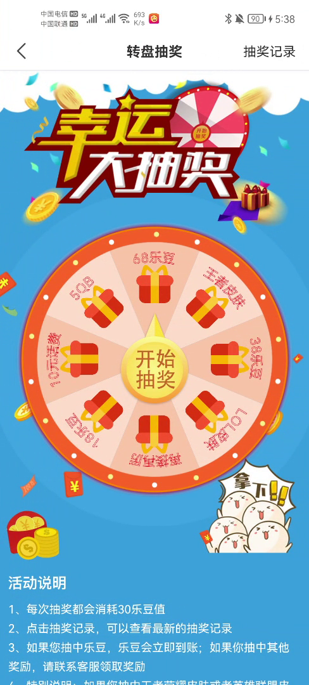

## 前言

之前听一个老铁说，一个开发者的真正蜕变，要从真正做一个属于自己的App开始，你只有自己一个人摸索、研究，真正靠自己踏上这条路，才能尝尽这条路上的酸甜苦辣，才会成长！于是，卸载掉LOL之后便踏上了《从0到1开发一个属于自己的App》这条不归路。

## 做一个什么样的APP？

其实这是一个很难确定的事情，因为如果你有一个好的想法，好到做出来就有大量用户，好到不用推广就能吸到万千粉丝，那么，你还做个屁的练手App啊，直接去创业不就好了！也不用自己开发啊，招人啊，自己当老板呀是吧！现在这个时候，基本上各个领域都已经有了相对成熟，独霸一方的App存在，所以我们不要想着，做一个App就能让自己流芳百世，一举成名了。

对于我们来讲，我们的目的是走流程，所以在功能上，不需要太苛求，做自己喜欢的就好，你只要想着，反正也不会大火就好了。对于我来说呢，我之前还是比较喜欢看段子的，所以我就打算做一个看段子的App，名为《段子乐》，经过一段时间的努力，目前已经在各大市场上线。如果有人也喜欢，可以去下载体验下，或者扫描二维码安装试试，我会一直维护这个App，直到我呜呼哀哉。。。

以下是截取的几张应用图片：

## 数据从哪里获取？

对于一个移动端的开发者来说，这其实是一个很痛苦的问题，因为我们擅长于把从服务端的获取的数据展示在App上，却不擅长创造数据。纵观现在的市场，不难得知，一个没有后台支持的App，是不可能走下去的，所以，我们也必须让我们的应用有后台数据的支持。那么问题来了，我们如何获取App上需要显示的数据？

+ **直接使用现成的网络云服务器**

其实也有一些平台为我们这些移动端的开发者考虑过这些问题，所以他们提供了一套解决方案，让我们调调接口就能实现在公网上方便的保存数据到数据库或者从数据库获取数据到本地。比如现在市场上有的[【Bmob 后端云】](https://www.bmob.cn/)和[【LeanCloud】](https://leancloud.cn/)，他们提供的服务是差不多的，对于Android开发者来说，我们只需要集成他们的SDK，就可能很轻松的实现建表，对表中的数据进行CRUD。

我用Bmob用的比较多，大学就开始接触他了，这里就对Bmob多介绍点。对于一个应用来说，用户体系往往是最重要的，有了用户，你才能往深层方向发展。Bmob也想到了这一点，从创建一个项目开始，它就默认创建了一个自己的用户体系，SDK也提供了很方便的用户管理的接口，包括发送手机验证码，对验证码的校验，用户注册，用户登录，用户重置密码，用户邮箱验证等等，这对于一个移动端开发者来说，简直就是福音，也一定程度上解决了App用户体系的常见问题。

+ **直接使用免费的公共接口**

这个虽然是有局限性的，但是在某些特定场景下也是可以使用的。比如我之前做了一个[《福彩自动对比助手》](https://www.jianshu.com/p/594c482df0d9)，主要功能就是对福利彩票上的内容进行识别，然后获取到用户购买的彩票的号码，再从网上自动获取彩票期号对应的中奖号码，与用户购买的号码进行对比，直观的告诉用户中奖情况。这里我们就需要用到免费的公共接口来获取彩票期号对应的中奖号码。再或者，对于我想做的《段子乐》来说，其实一定意义上也可以使用免费的公共接口，比如[【ShowAPI，互联网API入口 】](https://www.showapi.com/)，[【聚合数据】](https://www.juhe.cn/)，[【APIStore】](http://apistore.baidu.com/)等等上面就有很多关于笑话和段子的接口，项目初期可以直接使用上面的接口来获取段子数据。但是也是有一定的限制，比如某些接口会限制用户的调用次数等等。这当然是不友好的。

+ **终极方式，自己搭建后台服务器**

这当然是最好的一种方式，不管是数据，服务都是可控的，安全的。但是与此同时这也是成本最高的一种方式。首先，你需要学习去开发服务器端的代码，你还需要学习数据库相关的很多知识。当你摸爬滚打一段时间开发出一套后台接口之后，你还需要搭建一个线上的服务器，那么就意味着你需要购买一个云服务器，买完服务器之后，你需要在服务器里面搭建一个自己的代码运行的环境，然后你需要把你开发的代码部署到服务器上去......除此之外，买服务器意味着你要花钱，可能后面还需要买oss存储服务，cdn加速等等，还需要花更多的钱。而且，而且，而且这所有的所有，你需要自己摸索，遇到问题只能自己解决，这是很痛苦的。好在我是在阿里云购买的服务器，（其实还有很多其他平台，比如腾讯云，京东云等等），阿里的工单系统服务着实很好，响应也很快，技术服务也很到位，在一定程度上帮我解决了很多问题，在此表示感谢。

## 从0到1，我们需要从何开始？

+ **正常的开发流程**

对于企业项目的开发，粗糙的流程一般是：产品经理收到需求，与后台开发人员进行沟通，确定功能点，然后根据需求设计出原型，将原型交付给UI设计师，与此同时，后台开发人员开发出对应的API接口，UI设计师设计完成给予前端开发人员，前端开发人员先设计出页面，再与后台开发者对接API接口，将数据展示出来并完成具体功能的开发，最后上线。

+ **非正常的开发流程**

**可是我们是一个人开发呀**。

所以我们不太适用上面的开发流程。我们最开始需要做的是需求分析，我们需要确定，初始版本需要哪些功能，其次在移动端和服务端两个开发点做选择，到底是先开发移动端还是先开发服务端，这个就因人而异了，有的人喜欢先用假数据开发出一个模板，等到数据来了之后再进行填充，而对于我，我就不喜欢这样，反正都是要做的，多做一个模板的版本，就要多花时间，所以我决定先写服务器。

服务端开发完成之后，再写客户端，在开发客户端的时候，对于页面的设计，一方面靠自己想，另一方面，靠模仿别的App。当服务端和客户端都开发完成并完成测试之后，就要开始搭建线上服务器环境了，当环境搭建完成并完成代码的部署之后，就要开始着手上线操作了。

## 正式进入开发中

### 功能构想

最开始定下的功能也很简单：
+ 主要功能是浏览段子，文本，图片和视频
+ 用户体系，用户注册，登录（验证码登录，账号密码登录，第三方登录，手机号一键登录）
+ 社交体系，用户评论，收藏，发布段子，关注，推送，私信，积分抽奖，内容分享

----------

### 构建一个Java Web应用

在有《从0到1开始一个属于自己的App》这个想法之前，其实我也是没有任何Java Web开发基础的，当决定做这件事之后，在保证能保质保量完成工作上的任务之后，我开始了为期一个多月的Java Web自学之旅。当然方式就是看视频，当时找了很多Java开发的视频，上班的时候，没事做就看视频，一边看视频，一遍跟着做；下班的时候，把视频拷到手机上，地铁上看，吃饭的时候看，睡觉前看一会。一直看了很久的视频，基本上简单的学习一遍：HTML，CSS，JSP/Servlet，Struts2，Hibernate，Spring，Mybatis，都只是简单的了解了一遍，至于现在，可能大部分都已经忘记了，哈哈。最后的最后，经过一个多月的努力，我决定用Mybatis+Springmvc+Mysql来构建自己的项目。后面采用springboot + MybatisPlus 进行了3.0版本的升级。

技术选型：

+ Springboot 2.x 做服务基础
+ Redis 临时存储用户行为和验证码等等
+ MybaticsPlus 数据库框架
+ 由于是单体应用，这些东西就差不多了

具体的功能开发细节就不再赘述了，也不是本文的重点。

----------

### 构建一个Android应用

对于app页面来说，我们主要是自己设计加上模仿别人的app，多体验别人的app，把别人好的交互，好的设计引用的自己的应用里面。但是在引用的时候要注意，不是所有的交互都适合自己的应用，借鉴也要适可而止，否则会不伦不类。在图标上面，一来可以找做UI的朋友设计，二来可以在专业的网站上去获取。比如[【iconfont】](http://iconfont.cn/)，基本上常用功能的图标都能在这里找到。

还可以对图标进行简单的处理，比如颜色，大小，十分方便：

基于以上功能，在Android端，我们需要额外处理的有：集成极光推送，阿里巴川的即时通讯和图片存储。对于图片，如果将图片都上传到云服务器中，就我买的那个云服务器的带宽，到时候加载图片的时候肯定卡成狗，所以需要购买额外的文件存储，这里有很多选择，像什么又拍云，阿里的OSS，我最开始选择的是又拍云，因为之前使用过，有感情，后来为了丰富内容，在功能上添加了视频模块，需要大量的存储空间，又加上本着学习的目的选择的是阿里的OSS。至于谁牛逼，在此不做过多的评价。

使用文件存储的一个好处就是服务端不需要做过多的处理，在移动端，我们首先将文件上传到文件存储中，获取存储的路径，将这个路径传给服务器存起来就好了，很方便。

除此之外，移动端还需要对上传的图片进行处理，比如加滤镜，加标签，裁剪，美化等等。

不过，对于做Android开发的我来说，这些都不是问题！！！

应用内部添加了积分模块，所以新增了一个转盘抽奖的模块，主要是消费积分进行抽奖。为此用原生的方式写了一个转盘抽奖的页面，具体实现方式可参考另一篇博客[【Android撸一个转盘抽奖】](https://www.jianshu.com/p/0fbf96e330a9)，效果如下：

具体的其他功能开发细节就不再赘述了，也不是本文的重点。

- #### 但是有些东西是需要注意的

  1. **应用内更新：** 
  
        这个功能是必须在第一版就有的，因为这个功能是保证已安装你应用的用户能够第一时间获取你应用更新信息的基石。

        还有一点，比如我之前在百度成功上传了我的应用，后来版本更新了，我再次提交应用的时候，平台竟然跟我说，应用是用工具合成的，不让上传（套路我们都懂，不就是想让我在他们平台弄软著么），这个时候应用内更新就显得很重要了，用户在百度手机助手上只能获取到最初的版本，当你有更新的时候，你只需要开启应用内更新，用户就能体验到你的新版本了。

        还有一点，如果你有什么功能是应用市场不能接受的，你也可以采用这种方式，添加这些功能后，绕过应用市场，直接面向用户编程。不过，我不推荐这么做，有点欺骗消费者的意味在里面。
        
        考虑到功能的定制，我在应用中使用的是我自己写的一个应用内更新插件，请求和apk下载都采用原生HttpUrlConnection来实现，不强制依赖任何其他第三方工具，绝对绿色。[【需求解决系列之四】Android App 在线 自动更新（适配到9.0）]http://blog.mxnzp.com/?p=77)
        
        
        
  2. **分享功能：**
  
        这个模板不是必须要有的，但是却是最好能有的功能。为什么这么说呢？所谓物以类聚人以群分，我们的好朋友，用户的好朋友都是有着相似兴趣爱好的，当其中一个用户使用了你的APP，觉得很好玩的时候，他有可能也想分享给他的好朋友体验，这样一来，你可以不费吹灰之力，通过用户就能为你再生用户，岂不是美滋滋？
  
        你可以在应用宝添加你的应用，审核通过之后，这个应用就包含了QQ分享的能力了，如果需要，你还可以去微信公众平台申请一个应用，这样就拥有微信分享的能力了。当有了这些能力之后，你就可以让用户分享你的APP，一种方式是写个网页，网页上是简单的应用介绍信息，并且提供下载APP的入口，让用户分享这个网页给其他用户，实现用户的再生；另一种你就直接分享应用宝的微下载链接；或者说你都不想弄，你直接分享一个APP的下载链接可以了吧。
  
        再不济，你连QQ和微信平台的应用都不想创建，那你直接调用系统的分享功能，分享一段文字+你应用的下载链接总可以吧，这个是最简单粗暴的了，如果这个都不想弄，那我不说了。你就当我是空气吧！
  
  3. **意见反馈：**
  
        这个模块是一定要有的，因为作为个人开发者来说，你是没有很多时间来测试的，你也没有特别多的测试机来进行测试，所以，你更需要的是广大用户来帮助你测试，所以当他们在使用的过程中，遇到问题的时候，他们需要一个入口来反馈。而且当用户在使用的过程中，可能会有体验不佳的情况，或者他有更好的意见需要反馈，都需要一个入口来反馈，毕竟一个应用是需要在市场上进行不断的磨合才能越来越好。
  
        实现意见反馈的功能其实有很多种方式：
  
        - 意见反馈 
  
          这种方式是最常见的，你只需要在提交用户意见的同时，获取手机当前的手机型号，安卓版本，登录的用户，app的版本等信息并提交给后台就可以了。这样方便后台进行统计与处理。
          
          
          
        - 使用第三方的客服服务
  
          这种方式比较高端一点，毕竟可以进行即时聊天，问题的解决会更到位一点，比如我们公司项目中使用的[【中国最大的全场景智能客服系统解决商 UDESK】](http://www.udesk.cn/)，不过这个服务需要专门的客服24小时在线参与回复，成本有点高。
  
        - 直接使用QQ
  
          这种方式就比较简单粗暴了，你直接申请一个客服QQ，然后开通那个不需要加好友就能临时会话的服务。当用户点击客服的时候，你直接判断一下用户有没有安装QQ，如果安装了，直接打开QQ与你的客服QQ进行临时会话就好了，如果用户没有安装QQ（这种情况就比较少了），你就再申请一客服邮箱，直接弹出一个对话框，显示这个客服邮箱给用户，然后你定期去看下这个邮箱的邮件就好了。
  
  4. **崩溃信息收集：**
  
        这个也是必须要有的，就跟前面说的一样，有些bug是在特定的机型上面才会出现的，如果你没有这个机型，那么你在开发的过程中就不会发现这个bug，所以你就需要使用一个插件来收集用户在使用的过程中出现的崩溃信息，比如日常开发中常用的[【移动时代首选Bug 管理系统】](https://www.bugtags.com/)。

----------

### 测试

其实这是一个很蛋疼的事情，因为如果是我自己测试，我大脑会促使我按我的逻辑来操作，那么会有个屁的bug啊，这也就是为什么公司要招测试的原因吧。毕竟要找个比较贴近用户的人来操作才会找到问题所在，所以，我只能请我女票测了。

----------

## 代码都写好了，搭建ECS云服务器

等到应用可以在本地顺利跑起来的时候，这个时候就要考虑购买一台ECS服务器并部署应用了，这样，别人才能在公网上顺利访问你的应用呀。

[【云服务器ECS】](https://www.aliyun.com/product/ecs)，对于我们来说，买一个入门级的就好了，才几百块钱。

然后点击立即购买，在新的页面选择一些配置信息。然后有一点需要注意，就是镜像，在【镜像】栏目选择【镜像市场】，点击【从镜像市场选择（含操作系统）
】，我们这里因为要部署Java应用，就选择了一个现成的包含Java环境的镜像，如下图所示。

然后就是一路向下，做一些配置就可以去确认订单了。购买成功之后，你就可以按照镜像的说明文档来部署你的Java应用了。当然这里面有很多细节，你需要认真的阅读说明文档，或者新建一个工单咨询一下专业的工程师。

下面是我购买的服务器配置：

- #### 额外说明

    1. **短信服务：**
    
        因为功能的需要，我们需要在注册或者重置密码的时候发送验证码，所以需要使用到短信服务。市面上短信服务有很多，功能和使用方式都差不多。
        
        我这里使用的是阿里云里面的[【短信服务】](https://www.aliyun.com/product/sms)，他有两种付费方式，一种是按量付费，一种是购买短信包。按量付费就是你使用多少，扣多少，只要账户有钱，就可以成功发送，这种方式的优势是比较节省，不会浪费，因为前期也不会有太多注册，需要发送大量的短信。购买短信包就是一次性买很多条，如果你买5000条呢，是每条0.045元，跟按量付费是一样的，但是这5000条有时间限制，只能在半年内使用，超过半年就没用了，如果你买10000条+呢，就会便宜点，10000条的话每条是0.043元，这个就看你的用量和个人喜好了。
        
        购买完成之后，就跟其他短信服务平台的套路一样，你需要新增一个签名，然后需要创建一些模板。
        
        短信由签名和模板两部分组成。用户需要先申请短信签名，审批通过后，再申请短信模板。短信示例：【阿里云】验证码${code}，您正进行支付宝的身份验证；短信签名是：【阿里云】；短信模板是：验证码${code}，您正进行支付宝的身份验证；变量是：${code}。在申请签名和模板的时候，他们会让你提供官网地址，但是我们没有官网地址呀，你就需要额外的说明了，一般第一次审核签名或者模板是不会过的，你需要说明你的特殊情况，然后再次审核一次一般都会让你过的。
        
        这些都做完了之后，你就可以使用他们提供的工具jar在服务器调用接口给指定手机号发送指定内容的验证码短信了。
        
        
    
    2. **OSS服务：**
    
        之前提到了我们需要在应用里面提供应用内更新的功能，那么更新的apk放哪里呢？或者基于我要做的段子应用，里面的图片放哪里呢？对，就是这个[【对象存储 OSS】](https://www.aliyun.com/product/oss)。
        
        
        
        这个用起来就非常舒服了。
          - 首先他提供的有SDK，移动端集成其SDK就能很容易的实现文件的上传和下载工作，少了很多开发的工作；
          
          - 其次，使用这个配上cdn加速，可以很容易的解决并发访问加载慢的问题，我们可以少操很多心；
          
          - 第三，支持强大的数据处理功能。比如[【媒体处理】](https://www.aliyun.com/product/mts)，[【快速使用OSS图片服务】](https://help.aliyun.com/document_detail/44686.html)，正好在开发《段子乐》的时候就用到了图片服务，在recyclerView列表中可以使用图片服务的压缩功能，节省流量；还可以对图片进行添加水印的操作，将用户的昵称作为水印添加到图片上，成为用户的专属图片，美滋滋。他还提供了对媒体资源设置超时时间的功能，这个也挺好用的，比如后面添加的视频功能，当用户加载的时候，会获取到一个视频连接，设置这个视频链接的有效时间为10分钟，那么这个链接10分钟后就会失效，就能有效防止我们的资源被恶意下载等等。

          - **注意点**：OSS数据的存储和访问都是需要费用的，默认是按量收费。比如你现在总的存储量是10G，每天的访问量是10G，那么他每天都会分别收取数据的存储费用和下行流量费用。最开始我也没有仔细研究过这块，之前在账户中充了几百块钱，过了几天去看的时候，钱少了好多，查看账单才发现一直在扣费。这种情况下我们需要购买存储包和下行流量包比较划算，存储宝我买了100G，下行流量包我买了300G（下行流量包是每个月都有300G，相对比较划算），因为视频功能也才推出一个月不到，到了下个月就知道这种配置够不够用，再根据需求做适当的调整就好。

        

    3. **域名和域名备案：**
    
        作为一个开发者来说，我觉得域名就相当于我们的小名一样重要，所以我觉得我们需要去申请一个有特殊意义，有纪念意义的域名。比如我的域名就是用我和我女票的名字组成的，而且以后如果搞得不好，我们要创业开公司呢？正好也可以派上用场。再说了，万一哪天那个有钱人看上我这个域名，要花几千万买我的域名呢？运气这种事，谁说的准。
        
        申请域名比较容易，填一下资料就可以了。然后每年交少量的维护费用就好了。
        
        当你成功申请域名之后，最好还是去做一下域名的备案工作。其一，现在的互联网已经越来越注重安全了，体系也越来越完整了，我们作为开发者，心态也要放正一点，做一个有身份，够权威的开发者，所以我们的域名也需要备案一下。其二，在阿里云上绑定自己的域名，如果域名没有备案，是不能绑定的。
        
        阿里云本身也提供了域名备案的服务，很贴心，很多其他的平台也都有这个服务，可以去了解下。当你在阿里云备案的时候，需要先填写一些信息，等到初审通过之后，他们会给你寄一个有阿里云logo的背景幕布，你需要把这个幕布贴在墙上，站在幕布前手举自己的身份证宣誓，然后拍成照片在后台提交，再审核，然后经过一堆乱七八槽的步骤，经过大约半个多月，你就能备案成功了。恩，是这样。
        
----------

## 项目已经完成，提交应用市场？

现在应用已经开发完了，后台也已经部署了，也能在公网顺利访问了，那是不是就完了呢？当然不是，你花这么大力气，就是为了给自己用吗？这么高冷的吗？

- #### 上线应用市场

    目前Android端主流的应用市场如下所示（排名不分先后）：
    
    - [【腾讯开放平台】](http://open.qq.com/) （支持个人开发者）
    - [【酷安】](https://www.coolapk.com/) （支持个人开发者）
    - [【360移动开放平台】](http://dev.360.cn/) （支持个人开发者）
    - [【百度移动开放平台】](http://app.baidu.com/) （支持个人开发者）
    - [【华为应用市场】](http://developer.huawei.com/cn/) （支持个人开发者）
    - [【小米开放平台】](https://dev.mi.com/console/) （支持个人开发者）
    - [【阿里应用分发开放平台（豌豆荚）】](http://open.uc.cn/) （支持个人开发者）
    - [【魅族开放平台】](http://open.flyme.cn/?) （支持个人开发者）
    - [【锤子 Smartisan 应用商店】](http://dev.smartisan.com/) （支持个人开发者）
    - [【搜狗手机助手】](http://zhushou.sogou.com/open/) （支持个人开发者）
    - [【VIVO开发者平台】](https://dev.vivo.com.cn/) （==不支持个人开发者==）
    - [【OPPO开放平台】](https://open.oppomobile.com/) （==不支持个人开发者==）
    - [【三星应用商店】](https://seller.samsungapps.com/login/signIn.as?returnURL=%2fmain%2fsellerMain.as&ssoCheck=fail) （支持个人开发者）
    - [【联想开放平台】](http://open.lenovo.com/developer/) （==不支持个人开发者==）
    - [【金立开放平台】](https://open.appgionee.com/index) （==不支持个人开发者==）
    - [【应用汇】](http://dev.appchina.com/dev/index) （支持个人开发者）
    - [【历趣开发者平台】](http://dev.liqucn.com/) （支持个人开发者）
    - [【火狐移动联盟】](https://console.huohu123.com/) （支持个人开发者）
    
- #### 关于软著

    其实像我前面所说，现在越来越注重版权看，所以我觉得不论你是基于练手走流程，还是真的想开发一个APP，实现自己的价值，都有必要为你的应用去申请一个软著，就像给你的孩子上户口一样。而且有很多开放平台在你没有软著的时候，都会刻意不让你过。
    
    其实申请一个软著没你想象的那么复杂，而且也不贵。在很多大的开放平台都提供了软著的申请服务，比如[【腾讯创业服务平台】](http://c.qq.com/ListSku/view?firstCateId=100002&thirdCateId=100090)，有很多的服务商在这里，你可以像皇帝翻牌子一样随便挑一个，也可以对比一下评分后再选，都随你。挑好服务平台后，你需要提供一些资料，有关你的和你的软件的，然后支付费用，等待一个多月的时间就可以了。我是买的最便宜的那种服务，就是300块的那种，反正我又不急，一个多月就一个多月咯，加急的比较贵一点。

    

- #### 关于一点小插曲

    还记得之前上线应用的时候，选择了360，应用宝，百度，豌豆荚，其他三个平台都过了，360没有通过。他说我的应用是用工具合成的，可能就觉得页面都差不多，可不就是合成的马甲包么。我这暴脾气，老子辛辛苦苦写的应用你竟然这样恶意诽谤加侮辱？我很生气，就一直提交，打回来了就啥都不改再提交，还一直写邮件给他们的客服说明情况。就这样做了四次左右吧，恩，我的应用被封杀了，你没听错，被封杀了，就是360不再收录该包名的应用了，你怎么说都没用。

     

    所以说，还是不要太刚的好。

    在上传应用的时候，有时候需要耐心，有时候需要技巧，有时候需要说好话，有时候需要软磨硬泡，总之不管怎样，你只要能上上去，你就牛逼。这其中的分寸，你需要用时间来拿捏。
    
    祝你好运！！！
    
----------

### 万事具备，推广？

恩，这个方面，我是个白痴！但是我还是努力过的！
    
你想知道我是怎么操作的吗？

 - 贴吧发贴发广告
 - 加入段子群，段子总群，内涵段子群等等等群，发口令红包，口令就是类似下载段子乐这样的文案
 - 写博客打广告
 - 回复帖子打广告
 - 吹水打广告
 - 。。。。。。

**其实我能想到的还有一些办法：**
+ 找粉丝比较多的 **微信公众号** 打广告，但是粉丝不要太多，太多了费用贵，而且用户量暴增对服务器压力大，怕支撑不住。
+ 找粉丝比较多的 **知乎大V** 打广告，但是粉丝不要太多，太多了费用贵，而且用户量暴增对服务器压力大，怕支撑不住。
+ 找粉丝比较多的 **微博大V** 打广告，但是粉丝不要太多，太多了费用贵，而且用户量暴增对服务器压力大，怕支撑不住。
+ 找粉丝比较多的 **直播大V** 打广告，但是粉丝不要太多，太多了费用贵，而且用户量暴增对服务器压力大，怕支撑不住。
+ 反正就是找各种粉丝多的大V打广告，这些大V一般都会有入口接这种广告的，这种推广是成功率相对比较高的，不过我没有尝试，因为太贵了，有点难受。而且在找的时候也要注意一点，就是你找的大V所输出的内容要和你的App的性质差不多，比如人家是做美食的，你让人家推广你的段子应用，一来人家可能不会接，耽误时间，二来人家接了，你的转化率肯定特别低。
+ 找各个应用市场的首推，这个也是很好的一种途径，让市场帮你打广告转化率会相对好一点，不过不同的平台对首推的条件不一样，这个需要你自己去尝试。
+ 目前我能想到的就这么多了，有朋友有好的意见的可以私聊我，我再加上去。      

你想知道我现在应用的用户量吗？

**恩，我不告诉你！！哈哈哈**

----------

最后祝愿大家都能勇敢迈出这一步！只要你踏出这一步，你就会发现，其实也没有你想象中的那么可怕。

也希望大家关注我的简书，掘金，Github和CSDN，遇到好玩有趣的东西，我都会分享给大家。

**[简书首页](https://www.jianshu.com/u/123f97613b86)**，链接是 https://www.jianshu.com/u/123f97613b86

**[掘金首页](https://juejin.im/user/1099167356171918)**，链接是 https://juejin.im/user/1099167356171918

**[Github首页](https://github.com/MZCretin)**，链接是 https://github.com/MZCretin

**[CSDN首页](http://blog.csdn.net/u010998327)**，链接是 http://blog.csdn.net/u010998327

我是Cretin，一个可爱的小男孩。