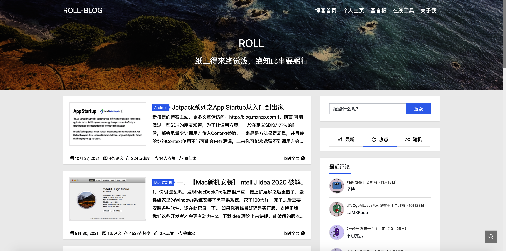
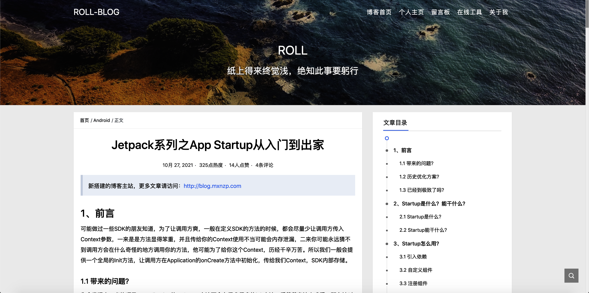

## 前言

由于类型掘金，简书，CSDN这些平台针对技术博客限制越来越大，导致文章内容中包含一些骚操作的时候审核不给通过，所以无奈搭建了自己的博客网站。后续发布的所有博客将会同步到当前站点。

博客站点采用了轻量级服务器+WordPress搭建，服务器购买时长为3年，所以可以尽情玩耍。

## 使用

访问：[http://blog.mxnzp.com](http://blog.mxnzp.com) 即可，pc和手机端都可访问。

+ 目前站点所有的文章书签如下：

  CSDN，Github，傻瓜记账APP，在线工具，掘金，段子乐APP，简书，通用免费API

+ 目前站点所有的文章标签如下：

  Docker，Mac软件，SpringCloud，指南，前端开发，小工具，后端开发，AndroidSDK，我爱搞事情，就是喜欢玩儿，学个新技术，解决需求，

## 推荐文章

+ 勇敢跨越，从0到1开发一个属于自己的App，博客地址：[http://blog.mxnzp.com/?p=68](http://blog.mxnzp.com/?p=68)
+ 通用免费Api使用教程，博客地址：[http://blog.mxnzp.com/?p=59](http://blog.mxnzp.com/?p=59)
+  Jetpack系列之App Startup从入门到出家，博客地址：[http://blog.mxnzp.com/?p=186](http://blog.mxnzp.com/?p=186)
+ 需求解决系列的系列文章
  + 【需求解决系列之一】移动卡片实现答题功能，博客地址：[http://blog.mxnzp.com/?p=64](http://blog.mxnzp.com/?p=64)
  + 【需求解决系列之二】回款日历的实现，博客地址：[http://blog.mxnzp.com/?p=69](http://blog.mxnzp.com/?p=69)
  + 【需求解决系列之三】Android 自定义可展开收回的ExpandableTextView，博客地址：[http://blog.mxnzp.com/?p=75](http://blog.mxnzp.com/?p=75)
  + 【需求解决系列之四】Android App 在线 自动更新（适配到9.0），博客地址：[http://blog.mxnzp.com/?p=77](http://blog.mxnzp.com/?p=77)
  + 【需求解决系列之五】一行代码实现Android 6.0以上动态权限的申请，博客地址：[http://blog.mxnzp.com/?p=79](http://blog.mxnzp.com/?p=79)

## 截图

