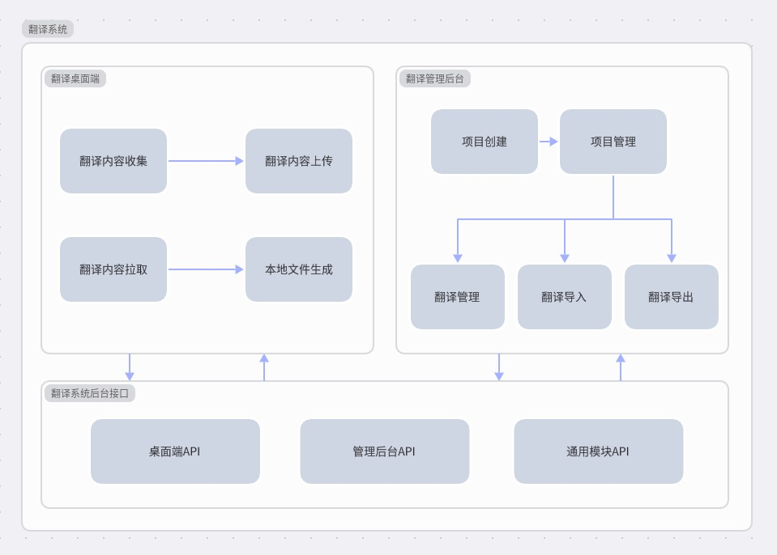

# 1、系统结构图

目前系统由三个板块组成：

+ 翻译桌面端

  主要负责收集项目中需要翻译的内容以及拉去云端翻译好的内容同步到本地项目中

+ 翻译管理后台

  主要负责创建项目，管理项目以及对内容进行在线翻译。其中我们提供了导入和导出翻译的功能，这样如果不喜欢在网站上进行翻译的时候可以选择导出到excel中进行翻译，最后再导入到系统

+ 翻译系统后台接口

  这里主要是为前面两个端提供数据支持，并提供相关API接口。



# 2、翻译终端实现

## 2.1 技术栈

目前翻译终端使用Electron+Vue3来实现，主打一个扩平台方便，接入成本低。缺点是生成的包体积比较大，不利于分发。

## 2.2 实现原理

目前已经适配了Android项目，iOS项目，PHP后端项目，Flutter项目和Vue项目。接下来我们一个个的简单介绍一下

首先我贴一下我们将数据上报给后台时候定义的数据格式以及拉去云端翻译的时候的数据格式，方便下面根据不同项目类型进行分析：

### 2.2.1 上传到云端的数据格式

其中，各个参数含义如下：

+ currentChannel：默认模块名称
+ channels：所有模块列表
+ items：本地收集到的k-v列表，其中key需要拼接模块名称，防止key重复
  + name：key
  + text：value值
  + from：来源，仅做记录

```json
{
    "currentChannel":"values",
    "channels":[
        "values",
        "values-en",
        "values-ja"
    ],
    "items":[
        {
            "name":"app.app_name",
            "text":"翻译助手",
            "from":"/app/src/main/res/values/strings.xml"
        },
        {
            "name":"mylibrary1.str_from_lib1_2",
            "text":"生活是苦涩的",
            "from":"/mylibrary1/src/main/res/values/strings.xml"
        },
        {
            "name":"mylibrary1.str_from_lib1_3",
            "text":"时间是挤出来的",
            "from":"/mylibrary1/src/main/res/values/strings.xml"
        }
    ]
}
```

### 2.2.2 拉取到本地的数据

其中，各个参数含义如下：

+ channels：需要被翻译的目标翻译语种（文件夹名称）
+ items：已经翻译好的文本内容
  + itemKey：key值
  + itemSource：翻译好的value值
  + itemChannel：所属的目标翻译语种（文件夹名称）

```json
{
    "data":{
        "channels":[
            "values-en",
            "values-ja"
        ],
        "items":[
            {
                "itemKey":"app.app_name",
                "itemChannel":"values-en",
                "itemSource":"TradeManager Assistant"
            },
            {
                "itemKey":"mylibrary1.str_from_lib1_3",
                "itemChannel":"values-ja",
                "itemSource":"時間は絞り出されている"
            },
            {
                "itemKey":"mylibrary1.str_from_lib1_2",
                "itemChannel":"values-ja",
                "itemSource":"生活は苦い"
            }
        ],
        "ignoreModules":[

        ]
    },
    "msg":"数据返回成功",
    "code":200
}
```

### 2.2.3 Android 项目适配

大家都是做Android的，那必然知道Android在做国际化这一块是原生都支持的，我们会将项目中的中文硬编码抽离到项目中的strings.xml文件中，所以提取中文字符串的操作就比较容易了，直接解析xml文件，取出key和value即可。同样，将云端翻译拉下来之后，也只需要生成对应的strings.xml文件就好了。

具体实现如下：

+ 收集K-V

  在整个项目文件下寻找 res/values/strings.xml，之所以直接读取values文件夹下的xml作为基础未翻译数据，是这个文件夹就是Android默认的语言文件夹。然后利用x2js插件读取xml文件，获取到里面的key和value，但是这个里面有一个点要注意的就是，我们需要在实际的key前面拼接上我们的模块名称，比如这个strings.xml是在app/src/main/res/values/strings.xml，那么这个模块名称就是app，这样做的目的是防止不同模块中出现相同的key会出现重复问题。比如strings.xml中有个item 是 <string name="app_name">段子乐</string>  ,那么我们提取出来的key就应该是app.app_name，value是段子乐。

  于此同时，我们会同时找一下项目中res/values-xxx/strings.xml的文件，并将values-xxx这个文件夹都统计起来，比如values-en，values-ja，这些文件夹就会被作为带翻译语种提交到云端。

  所以，如果你默认语言是中文，期望适配英文和日语，那你需要做的就是把中文key-value写入values/strings.xml文件中，与此同时，在values同级目录下新建values-en和values-ja文件夹，并在这两个文件夹中间新建strings.xml文件，这个文件可以是空文件。

+ 生成本地文件闭环翻译

  当在翻译系统完成其他国家语言的翻译工作后，我们拉取云端翻译，接口会返回除了默认语言（Android中默认是values）的其他语言列表和已经翻译好的内容列表，具体看#2.2.2，我们只需要遍历items，然后根据itemChannel进行分类，最后将itemKey和itemSource作为K-V生成到对应语言文件夹下面的strings.xml文件中就好了。

### 2.2.4 iOS 项目适配

跟Android一样，iOS的国际化这一块也是原生支持的，将项目中的中文硬编码抽离到项目中的xxxx.strings文件中，与Android不同的是，iOS的strings文件中格式是K=V的，所以我们需要换个策略解析文件，取出key和value即可。同样，将云端翻译拉下来之后，也只需要生成对应的strings文件就好了。

具体实现如下：

+ 收集K-V

  我们默认会找寻zh-Hans.lproj文件夹作为基础内容，并将这个文件夹中的所有strings文件中的内容提取出来，模块以xxx.strings中的xxx作为名称，读取strings文件的时候，先用正则去除掉文件中的单行注释和多行注释，然后按行读取内容，当一行满足"KEY"="VALUE";的时候，依次取出等号前后的KEY和VALUE内容即可。

  于此同时，我们需要同时找到有xxx.strings的文件夹，那么这些文件夹中除了zh-Hans.lproj是默认语种外，其他文件夹都是待翻译语种，我们需要将这些文件夹名称收集起来，提交给云端。

  所以，所以你默认语言是中文，期望适配英文，那你就将项目中的硬编码抽离到zh-Hans.lproj文件夹中，然后在zh-Hans.lproj同级目录下新建其他语言的文件夹，比如en.lproj，然后在zh-Hans.lproj中复制一个任意的xxx.strings文件到en.lproj中，以此来保证en.lproj文件夹会被扫描出来，需要适配更多语言时同理操作即可。

+ 生成本地文件闭环翻译

  当在翻译系统完成其他国家语言的翻译工作后，我们拉取云端翻译，接口会返回除了默认语言（iOS中默认是zh-Hans.lproj）的其他语言列表和已经翻译好的内容列表，具体看#2.2.2，我们只需要遍历items，然后根据itemChannel进行分类，最后将itemKey和itemSource作为K-V生成到对应语言文件夹下面的xxx.strings文件中就好了。其中需要注意的是，xxx对应的就是itemKey中包含的模块名称。

### 2.2.5 Vue 项目适配

不过对于Vue项目来说，原生项目就不自带国际化功能了，需要借助一些框架，目前比较流行的是vue-i18n，所以我们也先按这个来适配。将项目中的中文硬编码抽离到项目中的src/locales/lang/zh-CN下的json文件中，而且json文件中是标准的json格式的数据，那这个就比较好处理了，直接用js遍历json就能非常容易的取出key和value。同样，将云端翻译拉下来之后，也只需要生成对应的json文件就好了。

具体实现如下：

+ 收集K-V

  我们默认会找寻src/locales/lang/zh-CN文件夹作为基础内容，并将这个文件夹中的所有json文件中的内容提取出来，模块以xxx.json中的xxx作为名称，读取json文件的时候，直接遍历json内容，依次取出KEY和VALUE内容即可。

  于此同时，我们需要同时在src/locales/lang文件夹下找到所有文件夹，那么这些文件夹中除了zh-CN是默认语种外，其他文件夹都是待翻译语种，我们需要将这些文件夹名称收集起来，提交给云端。

  所以，所以你默认语言是中文，期望适配英文，日语，那你就将项目中的硬编码抽离到zh-CN文件夹中，然后在zh-CN同级目录下新建其他语言的文件夹，比如en，ja即可，Vue项目的其他语种文件夹仅需新建文件夹即可，不需要保证文件夹中有翻译文件就可以被扫描出来，这个是跟Android和iOS的区别，需要适配更多语言时同理操作即可。

+ 生成本地文件闭环翻译

  当在翻译系统完成其他国家语言的翻译工作后，我们拉取云端翻译，接口会返回除了默认语言（Vue中默认是zh-CN）的其他语言列表和已经翻译好的内容列表，具体看#2.2.2，我们只需要遍历items，然后根据itemChannel进行分类，最后将itemKey和itemSource作为K-V生成到对应语言文件夹下面的xxx.json文件中就好了。其中需要注意的是，xxx对应的就是itemKey中包含的模块名称。

### 2.2.6 Flutter 项目适配

Flutter项目的国际化也需要借助一些框架，目前比较流行的是flutter_localizations，所以我们也先按这个来适配。将项目中的中文硬编码抽离到项目中的lib/I10n下的arb文件中，而且arb文件中是标准的json格式的数据，那这个就比较好处理了，直接用js遍历json就能非常容易的取出key和value。同样，将云端翻译拉下来之后，也只需要生成对应的json文件就好了。

具体实现如下：

+ 收集K-V

  我们默认会找寻lib/I10n/intl_en.arb文件作为基础内容，并将这个文件中的内容提取出来，模块以intl_xxx.arb中的xxx作为名称，读取arb文件的时候，直接遍历json内容，依次取出KEY和VALUE内容即可。这里需要注意，文件中有很多k-v是无效的，其中@@开头标准的是当前文件的语言表示，@开头的一般是某个key的注释内容，所以我们需要过滤掉key中以@@开头和以@开头的k-v。

  于此同时，我们需要同时在lib/I10n文件夹下找到所有文件，那么这些文件中除了intl_en.arb是默认语种外，其他文件夹都是待翻译语种，我们需要将这些文件夹称收集起来，并且将每个文件名称抽离出intl_xxx.arb中的xxx提交给云端。

  所以，所以你默认语言是英文，期望适配法语，俄语，那你就将项目中的硬编码抽离到intl_en.arb文件中，然后在intl_en.arb同级目录下新建其他语言的文件夹，比如intl_fr.arb，intl_ru.arb即可，Flutter项目的其他语种文件仅需新建文件即可，不需要保证文件中有翻译内容就可以被扫描出来，这个是跟Android和iOS的区别，需要适配更多语言时同理操作即可。

+ 生成本地文件闭环翻译

  当在翻译系统完成其他国家语言的翻译工作后，我们拉取云端翻译，接口会返回除了默认语言（Flutter中默认是en）的其他语言列表和已经翻译好的内容列表，具体看#2.2.2，我们只需要遍历items，然后根据itemChannel进行分类，最后将itemKey和itemSource作为K-V生成到对应语言intl_xxx.arb文件中就好了。其中需要注意的是，xxx对应的就是itemKey中包含的模块名称。

### 2.2.7 PHP 项目适配

PHP项目的国际化也需要借助一些框架，目前比较流行的是啥我不知道，但是我们公司用的是laravel，所以我们也先按这个来适配。将项目中的中文硬编码抽离到项目中的resources/lang/zh-CN下的php文件中，但是这个php文件中定义的数据跟我们想象中的json数据不一样，php中对象和数组都是一样的表示方式，这样就不能直接进行解析了。于是，我们找个js插件，php-parser来帮我们做这个事情，先解析php文件，然后分别取出里面定义好的key和value，就能非常容易的取出key和value。同样，将云端翻译拉下来之后，也只需要生成对应的php文件就好了。

具体实现如下：

+ 收集K-V

  我们默认会找寻resources/lang/zh-CN文件夹作为基础内容，并将这个文件夹中的所有php文件中的内容提取出来，模块以xxx.php中的xxx作为名称，读取php文件的时候，php-parser来解析整个php文件，然后从生成的json文件中分别取出KEY和VALUE内容即可，具体可以看下php-parser的使用方式。

  于此同时，我们需要同时在resources/lang文件夹下找到所有文件夹，那么这些文件夹中除了zh-CN是默认语种外，其他文件夹都是待翻译语种，我们需要将这些文件夹名称收集起来，提交给云端。

  所以，所以你默认语言是中文，期望适配英文，那你就将项目中的硬编码抽离到zh-CN文件夹中，然后在zh-CN同级目录下新建其他语言的文件夹，比如en即可，PHP项目的其他语种文件夹仅需新建文件夹即可，不需要保证文件夹中有翻译文件就可以被扫描出来，这个是跟Android和iOS的区别，需要适配更多语言时同理操作即可。

+ 生成本地文件闭环翻译

  当在翻译系统完成其他国家语言的翻译工作后，我们拉取云端翻译，接口会返回除了默认语言（PHP中默认是zh-CN）的其他语言列表和已经翻译好的内容列表，具体看#2.2.2，我们只需要遍历items，然后根据itemChannel进行分类，最后将itemKey和itemSource作为K-V生成到对应语言文件夹下面的xxx.php文件中就好了。其中需要注意的是，xxx对应的就是itemKey中包含的模块名称。

  在生成php文件的时候，需要注意的是，在php中对象和数组外边包的都是"["和"]"，不像json中对象是“{}”，数组是"[]"，这里需要格外注意。

### 2.2.8 其他

从上面这些分析不难看出，目前的适配都是基于项目本身的特性进行挨个的特殊处理，当然我觉得这样也是比较好的方式，相比于那种可以自定义检测规则的方式来说，这种对使用者来说更加傻瓜式，当然，这都建立在我们需要去适配不同语言下的不同框架下的项目类型，尽可能做到所有项目的所有框架都被覆盖，这就需要更多人来参与进来了。

后续会在大家的使用过程中根据提出的诉求和项目类型进行依次的适配，只到做的更好。

# 3、翻译管理端实现

管理端主要是负责的功能如下：

+ 用户系统
+ 项目创建
+ 翻译

技术栈：

使用Vue2.0实现

### 3.1 用户系统

主要提供用户注册功能，注册和登录只能在管理后台进行操作，终端仅提供使用token登录，不提供注册功能。管理后台的所有控制台页面都需要登录后才可以访问，终端所有的页面都需要使用token登录后访问。

### 3.2 项目创建

项目的创建仅能在管理后台进行，创建成功的项目才可以在终端看见，也包括对创建成功的项目进行编辑操作都在管理后台进行。

### 3.3 翻译

整个系统最重要的功能，在这里可以对终端上传上来的内容进行翻译，于此同时，我们也提供了在线翻译的功能，虽然可能不是特别准确，但是拿来当个参考还是极好的。

另外还有一个很重要的功能就是，我们提供了导入和导出的功能，如果你因为某些原因，不能将项目交由其他人直接进行翻译，可以将上传好的内容导出到excel中，这样可以将excel给到别人进行翻译，翻译好了之后再将excel导入到翻译系统中，这样依然可以对翻译步骤进行闭环。

# 4、翻译后台接口端实现

后台接口主要给上面两个端提供API支持，技术栈使用Springboot+Mysql实现，服务器使用云服务器，具体实现细节不在这里赘述。

# 5、写在最后

我是一个比较爱折腾的程序员，也是希望能整出一些对大家有所帮助的东西，到目前来看，现在这个系统确实能帮到一些团队，所以希望能得到大家的支持和鼓励、

