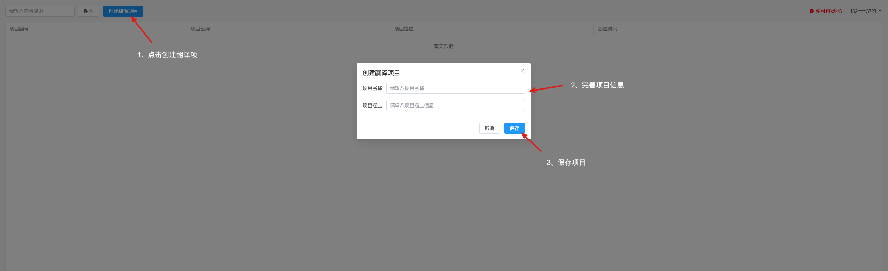
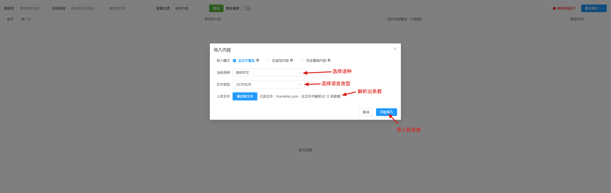
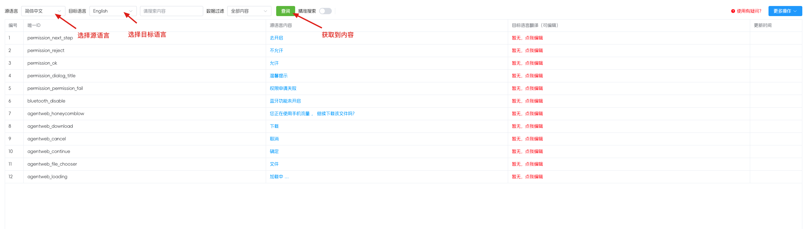
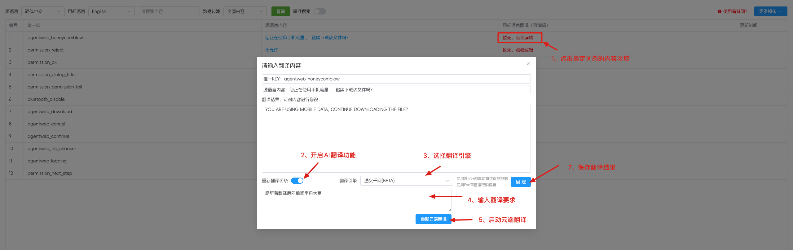
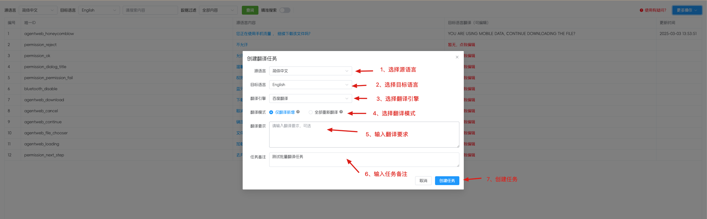
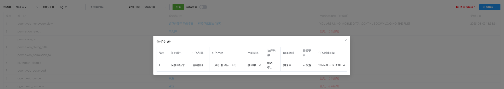
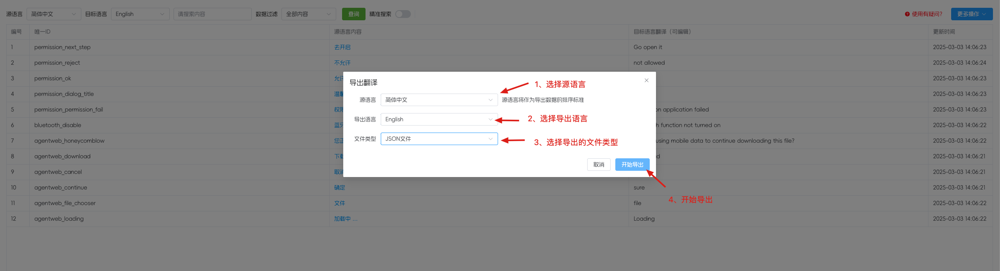
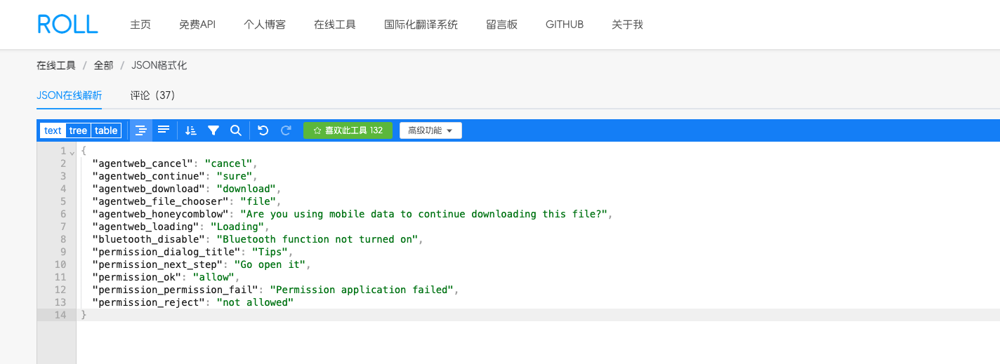

## 1.前言

因为软件出海，从在上上家公司就开始做翻译系统，到目前为止已经出了两个比较大的版本了，各个版本解决的痛点如下：

**V1版本：** 主要针对的是Android+iOS翻译不一致和翻译内容管理麻烦的问题，通过这个工具能实现，在同一个页面的同一个按钮的文案，能保证iOS和Android的翻译是一致的，UI审查的时候不致于说被翻译不一致的问题打回，在统一的地方对翻译内容进行管理，也能保证对双端翻译内容的高效管理。

**V2版本：** 主要针对的是多项目类型（Android，iOS，vue2，vue3，Php和Java项目）的翻译支持和全自动国家化实现。通过这个工具，可以支持很多种项目类型的国际化，于此同时，提供桌面PC端工具，能够直接操作本地项目文件，实现全自动拉去和生成本地翻译文件的功能。

随着项目的使用，也暴露出一些新的问题。于是我们来到了V3版本。历史版本出现的问题如下：

+ 桌面端存在下载安装，版本更新不方便，系统版本适配麻烦等问题，V3版本直接使用网页端操作

+ V2版本不能批量翻译，需要一个个翻译，效率低下，V3版本可以创建翻译任务，批量翻译

+ V2版本翻译引擎单一，存在翻译不准确的地方需要使用第三方翻译工具，V3版本支持AI翻译，翻译更准确，更快速

+ 支持多平台，通过文件类型划分，而不是通过项目划分，更加灵活，支持更多类型的文件类型翻译

+ V3版本页面交互更加亲民，使用成本比较低

## 2.功能介绍

### 2.1 功能入口

复制链接访问最新版本V3：https://cretinzp.com/translate-v3/#/home，如果之前注册过V2版本，可以用V2版本注册的账号直接使用，如果没有注册过需要重新注册一个账号。

### 2.2 创建项目

登录成功之后，点击首页的【V3版本控制台管理】，或者直接访问：https://cretinzp.com/translate-v3/#/desktop 进入项目管理列表页面。然后按照如下步骤创建项目：

+ 1、点击【创建翻译项目】按钮
+ 2、完善项目信息
+ 3、保存项目

### 2.3 导入翻译内容到系统

项目创建成功之后，点击新项目最后边的【查看内容】按钮，进入到内容详情页面，按照如下步骤导入内容：

+ 1、点击右上角【更多操作】，在下拉选项中点击【导入内容】
+ 2、选择导入模式，其中：
  + 【追加并覆盖】代表：遇到之前存在的key，覆盖之前的内容，不存在的key，则新增
  + 【仅追加内容】代表：遇到之前存在的key，跳过，不存在的key，则新增
  + 【完全替换内容】代表：删除掉之前的所有数据，仅保留当前版本数据
+ 3、选择当前导入内容的语种，如果你默认语言为中文，则你导入的内容应该是中文，这里的语种应该也选择中文
+ 4、选择文件类型，当前支持如下格式：
  + 1、JSON格式，适用于类似vue2，vue3，Php和部分Java项目的国际化数据格式
  + 2、EXCEL格式和CSV格式，适用于产品经理那些非开发人员需要用国际化翻译功能
  + 3、XML文件，适用于Android项目
  + 4、STRINGS文件，适用于iOS项目

> 这次我们选择一个json文件演示系统功能，其他类型的文件使用方式一样。

### 2.4 查看导入的内容

系统左上角，先选择源语言，再选择目标语言，点击查询获取到内容。

### 2.5 尝试AI翻译

对系统中没有翻译的，或者你对翻译内容不是很满意的词条内容，可以进行AI翻译：

+ 1、点击指定词条的内容区域
+ 2、开启【重启翻译词条】功能
+ 3、选择翻译引擎，目前支持【百度翻译】，【DeepSeek】和【通义千问】三个引擎
+ 4、输入你的翻译要求，例如我这里是【将所有翻译后的单词字母大写】
+ 5、点击【重新云端翻译】，系统将会自动翻译词条，翻译成功之后将内容填充到翻译结果区域，注：AI翻译较慢，请耐心等待。
+ 6、点击确定按钮可将翻译结果提交。

当然，你也可以自主翻译，不借助AI，直接修改输入框的内容，然后进行保存。

### 2.6 创建批量翻译任务

一个一个翻译固然是比较浪费时间的，所以我们提供了批量翻译任务的功能，点击右上角【更多操作】按钮，选择【创建翻译任务】，完善任务信息：

+ 1、选择源语言
+ 2、选择目标语言
+ 3、选择翻译引擎
+ 4、选择翻译模式，其中【仅翻译新增】表示：对于历史翻译过的内容不再翻译，仅翻译未翻译的内容，【全部重新翻译】表示：会将所有词条进行重新翻译。
+ 4、输入翻译要求
+ 5、输入任务备注

### 3.7 查看翻译任务

点击右上角【更多任务】，选择【查看任务列表】，可查看任务的状态和一些表单信息。

### 3.8 导出翻译内容

点击右上角【更多任务】，选择【导出翻译】，完善表单：

+ 1、选择源语言
+ 2、选择导出的目标语言
+ 3、选择导出的文件类型
+ 4、开始导出

### 3.9 查看导出的翻译内容

文件名称是：frgnjliligq1ntrr-zh-en-翻译导出.json，按照项目【项目id-源语言-目标语言-翻译导出,文件类型】的方式命名，另外在此打个广告，下方的json解析工具是我提供的一个站长工具，功能强大，支持超大json，还支持{"a":{"b":1}} 到 {"a.b":1}这种层级互相转换的高级功能，欢迎体验：https://www.mxnzp.com/tools/json

## 3、视频教程

当然我们也录制了整个系统所有功能使用的完整操作视频，也可以通过视频更快的了解功能。视频地址为：https://www.bilibili.com/video/BV15tPFebEy8 ， 希望使用B站的朋友能给个一键三连哦。

## 4、其他

我是比较喜欢折腾的，我总觉得技术是服务于人的，所以做了很多我觉得可以帮助到用户的东西，从V1到V3，我一直在坚持，也希望大家在用的过程中有什么问题或者建议可以积极反馈，做到更好。

系统右上角有入口，可以查看到联系我的方式。