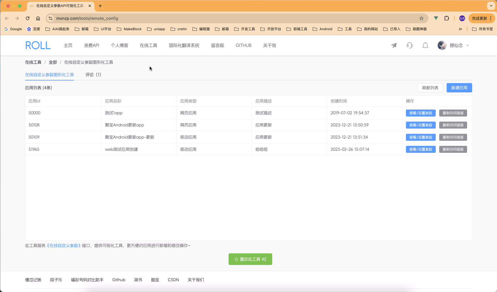
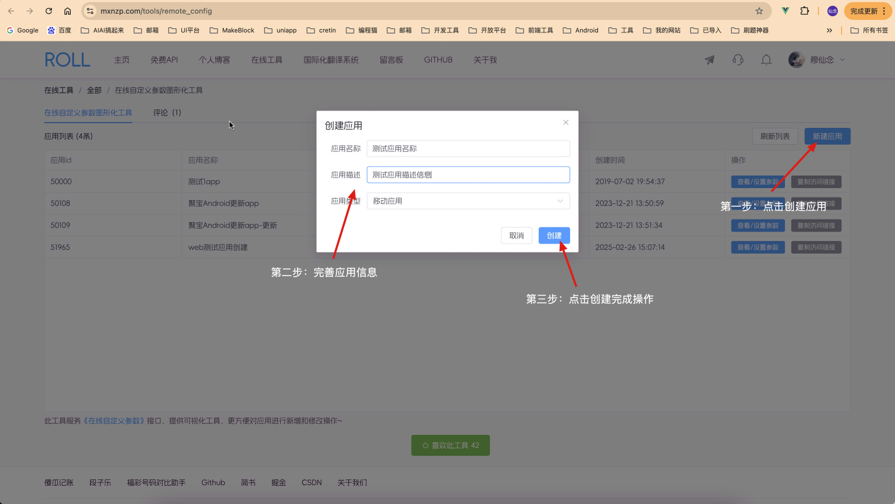
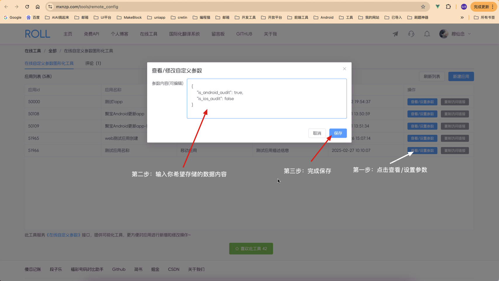
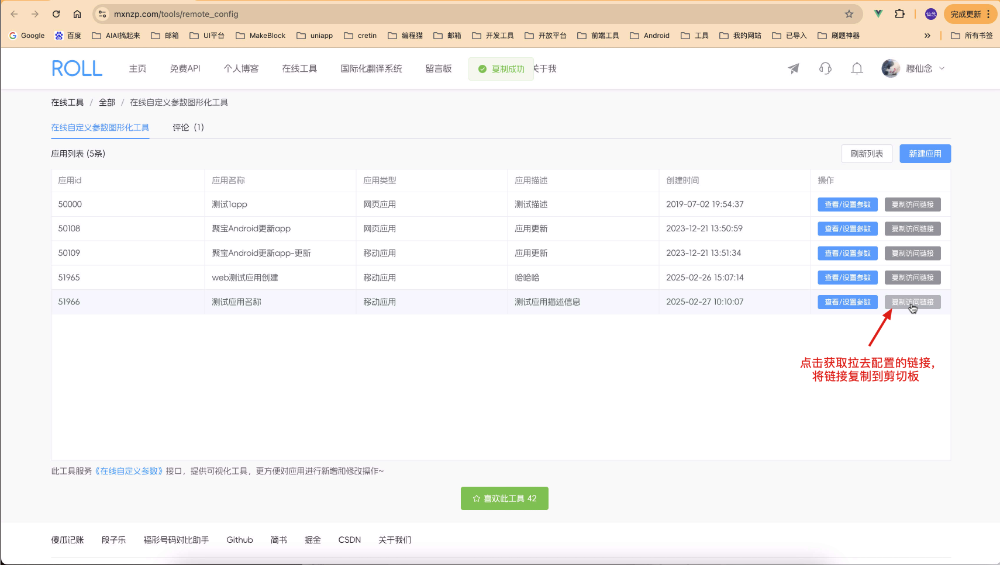
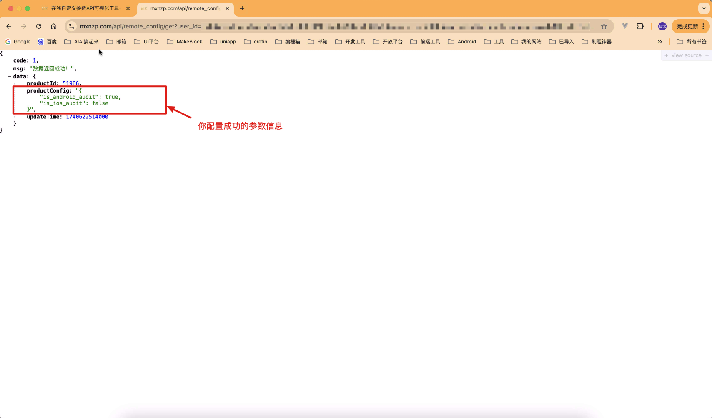

## 一、需求背景

在《RollApi中》提供了一个《在线自定义参数》的API接口，接口地址为：https://www.mxnzp.com/doc/detail?id=11，用这个接口可以自定义远程配置，远程存储json数据。

比如：

1、App正在应用市场进行审核的时候，需要隐藏一些敏感的页面，一个敏感的功能，防止审核员看到后会让应用审核不通过，这个时候就需要一个在线自定义的参数，来告诉App当前是否是审核的敏感期，来做对应的处理。

2、App内应用更新，可以利用这个接口，存储最新版本的应用信息，App内调用之后判断是否需要更新，来做应用升级提醒等等。

目前这个接口的使用量也起来了，有用户就提到，接口虽好，但是每次要更新配置的时候，还需要自己做base64然后调用接口，挺麻烦的，于是希望我们能出一个可视化工具，更加方便的更新配置信息，于是，我们新增了在线自定义参数的图形化工具。

工具的访问地址如下：https://www.mxnzp.com/tools/remote_config，需要你登录之后使用。

## 二、工具使用

### 2.1 查看已创建的应用列表

登录之后访问工具主页，会展示你已创建的应用列表信息。

### 2.2 创建应用信息

+ 第一步：点击右上角新建应用

+ 第二步：在对话框中完善应用信息

+ 第三步：创建应用

### 2.3 修改和查看配置信息

+ 第一步、点击你刚刚创建的应用的最右边的【查看/设置参数】按钮
+ 第二步、输入你希望设置的自定义参数内容
+ 第三步、点击【保存】按钮进行保存

### 2.4 获取拉去配置信息的请求链接

1、复制请求链接到剪切板

2、访问链接查看效果

## 三、其他工具

另外，我们还提供了很多其他在线工具，可以自行查看和使用。

### 1、通用工具

+ 1、IP归属地查询：https://www.mxnzp.com/tools/ip
+ 2、哔哩哔哩视频解析：https://www.mxnzp.com/tools/bilibili
+ 3、抖音视频解析：https://www.mxnzp.com/tools/douyin
+ 4、生成短链接：https://www.mxnzp.com/tools/short_link
+ 5、ICP备案查询：https://www.mxnzp.com/tools/icp
+ 6、商品条码信息查询：https://www.mxnzp.com/tools/tiaoma
+ 7、在线PDF转换：http://online.mxnzp.com
+ 8、抖音解析Pro：https://www.mxnzp.com/tools/douyin_pro
+ 9、快手解析：https://www.mxnzp.com/tools/kuaishou
+ 10、小红书笔记解析：https://www.mxnzp.com/tools/xhs

### 2、开发工具

+ 1、生成二维码：https://www.mxnzp.com/tools/qrcode
+ 2、JSON在线格式化：https://www.mxnzp.com/tools/json
+ 3、MD5在线加密：https://www.mxnzp.com/tools/md5
+ 4、Base64在线编码解码：https://www.mxnzp.com/tools/base64
+ 5、Base64/图片转换：https://www.mxnzp.com/tools/base64_img
+ 6、UUID生成器：https://www.mxnzp.com/tools/uuid
+ 7、时间戳转换：https://www.mxnzp.com/tools/timestrap