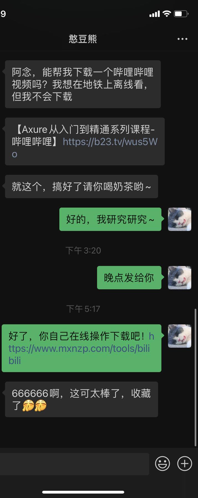
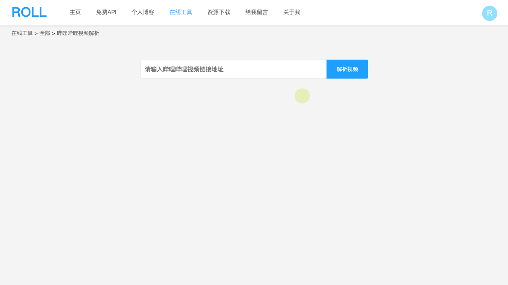

## 1、故事背景
有个朋友找我帮忙下载哔哩哔哩的视频，她最近在B站上学习，想在通勤的时间看看视频，但是又不想在线观看，因为地铁上网络不好，再加上流量顶不住，于是想下载到本地离线观看。



## 2、实现效果

需求明确之后，在网上找了一圈看有没有现成的在线工具可以使用，不过要么是链接404了，要么是服务异常，要么是要下载App或者桌面应用，要么是有bug，所以到最后，决定自己开发一个，顺便可以添加到我的个人主站上面去。

下面是实际效果图，请在pc端体验：[哔哩哔哩视频解析](https://www.mxnzp.com/tools/bilibili)，另外说一句，**EDG牛逼~**

+ 第一步：输入哔哩哔哩视频的播放链接，也可以是手机分享出来的短连接。
+ 第二步：点击解析视频按钮。
+ 第三步：在视频列表中选择你感兴趣的视频片断，点击下载视频即可。



另外，针对有开发能力的小伙伴，我提供了视频解析的远程API接口可以调用，你可以调用API接口开发属于自己的小工具哦~

> API接口请在pc端打开获取更好的体验。

+ [哔哩哔哩视频解析API接口](https://www.mxnzp.com/doc/detail?id=30) 

## 3、功能实现过程

> 本功能是基于springboot开发，所以技术项选取框架自带的RestTemplate

### 3.1 解析短链

针对手机端哔哩哔哩App分享出来的链接，为了缩短链接长度，是短链的形式存在的，遇到这种链接，我们需要解析短链获取实际的视频地址信息。如果本身不是短链就不需要此步骤。

+ 如何获取短链的实际对应地址呢？

点击短链会发现它会自动重定向到实际的链接，于是我们只需要获取请求响应头的location即可，但是RestTemplate默认是会自动重定向的，所以无法获取location。于是我们需要关闭默认的重定向功能。

```java
import org.springframework.http.client.SimpleClientHttpRequestFactory;
import java.io.IOException;
import java.net.HttpURLConnection;

public class NoRedirectSimpleClientHttpRequestFactory extends SimpleClientHttpRequestFactory {

    @Override
    protected void prepareConnection(HttpURLConnection connection, String httpMethod) throws IOException {
        super.prepareConnection(connection, httpMethod);
      	//禁止自动重定向
        connection.setInstanceFollowRedirects(false);
    }
}

```

使用RestTemplate获取重定向地址：

```kotlin
//测试短链地址
var realUrl = "https://b23.tv/RZiviW"
val headers = HttpHeaders()
headers["origin"] = "https://www.bilibili.com"
headers["referer"] = realUrl
headers["Content-Type"] = Collections.singletonList("application/json;charset=UTF-8")
headers["user-agent"] = "Mozilla/5.0 (Macintosh; Intel Mac OS X 10_14_6) AppleWebKit/537.36 (KHTML, like Gecko) Chrome/94.0.4606.81 Safari/537.36"

headers.setAccept(Arrays.asList(MediaType.APPLICATION_JSON))
val entity = HttpEntity("", headers)

val restTemplate = RestTemplateBuilder()
.requestFactory(NoRedirectSimpleClientHttpRequestFactory::class.java)
.setConnectTimeout(30000)
.setConnectTimeout(30000)
.build()
val responseEntity = restTemplate?.exchange(realUrl, HttpMethod.GET, entity, String::class.java)
//获取重定向之后的地址
realUrl = responseEntity?.getHeaders()?.location?.toString()?:""
```

### 3.2 获取bvid

哔哩哔哩实际的视频播放地址：https://www.bilibili.com/video/BV1EP4y1j7kV，其中**BV1EP4y1j7kV**是bvid，所以我们需要对链接进行截取获取bvid的内容，这个bvid是后面步骤中的重要数据。

### 3.3 获取视频信息得到cid

调用如下接口可获取视频信息，其中接口的bvid参数为上一步获取到的数据，不过需要注意一下user-agent需要设置成浏览器的ua：

+ https://api.bilibili.com/x/web-interface/view?bvid=BV1EP4y1j7kV

接口返回数据如下，其中我们关心的数据有title，desc，和pages，其中title是视频的标题，desc是视频的描述信息，pages是视频的分片列表信息，这个列表中有实际的视频片断信息，其中cid很重要，比如【S11全球总决赛第一局视频的cid是**437586584**】是获取视频下载链接的关键。

```json
{
    "code": 0,
    "message": "0",
    "ttl": 1,
    "data": {
        "bvid": "BV1EP4y1j7kV",
        "aid": 891511588,
        "videos": 7,
        "tid": 171,
        "tname": "电子竞技",
        "copyright": 1,
        "pic": "http://i2.hdslb.com/bfs/archive/884edc6f4ca5860f303c225afc179aa1f526430d.jpg",
        "title": "【S11全球总决赛】决赛 11月6日 EDG vs DK",
        "pubdate": 1636204381,
        "ctime": 1636204381,
        "desc": "【S11全球总决赛】决赛 11月6日 EDG vs DK",
        "desc_v2": [
            {
                "raw_text": "【S11全球总决赛】决赛 11月6日 EDG vs DK",
                "type": 1,
                "biz_id": 0
            }
        ],
        "state": 0,
        "duration": 19080,
        "rights": {
            "bp": 0,
            "elec": 0,
            "download": 1,
            "movie": 0,
            "pay": 0,
            "hd5": 0,
            "no_reprint": 0,
            "autoplay": 1,
            "ugc_pay": 0,
            "is_cooperation": 0,
            "ugc_pay_preview": 0,
            "no_background": 0,
            "clean_mode": 0,
            "is_stein_gate": 0,
            "is_360": 0,
            "no_share": 0
        },
        "owner": {
            "mid": 50329118,
            "name": "哔哩哔哩英雄联盟赛事",
            "face": "http://i2.hdslb.com/bfs/face/cb620bbb9071974f37843134875d472b47532a97.jpg"
        },
        "stat": {
            "aid": 891511588,
            "view": 15181243,
            "danmaku": 235955,
            "reply": 61016,
            "favorite": 157194,
            "coin": 301455,
            "share": 27068,
            "now_rank": 0,
            "his_rank": 2,
            "like": 434765,
            "dislike": 0,
            "evaluation": "",
            "argue_msg": ""
        },
        "dynamic": "#S11# #英雄联盟# #S11全球总决赛# #电子竞技# #电竞赛事# #EDG# #DK# 【S11全球总决赛】决赛 11月6日 EDG vs DK",
        "cid": 437586584,
        "dimension": {
            "width": 1920,
            "height": 1080,
            "rotate": 0
        },
        "no_cache": false,
        "pages": [
            {
                "cid": 437586584,
                "page": 1,
                "from": "vupload",
                "part": "第一局 4K",
                "duration": 2952,
                "vid": "",
                "weblink": "",
                "dimension": {
                    "width": 1920,
                    "height": 1080,
                    "rotate": 0
                }
            },
            {
                "cid": 437626309,
                "page": 2,
                "from": "vupload",
                "part": "第二局 4K",
                "duration": 3031,
                "vid": "",
                "weblink": "",
                "dimension": {
                    "width": 1920,
                    "height": 1080,
                    "rotate": 0
                }
            },
            {
                "cid": 437659159,
                "page": 3,
                "from": "vupload",
                "part": "第三局 4K",
                "duration": 3406,
                "vid": "",
                "weblink": "",
                "dimension": {
                    "width": 1920,
                    "height": 1080,
                    "rotate": 0
                }
            },
            {
                "cid": 437727348,
                "page": 4,
                "from": "vupload",
                "part": "第四局 4K",
                "duration": 3212,
                "vid": "",
                "weblink": "",
                "dimension": {
                    "width": 1920,
                    "height": 1080,
                    "rotate": 0
                }
            },
            {
                "cid": 437729555,
                "page": 5,
                "from": "vupload",
                "part": "第五局 4K",
                "duration": 3478,
                "vid": "",
                "weblink": "",
                "dimension": {
                    "width": 1920,
                    "height": 1080,
                    "rotate": 0
                }
            },
            {
                "cid": 437550300,
                "page": 6,
                "from": "vupload",
                "part": "开幕式",
                "duration": 984,
                "vid": "",
                "weblink": "",
                "dimension": {
                    "width": 1920,
                    "height": 1080,
                    "rotate": 0
                }
            },
            {
                "cid": 437717574,
                "page": 7,
                "from": "vupload",
                "part": "夺冠时刻",
                "duration": 2017,
                "vid": "",
                "weblink": "",
                "dimension": {
                    "width": 1920,
                    "height": 1080,
                    "rotate": 0
                }
            }
        ],
        "subtitle": {
            "allow_submit": false,
            "list": []
        },
        "user_garb": {
            "url_image_ani_cut": ""
        },
        "honor_reply": {
            "honor": [
                {
                    "aid": 891511588,
                    "type": 2,
                    "desc": "第138期每周必看",
                    "weekly_recommend_num": 138
                },
                {
                    "aid": 891511588,
                    "type": 3,
                    "desc": "全站排行榜最高第2名",
                    "weekly_recommend_num": 0
                },
                {
                    "aid": 891511588,
                    "type": 4,
                    "desc": "热门",
                    "weekly_recommend_num": 0
                }
            ]
        }
    }
}
```

### 3.4 获取视频源信息

有了cid之后，通过调用如下接口可以获取视频的源信息，里面就包含视频的下载链接。

+ https://api.bilibili.com/x/player/playurl?otype=json&fnver=0&fnval=3&player=2&qn=64&bvid=BV1EP4y1j7kV&cid=437586584&platform=html5&high_quality=1

其中我们关心的参数有两个，一个是bvid，3.2步骤获取到的参数，一个是cid，3.3步骤获取到的数据，其他的参数照抄即可。

接口返回的数据如下，其中我们关心的数据是data.durl[0]，这个里面包含了视频的播放时长length和播放链接url。

```json
{
    "code": 0,
    "message": "0",
    "ttl": 1,
    "data": {
        "from": "local",
        "result": "suee",
        "message": "",
        "quality": 208,
        "format": "mp4",
        "timelength": 2951933,
        "accept_format": "mp4",
        "accept_description": [
            "高清 1080P"
        ],
        "accept_quality": [
            208
        ],
        "video_codecid": 7,
        "seek_param": "start",
        "seek_type": "second",
        "durl": [
            {
                "order": 1,
                "length": 2951933,
                "size": 1019658600,
                "ahead": "",
                "vhead": "",
                "url": "https://cn-gdfs-dx-bcache-24.bilivideo.com/upgcxcode/84/65/437586584/437586584_da3-1-208.mp4?e=ig8euxZM2rNcNbhM7WdVhwdlhzKBhwdVhoNvNC8BqJIzNbfq9rVEuxTEnE8L5F6VnEsSTx0vkX8fqJeYTj_lta53NCM=&uipk=5&nbs=1&deadline=1636894545&gen=playurlv2&os=bcache&oi=2004584396&trid=0000778c47abaf18439db9d3013f645c77ceT&platform=html5&upsig=0731fa951d1b846d09bdaf4d1b0286da&uparams=e,uipk,nbs,deadline,gen,os,oi,trid,platform&cdnid=60924&mid=0&bvc=vod&nettype=0&bw=345529&orderid=0,1&logo=80000000",
                "backup_url": null
            }
        ],
        "support_formats": [
            {
                "quality": 208,
                "format": "mp4",
                "new_description": "1080P 高清",
                "display_desc": "1080P",
                "superscript": ""
            }
        ],
        "high_format": null
    }
}
```

### 3.5 相关源码

> 这些是抽离了业务的基础代码，大家乐呵乐呵就好。

```kotlin
/**
 * Bilibili视频解析
 *
 * @author cretin
 * @create 11/25/18
 * @since 1.0.0
 */
@RestController
@RequestMapping("/bilibili")
@ResponseBody
class BilibiliVideoController {

    @Autowired
    private val restTemplate: RestTemplate? = null

    /**
     * 解析视频
     * url 是真实链接的base64
     * @return
     */
    @RequestMapping(value = ["/video"])
    fun videoAnalyse(@RequestParam(value = "url") videoUrl: String): Any {
        try {
            var realUrl = try {
                String(Base64Utils.decodeFromString(videoUrl.replace(" ","+")), Charset.forName("utf-8"))
            } catch (e: UnsupportedEncodingException) {
                throw Exception("链接格式有误")
            }
					
          	//哔哩哔哩的短链域名是b23.tv
            if (realUrl.contains("b23.tv")) {
                //可能是短链来的 需要请求一下拿到实际的跳转链接
                val headers = HttpHeaders()
                headers["origin"] = "https://www.bilibili.com"
                headers["referer"] = realUrl
                headers["Content-Type"] = Collections.singletonList("application/json;charset=UTF-8")
                headers["user-agent"] = "Mozilla/5.0 (Macintosh; Intel Mac OS X 10_14_6) AppleWebKit/537.36 (KHTML, like Gecko) Chrome/94.0.4606.81 Safari/537.36"
                headers["cookie"] = "_uuid=88FD49F2-0728-5896-0AB0-3D42C6C97D4382817infoc;"

                headers.setAccept(Arrays.asList(MediaType.APPLICATION_JSON))
                val entity = HttpEntity("", headers)

                val restTemplate = RestTemplateBuilder()
                        .requestFactory(NoRedirectSimpleClientHttpRequestFactory::class.java)
                        .setConnectTimeout(30000)
                        .setConnectTimeout(30000)
                        .build()
                val responseEntity = restTemplate?.exchange(realUrl, HttpMethod.GET, entity, String::class.java)
                realUrl = responseEntity?.getHeaders()?.location?.toString()?:""
                println(realUrl)
                if (TextUtils.isEmpty(realUrl)) {
                    throw Exception("链接格式有误")
                }
            }

            val bvid = URL(realUrl).path?.trim('/')?.let {
                val index = it.lastIndexOf("/")
                val pre = it.substring(0, index)
                val vid = it.substring(index + 1)
                if (pre.endsWith("video")) {
                    vid
                } else {
                    ""
                }
            }

            if (TextUtils.isEmpty(bvid)) {
                throw Exception("链接格式有误")
            }

            val result = restTemplate?.getForObject("https://api.bilibili.com/x/web-interface/view?bvid=" + bvid, BilibiliVideoPreInfo::class.java)

            val resultList = mutableListOf<MutableMap<String, Any?>>()
            val resultMap = mutableMapOf<String, Any?>()
            resultMap.put("title", result?.data?.title)
            resultMap.put("desc", result?.data?.desc)
            resultMap.put("cover", result?.data?.pic)

            result?.data?.pages?.forEach {
                val map = mutableMapOf<String, Any?>()
                map.put("title", it.part)
                map.put("duration", it.duration)
                map.put("durationFormat", StringUtils.formatSecondToTimeStr(it.duration))
                map.put("width", it.dimension?.width)
                map.put("height", it.dimension?.height)

                val cid = it.cid
                val newUrl = "https://api.bilibili.com/x/player/playurl?otype=json&fnver=0&fnval=3&player=2&qn=64&bvid=" + bvid + "&cid=" + cid + "&platform=html5&high_quality=1"
                val headers = HttpHeaders()
                headers["origin"] = "https://www.bilibili.com"
                headers["referer"] = newUrl
                headers["Content-Type"] = Collections.singletonList("application/json;charset=UTF-8")
                headers["user-agent"] = "Mozilla/5.0 (Macintosh; Intel Mac OS X 10_14_6) AppleWebKit/537.36 (KHTML, like Gecko) Chrome/94.0.4606.81 Safari/537.36"
                //headers["cookie"] = "_uuid=88FD49F2-0728-5896-0AB0-3D42C6C97D4382817infoc;"

                headers.setAccept(Arrays.asList(MediaType.APPLICATION_JSON))
                val entity = HttpEntity("", headers)
                val newResult = restTemplate?.exchange(newUrl, HttpMethod.GET, entity, BilibiliVideoInfo::class.java)?.body
                map.put("accept", newResult?.data?.accept_description)
                map.put("url", newResult?.data?.durl?.get(0)?.url)
                resultList.add(map)
            }
            resultMap["list"] = resultList
            return resultMap
        } catch (e: Throwable) {
            throw Exception("解析失败")
        }
    }
}
```

## 4、关于我

> 如果你觉得我搞的一些小东西还挺好玩的，别忘了动动你的小手帮我分享一下，在此谢谢你了

如果你也喜欢折腾一些东西，你可以通过留言，客服找到我，正好，我也喜欢折腾一些东西，我们可以做朋友。

欢迎访问我的个人主页：[https://www.mxnzp.com](https://www.mxnzp.com)
新搭建的博客主站：[http://blog.mxnzp.com](http://blog.mxnzp.com/)
Github地址：[https://github.com/MZCretin](https://github.com/MZCretin)

