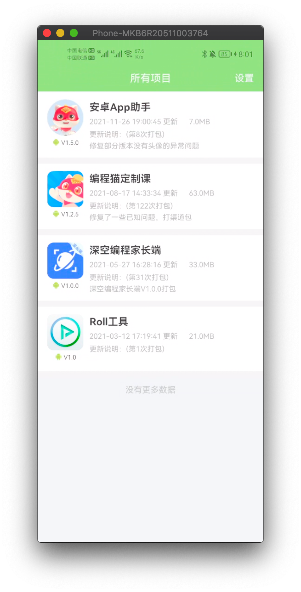
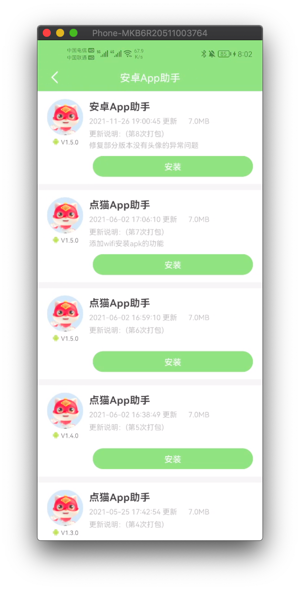
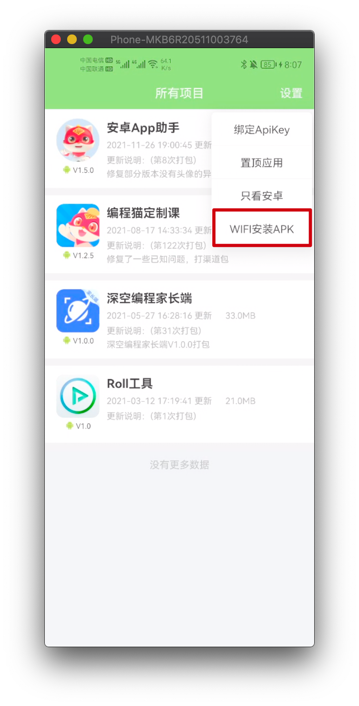
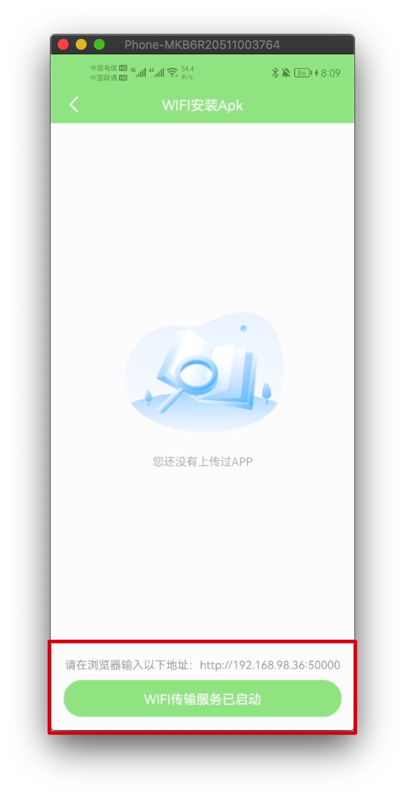
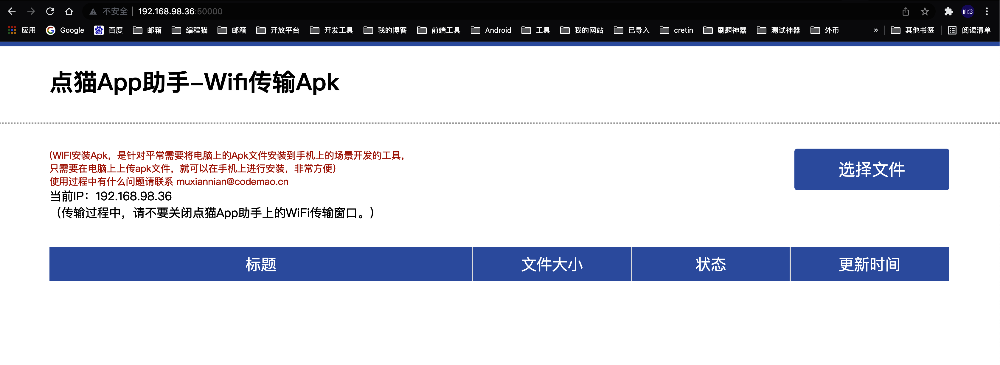
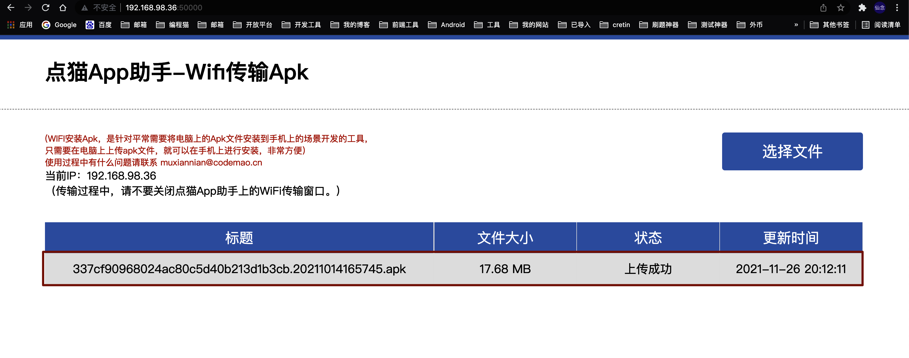
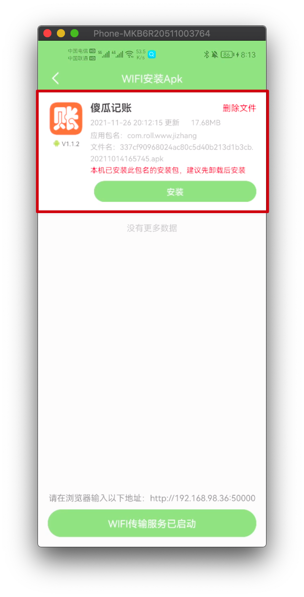

## 1、故事背景

因为我们公司旗下app很多个，测试人员在下载新版本进行测试的时候的流程如下：

+ 打开钉钉进入App打包群，获取下载二维码，由于并行版本很多，每次找二维码都要找半天，也很容易出错
+ 手机扫描二维码，如果没有二维码扫描的工具还需要下载微信或者其他app辅助扫描
+ 输入app下载密码
+ 下载app后安装

流程复杂不是很方便，于是在职期间给测试开发了一款App安装工具，旨在加快下载安装新版本的流程，也能更方便的查看和安装历史版本，流程优化之后：

+ 进入app选择指定项目进入所有版本，app会展示所有的项目
+ 根据版本号点击对应版本后直接跳转下载app

看似没有什么差别，在测试同学试用后觉得还是有一定的提速效果~

## 2、实现的功能点

- 首页会显示当前账号下所有的app应用信息
- 置顶app应用信息【将你感兴趣的APP放到最上面，针对应用比较多的账号有帮助，我们的应用就很多】
- 区分系统版本【Android和iOS都能看，不过只有Android能装上~】
- 查看某个应用下所有的历史版本
- 点击安装应用直接进入浏览器开始下载应用，无需输入密码【即使你设置了密码】
- Wifi 安装应用【在没有数据线的情况下，可以将电脑上的apk文件通过wifi的形式安装到手机上，👍🏻】
- 安全，app不会收集你的任何信息，代码也开源了；即使不小心泄露了ApiKey，你可以去蒲公英后台重置一下ApiKey，之前的ApiKey就失效了

## 3、实现效果

## 3.1 安装上传在蒲公英上的应用

### 3.1.1 启动app选择指定项目

### 3.1.2 选择指定版本跳转下载app

## 3.2 安装电脑上的apk包

这种场景其实挺多的，比如给你发了一个包，你需要安装，那么你需要将这个包发到你的手机上才能安装，一般使用qq，因为微信会加后缀导致识别不了是个apk，就很麻烦。

所以工具内置一个wifi安装apk的功能。

### 3.2.1 打开工具app，点击设置，选择【WIFI安装APK】

### 3.2.2 点击底部按钮启动传输服务

### 3.2.3 在浏览器输入WIFI服务地址进入管理页面

### 3.2.4 在管理端选择APK上传

### 3.2.5 工具APP上会显示出你安装的APK，点击安装即可实现安装外部APK文件

## 4、实现思路

### 4.1 实现打包成功通知并获取连接下载

当最初发现这个问题想解决的时候，是想着给一个hock地址给Jenkins，然后打包成功的时候回调我的服务端，然后生成记录入库，然后再发钉钉到群，然后提供工具APP给测试，后来发现其实像蒲公英这样的平台早就提供的有API接口，于是参考他们的文档，省略了后台入库的操作。

有了蒲公英的API接口，剩下就是开发一个工具APP了，也只需要对接几个接口就好了，一个是获取所有项目列表的接口，一个是获取项目所有版本的接口，最后一个就是获取免密下载链接的接口。

### 4.2 WIFI安装APK的实现

实际上就是将APP作为服务端，在同一局域网下在电脑端访问APP的服务端，向APP上传APK，也就是将APK上传到手机的sd卡，实现apk的上传和删除，最后拉起安装程序安装APK文件。

具体APP的开发细节就不赘述了，不是本文的重点，感兴趣的可以参考源码，源码已经托管到Github：[https://github.com/MZCretin/CMAppDownload](https://github.com/MZCretin/CMAppDownload)，欢迎STAR呀。

## 5、关于我

> 如果你觉得我搞的一些小东西还挺好玩的，别忘了动动你的小手帮我分享一下，在此谢谢你了

如果你也喜欢折腾一些东西，你可以通过留言，客服找到我，正好，我也喜欢折腾一些东西，我们可以做朋友。

欢迎访问我的个人主页：[https://www.mxnzp.com](https://www.mxnzp.com)
新搭建的博客主站：[http://blog.mxnzp.com](http://blog.mxnzp.com/)
Github地址：[https://github.com/MZCretin](