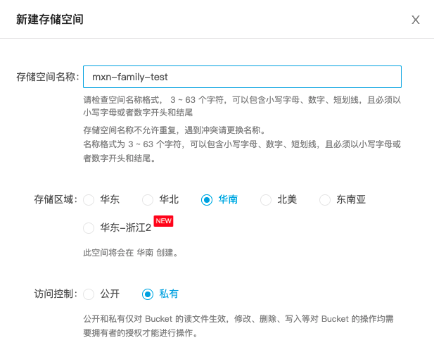

## 1、啥是个人相册

你用过QQ相册吗？就是那玩意儿，就是可以存照片的地方【目前不支持视频，太大了我服务器顶不住】，前段时间我也开发了一个小程序，如下图所示。

## 2、为啥叫个人相册？

前段时间其实我就在朋友圈发过一次了，让大家体验一下，后来大家给我提出了一些问题，其中最重要的一个就是照片的归属问题，你虽然觉得这个小程序还挺好用，但是你不愿意把你的图片放在我的服务器，我虽然也想给你提供方便，但是我也不想存储你的照片，费钱费力不讨好。所以前段时间我提出开源小程序和后台代码，给有动手能力的小伙伴去搭建，但是反响不是很好，要自己买服务器和搭建环境，也挺麻烦的。

后来，在网友的建议下，我推出了另外一种模式，就是我提供后台和小程序的功能，你自己提供存储空间，这样你自己的照片你自己保管，也不用费时费力费钱搭建后台环境和注册小程序，一举三得。因为照片是存在你自己的空间的，所以叫个人相册。

## 3、啥叫自己提供存储空间？

就是你自己去注册一个七牛云的账号，实名认证之后，平台会送你每个月10G的下行流量，也就是你每个月有10G免费流量查看你存储的照片，也送你每个月10G的存储空间，也就是在你的照片没有存储超过10G之前，都是免费的，我寻思对于一个普通人来讲，10个G应该能存很多照片了吧！注册成功之后就相当于你有了自己的存储空间，在我提供的小程序上操作之后，就可以用我的小程序，将图片存储在你的存储空间里面了。

## 4、如何创建并使用自己的存储空间

### 4.1、注册账号并实名认证

如果你有点良心，我希望你能点击我的分享链接注册，哈哈哈~

https://s.qiniu.com/jQZv6r

注册成功之后，需要实名认证，实名认证成功之后即可获取每个月10G存储，10G下行流量和无限上传的福利。

### 4.2、新建存储空间

完成上一步操作之后，我们就去新建仓库了，访问：https://portal.qiniu.com/kodo/bucket ，点击新建空间，在右边弹出的页面中输入存储空间的名称，记得名称中不要包含空格，地区的话按照推荐来就好了，影响不大。访问控制记得选私有。

### 4.3、获取秘钥

访问：https://portal.qiniu.com/user/key ,如果没有秘钥，点击创建秘钥，即可获取到AK和SK。解释一下，这个AK和SK是为了授权给我给你生成上传的token，然后在小程序上上传图片，另外也需要用来生成加权的防盗链链接。并且，你可以在任意时刻停用该组AK和SK，这样我就无法对你的存储空间进行操作了。

### 4.4、获取域名

存储空间新建成功之后，需要绑定域名，不过刚开始会送你一个月的临时域名使用，点击：https://portal.qiniu.com/kodo/bucket ，然后点击你刚刚创建的空间名称，右边会显示一个测试域名。如果你有自己的域名，则需要配置一个域名，这样就能用你自己的域名访问你的图片了。

### 4.5、绑定专属的存储空间

经过前面的几个步骤，我们已经获取了需要绑定的四个重要信息。

1、七牛云授权AK

2、七牛云授权SK

3、存储空间的名称，我这里是mxn-family-test

4、域名，你现在获取到的测试域名

现在我们进行绑定，先在小程序中搜索【我有小家】，进入小程序之后，点击右下角【我的】，点击最上方【登录/注册】，登录成功之后，点击你的昵称那块区域，进入【用户设置】，点击使用自建存储空间，在此页面输入刚刚提到的四个信息，点击绑定按钮，即可成功绑定。

### 4.6、验证效果

回到小程序的首页，尝试上传一张图片，操作完成后，来到七牛云的后台管理页面，查看是否有图片。

点击：https://portal.qiniu.com/kodo/bucket ，选择你刚刚创建的空间名称，点击文件管理，即可在当前页面查看你的图片，如果成功看到图片，代表你个人的储存空间已经绑定成功。现在你所有的照片已经存在你个人领域了，这样你大可放心了。

## 5、其他说明

### 5.1、为啥要搞这个？

其实关注我的人早就知道了，我马上要当爸爸了，所以做这个相册是为了记录他的成长，也记录我跟我老婆的生活日常，等到我们老了，这些都将是美好的回忆。我一定知道，你一定也有这些需求，虽然市面上有很多网盘或者qq相册，但其实你用过之后就会知道他们其实不好用，所以我才开发一个。

### 5.2、操作麻烦，不会怎么办

其实关注我的大都是开发者，我相信就我上面所说的这些操作真是的非常简单的，你只需要一步步跟着做，绝对可以完成，如果你在期间遇到什么问题，可以在公众号留言，或者进入我的个人主页 https://www.mxnzp.com ,里面有我的联系方式。

### 5.3、七牛云的域名是临时的，过期怎么办

其实我觉得域名就像是身份证一样，作为开发者你可以自己拥有一个，注册一个之后几年才一两百块钱，真没几个钱。如果你真的没有的话，你也可以联系我，我可以用我的域名给你开一个二级域名给你用。

### 5.4、我可以自己搭建吗？

当然可以，我也是特别建议你自己搭建，我可以给你提供小程序的源码给你，哈哈。