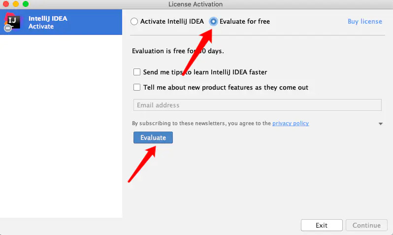

## 1、说明

最近呢，发现MacBookPro发热很严重，接上扩展屏之后更热了，索性给家里的Windows系统安装了黑苹果系统，花了100大洋，完了之后需要安装各种软件，遂在此记录一下。

如果你有钱最好还是买正版，支持正版，我们这些开发者才会更有动力~

## 2、下载idea

理论上来讲呢，能破解的版本一般都不是最新版本，在我写这篇文章之前，我用的一直都是2020.1版本的，我觉得已经很高了，我看到我的同事有的还在用2018版本的。

为了确保破解顺利，我在这里给大家放上2020.1版本的链接：

链接: https://pan.baidu.com/s/18IPQQ3cupX2AMg5JQB9M6g 提取码: 6pdo 

**如果发现链接失效了或者被举报多了，你给我留个言，我更新一下链接**

## 3、破解Idea

### 3.1 下载破解所需要的文件

链接: https://pan.baidu.com/s/1W3sCm8_6rSslsknv2s57Bg 提取码: pi2g 

### 3.2 安装idea

+ 1、为了更好的安装，如果你之前安装的有其他版本的idea，建议你先卸载他们，并删除之前生成的一些配置文件和缓存文件。

**完全卸载IntelliJ xxx**

```shell
第一步：
去Application把应用移到废纸篓
第二步：
（1）删除~/Library/Preferences/IntelliJIdea（IntelliJIdea后边跟版本发行日期）
（2）删除~/Library/Caches/IntelliJIdea（IntelliJIdea后边跟版本发行日期）
（3）删除~/Library/Application Support/IntelliJIdea（IntelliJIdea后边跟版本发行日期）
（4）删除~/Library/ApplicationSupport/IntelliJIdea（IntelliJIdea后边跟版本发行日期）
（5）删除~/Library/Logs/IntelliJIdea（IntelliJIdea后边跟版本发行日期）
```


+ 2、双击dmg文件，进行安装，安装完成之后运行程序，首次打开选择 Evaluate for free，点击 Evaluate 进入软件界面中：

  

+ 3、将破解文件夹中的 jetbrains-agent.jar 文件拖动到软件内，然后点击 Restart 重启软件

  

+ 4、重启完成之后，如果弹出了激活方式，选择 Activation code，没有弹出则不用管，复制破解文件中的 Activation code，然后选择激活，重启软件

  > 注意不一定有弹出激活方式，没有不用管，此时已经激活

+ 5、重启软件，在 Get Help 中点击 About ，如下图可以查看激活情况

  

+  6、idea 激活成功，可以看到有效期到 2089 年

  