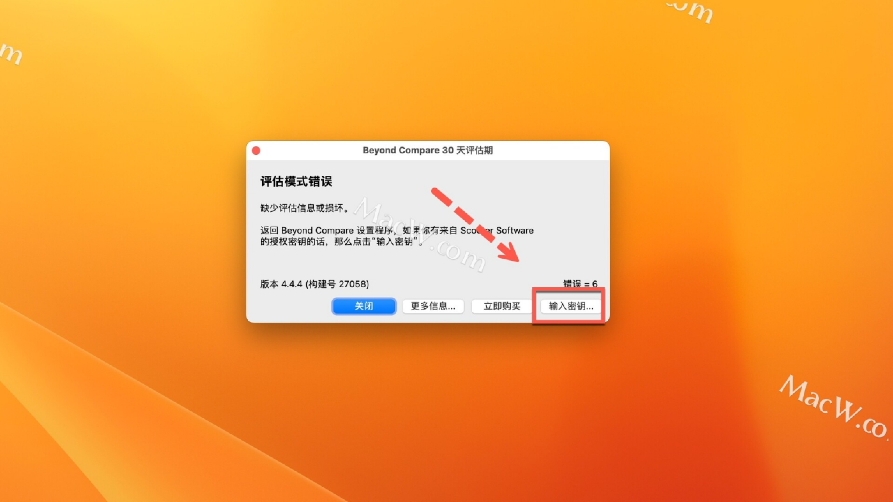
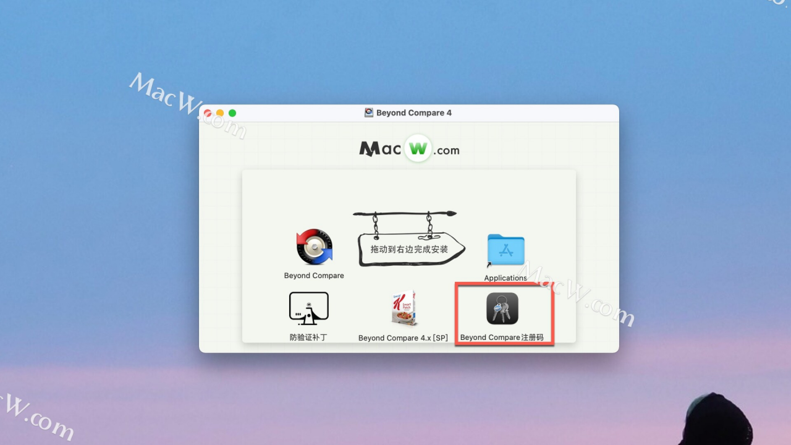
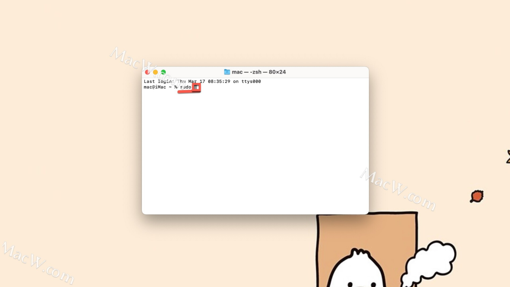

## 1、说明

Beyond Compare 是个很牛逼的对比工具，但是要使用全部功能需要破解

## 2、下载

链接: https://pan.baidu.com/s/1j70H6ZKLIMqE2bpQh7HGtg 提取码: 2a7x

如果链接被举报或者失效，请联系我

## 3、破解

**软件下载完成后打开，将左侧****Beyond Compare****拖动到右侧的应用程序中进行安装** 

 

**返回软件安装包，双击运行 **防验证补丁** **，根据提示进行安装** 

 

**运行软件，点击****输入密钥**

 

**返回软件安装包，双击打开****Beyond Compare注册码**

 

**将上面打开的注册码复制到注册页面，点击****确定** 

 

**注册成功，点击****OK****即可**

 

**11以上系统，镜像中激活码如果失效，请使用以下安装方法。**

**返回镜像，右键打开Beyond Compare 4.x [SP]，选择****显示包内容** 

 

**打开****MacOS****文件夹，同时打开****终端**

 

**在终端输入****sudo (空格)**

 

**将MacOS文件夹中的****patcher****拖入终端，**

 

**然后从****应用程序****中将****beyond compare****拖入终端** 

 

**接着将MacOS文件夹中的****eyePatch****拖入终端**

 

**再次将应用****beyond compare****拖入终端**

 

**回车，输入用户密码(密码不可见)**

 

**等待完成即可**

 

**运行应用，beyond compare 注册安装成功！**

 

**10.15 及以下系统安装教程：**

**软件下载完成后打开，将左侧****Beyond Compare****拖动到右侧的应用程序中进行安装**

 

**返回软件安装包，双击运行****防验证补丁****，根据提示进行安装**

 

**返回镜像包，然后打开beyond compare 注册机****【Beyond Compare 4.x [SP]】****。**

 

**在应用程序中找到Beyond Compare然后拖到Beyond Compare注册机上。**

 

**注意！如果提示失败，无需理会，我们关闭界面。**

 

 